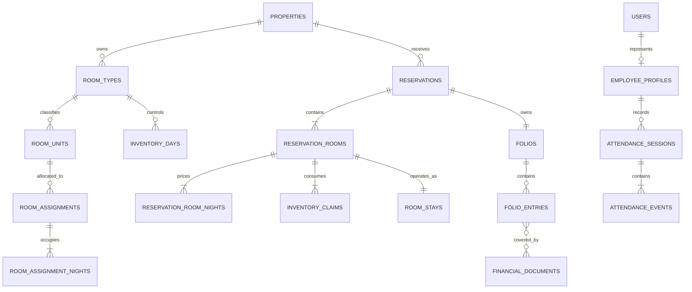

# PostgreSQL Database Schema Blueprint — KOOKA Residence

| Informasi | Nilai                                                                                                                                  |
| --------- | -------------------------------------------------------------------------------------------------------------------------------------- |
| Versi     | 1.2 Physical Foundation                                                                                                                |
| Tanggal   | 2 Agustus 2026                                                                                                                         |
| Database  | PostgreSQL 18                                                                                                                          |
| Scope     | Logical schema Phase 1A, Phase 1B, dan extension boundary Phase 2                                                                      |
| Status    | Logical baseline disetujui; physical Drizzle schema dan initial SQL berhasil digenerate serta divalidasi pada PostgreSQL 18 disposable |

## 1. Tujuan

Dokumen ini menerjemahkan PRD ke model data PostgreSQL sebelum pembuatan migration. Fokus utamanya adalah:

- mencegah double booking;
- memisahkan room type yang dibeli dari room unit fisik yang dialokasikan;
- menjaga status reservation, stay, payment, refund, room, dan cleaning tetap terpisah;
- menyediakan satu master folio yang dapat menghasilkan invoice combined maupun split tanpa menggandakan charge;
- mempertahankan histori melalui snapshot, reversal, event, dan audit;
- memakai identity, RBAC, file metadata, serta audit yang sama untuk lodging dan attendance.

## 2. Keputusan desain database

### 2.1 Satu database, modular secara logis

Gunakan satu PostgreSQL database. Tabel aplikasi berada dalam schema PostgreSQL `public` pada baseline agar Drizzle migration, backup, restore, dan operasi tetap sederhana. Boundary domain dijaga melalui penamaan tabel, module repository/service, permission, dan transaction boundary—bukan melalui database atau service terpisah.

### 2.2 Konvensi tipe data

| Kebutuhan           | Tipe/aturan                                                                                                       |
| ------------------- | ----------------------------------------------------------------------------------------------------------------- |
| Primary key         | `uuid`, default UUIDv7; tidak ditampilkan sebagai kode customer                                                   |
| Waktu kejadian      | `timestamptz`, disimpan sebagai instant UTC                                                                       |
| Business/stay date  | `date`, ditafsirkan pada timezone property `Asia/Jakarta`                                                         |
| Jam konfigurasi     | `time` + timezone pada property/config version                                                                    |
| Nominal             | `numeric(18,2)`, tidak pernah `float`; seluruh nilai resmi IDR wajib bilangan bulat rupiah dan ditegakkan `CHECK` |
| Kurs display        | `numeric(18,6)` + source/as-of/expiry snapshot                                                                    |
| Quantity            | `numeric(12,3)` bila dapat pecahan; `integer` untuk guest/room/resource unit                                      |
| Status              | `text`/`varchar` dengan application validation dan `CHECK` untuk set stabil                                       |
| Extensible metadata | `jsonb` hanya untuk metadata non-kritis, bukan pengganti column/FK inti                                           |
| Email               | normalized lowercase column untuk pencarian; original value boleh disimpan terpisah                               |
| Room number         | `varchar`, unik per property; bukan PK dan bukan petunjuk room type                                               |

Status tidak memakai PostgreSQL enum pada baseline agar penambahan transition tidak memerlukan perubahan tipe enum yang berisiko. Semua timestamp ditampilkan ke pengguna dalam timezone property, tetapi official instant tetap `timestamptz`.

### 2.3 Column standar

Master/transaction table secara umum memiliki:

```text
id uuid primary key
created_at timestamptz not null
updated_at timestamptz not null
created_by_user_id uuid null
updated_by_user_id uuid null
version integer not null default 1
```

`version` dipakai untuk optimistic concurrency pada aggregate yang dapat diedit. Master menggunakan `archived_at` atau lifecycle version, bukan generic hard delete. Posted ledger, payment/refund history, attendance event, document version, state transition, serta audit event tidak dihapus atau ditimpa melalui CRUD biasa.

### 2.4 Property root

Walaupun hanya ada KOOKA Residence Surabaya, tabel operasional relevan tetap memiliki `property_id`. Baseline hanya mengizinkan satu property aktif dan belum menyediakan UI/workflow multi-property. Ini mencegah setting global hard-coded tanpa menambahkan kompleksitas tenancy.

## 3. Peta relasi inti



Diagram hanya menunjukkan jalur utama. Daftar tabel lengkap dan aturan relasi terdapat pada bagian berikutnya.

## 4. Identity, staff, dan RBAC

### 4.1 Tabel

| Tabel                    | Tujuan/column penting                                                                                                                                                                                                                    |
| ------------------------ | ---------------------------------------------------------------------------------------------------------------------------------------------------------------------------------------------------------------------------------------- |
| `users`                  | Akun staf: email normalized unik, display name, status, locale, last login. Tidak digunakan untuk customer.                                                                                                                              |
| `auth_accounts`          | Credential/provider record yang dibutuhkan Better Auth; `password_hash` berisi hash password (scrypt bawaan Better Auth), `account_id` adalah identifier akun per provider.                                                              |
| `auth_sessions`          | Session token, user, expiry, device/IP metadata proporsional, revoked time. Token disimpan apa adanya (default posture Better Auth 1.6.25, bukan hash); proteksi mengandalkan cookie HttpOnly/Secure/SameSite, TLS, dan database privat. |
| `auth_verifications`     | Token verifikasi/reset password berumur pendek sesuai adapter Better Auth, disimpan apa adanya dan bersifat single-use dengan expiry pendek.                                                                                             |
| `two_factor_credentials` | Artefak kompatibilitas migration lama. Tidak dipakai runtime setelah keputusan login biasa tanpa MFA; tabel dipertahankan agar migration yang sudah diterapkan tidak ditulis ulang.                                                      |
| `roles`                  | Role seperti Owner/Super Admin, Front Office, Cleaning, dan F&B.                                                                                                                                                                         |
| `permissions`            | Named server-side permission per action/field/file.                                                                                                                                                                                      |
| `user_roles`             | Relasi user-role dengan property scope, effective period, grant actor.                                                                                                                                                                   |
| `role_permissions`       | Relasi role-permission.                                                                                                                                                                                                                  |
| `employee_profiles`      | Hubungan satu-ke-satu opsional ke user: employee code unik, employment status, default attendance mode.                                                                                                                                  |

### 4.2 Constraint utama

- `users.email_normalized` unik untuk akun staf aktif maupun archived.
- Satu `employee_profiles.user_id` hanya menunjuk satu user.
- Tidak ada `customer_users` dan tidak ada reservation-to-user login relationship.
- User tidak boleh mengubah role/permission dirinya sendiri melalui generic profile update.
- Exact table/column yang diwajibkan versi Better Auth dikunci saat dependency dipasang; domain RBAC tetap memakai tabel aplikasi di atas.

## 5. Property, configuration, dan master lodging

### 5.1 Property/configuration

| Tabel                          | Tujuan/column penting                                                                      |
| ------------------------------ | ------------------------------------------------------------------------------------------ |
| `properties`                   | Nama, alamat, timezone, default locale, base currency `IDR`, status.                       |
| `property_setting_sets`        | Stable parent untuk kelompok setting operasi/payment/document.                             |
| `property_setting_versions`    | Version, lifecycle, approval status, effective range, structured values, creator/approver. |
| `policy_sets`                  | Stable policy seperti house rules, cancellation, no-show, privacy/consent.                 |
| `policy_versions`              | Copy Indonesia/English, effective range, lifecycle, approval, checksum.                    |
| `payment_instruction_sets`     | Stable bank/payment instruction master.                                                    |
| `payment_instruction_versions` | Bank, masked/encrypted account data, holder, IDR, bilingual instruction, effective period. |
| `exchange_rate_snapshots`      | Display-only IDR→USD/AUD rate, source, fetched/as-of/expiry time, rounding rule.           |
| `tax_profiles`                 | Stable tax/service-charge identity per product domain.                                     |
| `tax_profile_versions`         | Tax/service rates, inclusive/exclusive flag, no-tax option, effective period, approval.    |
| `document_profiles`            | Stable legal/document identity.                                                            |
| `document_profile_versions`    | Legal name, address, logo file, footer, language/layout/template reference.                |
| `document_sequences`           | Atomic counter per property, document type, prefix, and period.                            |

Untuk configuration yang penting terhadap transaksi, booking/folio menyimpan `*_version_id` dan resolved snapshot. `jsonb` boleh menyimpan complete version payload pada setting set, tetapi searchable/high-risk values seperti check-in time, payment deadline, rate, tax, dan capacity tetap mempunyai explicit column pada domain terkait.

### 5.2 Room dan amenity

| Tabel                         | Tujuan/column penting                                                                                   |
| ----------------------------- | ------------------------------------------------------------------------------------------------------- |
| `room_types`                  | Stable code, active/archive state.                                                                      |
| `room_type_versions`          | Nama/deskripsi ID/EN, capacity, bed config, extra-bed rule, effective period.                           |
| `room_units`                  | Property, `room_number`, sort order, floor/area, active state.                                          |
| `room_unit_type_periods`      | Room unit→room type dengan effective range dan audit; mencegah histori berubah saat type unit diganti.  |
| `room_unit_states`            | Satu current snapshot per unit: occupancy, housekeeping condition, serviceability, version, changed_at. |
| `amenities`                   | Stable amenity code seperti Wi-Fi, AC, air panas, no smoking.                                           |
| `amenity_translations`        | Nama/deskripsi `id` dan `en`.                                                                           |
| `room_type_amenities`         | Amenity default per room type/version.                                                                  |
| `room_unit_amenity_overrides` | Override unit fisik bila benar-benar berbeda.                                                           |

Constraint minimum:

- `unique(property_id, room_number)`.
- Effective range pada `room_unit_type_periods` untuk unit yang sama tidak boleh overlap.
- Room number disimpan sebagai string; rencana `1`–`15` hanya data awal dan bukan batas teknis.
- `room_unit_states` menyimpan tiga dimensi terpisah: occupancy (`Vacant/Occupied`), housekeeping (`Dirty/Cleaning/Cleaned/Inspected`), dan serviceability (`In Service/Blocked/Out of Order`).
- `Available to Sell` dan `Ready for Check-in` dihitung, bukan status yang dapat diedit.

## 6. Pricing, quote, dan snapshot

| Tabel                  | Tujuan/column penting                                                                                 |
| ---------------------- | ----------------------------------------------------------------------------------------------------- |
| `rate_plans`           | Stable rate-plan code, channel/source eligibility, active state.                                      |
| `rate_plan_versions`   | Name/copy bilingual, payment/cancellation/tax references, effective range.                            |
| `rate_rules`           | Room type, date range/day-of-week, priority, restriction, IDR rate, minimum/maximum stay.             |
| `rate_rule_dates`      | Explicit override/special date bila diperlukan; tidak mewajibkan admin mengisi harga setiap hari.     |
| `booking_quotes`       | Search/checkout quote header, expiry, guest/currency preference, exchange-rate snapshot, total IDR.   |
| `booking_quote_rooms`  | Requested room type, dates, occupancy, extra bed, quantity represented as individual requested rooms. |
| `booking_quote_nights` | Resolved nightly rate IDR, applied rule/version, tax/service snapshot, display estimate.              |

Rate calendar dibentuk dari base rate/rule plus override tanggal khusus. Admin tidak perlu mengisi setiap tanggal. Ketika booking dibuat, resolved nightly values disalin ke reservation/folio snapshot; perubahan rate berikutnya tidak mengubah booking lama.

USD dan AUD hanya preference tampilan. Semua quote menyimpan official IDR dan optional display snapshot; payment, folio, invoice, refund, dan report resmi tetap IDR.

## 7. Reservation, guest, dan booking lookup

### 7.1 Reservation

| Tabel                       | Tujuan/column penting                                                                                                                           |
| --------------------------- | ----------------------------------------------------------------------------------------------------------------------------------------------- |
| `reservations`              | Booking header: booking code, source, status, booker, dates summary, language/currency preference, payment deadline, policy snapshots, version. |
| `reservation_rooms`         | Satu row untuk setiap kamar yang dipesan, walaupun tipenya sama; booked room type, fulfilled room type, guest count, extra bed, line status.    |
| `reservation_room_nights`   | Satu row per reservation room dan stay date; IDR rate/tax/service/discount snapshot.                                                            |
| `reservation_status_events` | Append-only transition/action, from/to, actor, reason, correlation ID, guard result.                                                            |
| `booking_lookup_sessions`   | Hashed short-lived lookup token, reservation, verified email context, expiry, revoked time.                                                     |
| `booking_contact_attempts`  | Contact channel/outcome untuk no-show, payment, cancellation, dan exception workflow.                                                           |

`reservations.booking_code` adalah kode acak high-entropy yang user-friendly dan unik, bukan UUID/sequence yang mudah ditebak. Lookup membutuhkan exact booking code + normalized matching booker email, rate limit, generic error, dan short-lived session.

### 7.2 Guest dan occupancy

| Tabel                  | Tujuan/column penting                                                                                 |
| ---------------------- | ----------------------------------------------------------------------------------------------------- |
| `guests`               | Guest identity operasional: name, contact minimum, nationality optional; tidak otomatis menjadi akun. |
| `reservation_guests`   | Guest pada reservation dengan role Booker/Guest/Payer/Invoice Recipient.                              |
| `room_stays`           | Operasional per `reservation_room`: status, planned/actual arrival/departure, lead guest, version.    |
| `room_stay_guests`     | Guest allocation ke room stay dan occupancy period; mendukung partial multi-room arrival/departure.   |
| `stay_status_events`   | Append-only transition per room stay.                                                                 |
| `guest_requests`       | Preference/request target booking/room/guest, lifecycle, due time, confirmation evidence.             |
| `guest_request_events` | Append-only request status/history.                                                                   |

Reservation status tidak menyimpan `Partially Checked In/Out`; indikator tersebut dihitung dari kumpulan `room_stays`.

## 8. Inventory, hold, assignment, dan room move

### 8.1 Type-level inventory

| Tabel                    | Tujuan/column penting                                                                                                        |
| ------------------------ | ---------------------------------------------------------------------------------------------------------------------------- |
| `inventory_days`         | Lock/control row per `property + room_type + stay_date`, physical capacity snapshot, version.                                |
| `inventory_claims`       | Konsumsi satu unit type/night oleh checkout hold, payment hold, committed booking, block, atau future whole-house component. |
| `inventory_claim_events` | Append-only hold/commit/release/expire/move history.                                                                         |

Customer membeli room type, bukan room number. Karena itu confirmed booking yang belum assigned tetap membuat active `inventory_claims` dan mengurangi availability.

Availability per room type/night:

```text
sellable = physical capacity - active claims
```

Active claim mencakup `CHECKOUT_HOLD`, `PAYMENT_HOLD`, `COMMITTED`, `BLOCKED`, serta nanti `WHOLE_HOUSE`. Claim mempunyai source, state, expiry bila hold, dan idempotency key. Satu `reservation_room` menghasilkan satu claim per malam; booking multi-room menghasilkan beberapa reservation-room row agar assignment, guest, price, dan cancellation dapat ditargetkan dengan jelas.

Final booking transaction:

1. Tentukan seluruh `room_type + stay_date` yang diminta.
2. Lock `inventory_days` dengan `SELECT ... FOR UPDATE` dalam urutan `room_type_id, stay_date` yang konsisten.
3. Hitung active claims dan validasi capacity/restriction.
4. Buat reservation, room lines, nights, claims, master folio, serta outbox dalam transaction yang sama.
5. Commit seluruhnya atau rollback seluruhnya.

Redis tidak digunakan sebagai lock utama inventory. Hard overbooking ditolak untuk semua role.

### 8.2 Physical assignment

| Tabel                    | Tujuan/column penting                                                                                               |
| ------------------------ | ------------------------------------------------------------------------------------------------------------------- |
| `room_assignments`       | Assignment period untuk room stay→room unit, status/current flag, effective time, assigned by/reason.               |
| `room_unit_night_claims` | Common physical slot untuk assignment maupun block; hanya satu active claim per unit dan malam.                     |
| `room_assignment_nights` | Satu row per room unit dan stay date untuk enforcement physical overlap.                                            |
| `room_moves`             | Action old/new unit/type, effective time, reason, price treatment, incidental/no-charge flag, cleaning consequence. |
| `room_move_events`       | Prepared/applied/rejected/cancelled history dan guard result.                                                       |

Database memakai common physical claim agar assignment dan maintenance block juga tidak dapat saling overlap. Partial unique index utamanya setara:

```sql
CREATE UNIQUE INDEX uq_room_unit_night_claim_active
ON room_unit_night_claims (room_unit_id, stay_date)
WHERE claim_status = 'ACTIVE';
```

`room_assignment_nights` dan `room_block_nights` masing-masing menunjuk common claim tersebut. Assignment tidak membuat consumption type kedua karena type-level inventory sudah dikonsumsi oleh `inventory_claims`. Jika complimentary upgrade mengubah fulfilled room type, claim lama dipindahkan ke type baru secara atomik, sedangkan booked type dan original price tetap tersimpan.

Room move dapat memiliki `price_treatment` berupa `NO_CHANGE`, `CHARGE`, atau `CREDIT`; nilai incidental/no-charge dan alasan disimpan eksplisit. Move keluar membuat unit lama `Vacant + Dirty` serta cleaning task tanpa mengubah stay menjadi checked out.

### 8.3 Block dan resource

| Tabel                     | Tujuan/column penting                                                              |
| ------------------------- | ---------------------------------------------------------------------------------- |
| `room_blocks`             | Unit, block type, period, reason, source maintenance optional, lifecycle.          |
| `room_block_nights`       | Physical block per unit/stay date.                                                 |
| `resource_pools`          | Shared accommodation resource seperti extra bed, capacity, inventory-tracked flag. |
| `resource_inventory_days` | Lock/control row per resource/date.                                                |
| `resource_claims`         | Held/committed/assigned quantity per reservation room/date.                        |
| `reservation_addons`      | Extra bed atau accommodation add-on, price/tax snapshot, target room stay.         |

Block aktif membuat type-level inventory claim dan physical block night dalam satu transaction. Extra bed yang inventory-tracked dikunci bersama room inventory; kegagalan salah satunya membatalkan seluruh booking/hold.

## 9. Check-in registration dan data opsional

| Tabel                     | Tujuan/column penting                                                                                             |
| ------------------------- | ----------------------------------------------------------------------------------------------------------------- |
| `checkin_registrations`   | Per room stay: status `Not Started/Partial/Complete/Skipped`, operator, purpose/policy version.                   |
| `checkin_capture_items`   | Jenis `IDENTITY_DOCUMENT`, `GUEST_PHOTO`, `SIGNATURE`; outcome `CAPTURED/DECLINED/SKIPPED/FAILED`; file optional. |
| `guest_identity_details`  | Optional encrypted identity type/number/name/expiry bila benar-benar diisi; restricted access.                    |
| `policy_acknowledgements` | Policy version, subject/guest, channel, language, accepted/declined/provided, timestamp.                          |

Masing-masing foto KTP/identitas, guest photo, dan signature opsional secara independen. Tidak adanya file tidak menghalangi check-in dan tidak mengubah reservation, stay, payment, room readiness, atau occupancy status. File content tidak pernah disalin ke audit JSON.

## 10. Folio, payment, refund, dan document

### 10.1 Ledger

| Tabel                   | Tujuan/column penting                                                                                                         |
| ----------------------- | ----------------------------------------------------------------------------------------------------------------------------- |
| `folios`                | Tepat satu master folio per reservation, lifecycle `OPEN/CLOSED`, official currency IDR.                                      |
| `folio_billing_buckets` | Payer/routing untuk split invoice pada group/multi-room tanpa membuat folio tandingan.                                        |
| `folio_entries`         | Immutable debit/credit entry: category, source, service date, qty, unit/net/tax/service/total IDR, snapshots, posted time/by. |
| `folio_entry_links`     | Relasi reversal/adjustment atau source coverage bila dibutuhkan.                                                              |
| `folio_status_events`   | Close/reopen history, reason, actor, guard result.                                                                            |

`folio_entries` menyimpan `reversal_of_entry_id`; posted row tidak diedit. Koreksi membuat reversal dan replacement/new entry. Saldo dihitung dari signed debit/credit entries; cached summary bila kelak digunakan bukan source of truth.

### 10.2 Payment dan refund

| Tabel                   | Tujuan/column penting                                                                                   |
| ----------------------- | ------------------------------------------------------------------------------------------------------- |
| `payments`              | Payment record dengan method, amount IDR, received time, destination account snapshot, status terpisah. |
| `payment_proofs`        | Payment→private file dan verification metadata.                                                         |
| `payment_status_events` | Pending/verified/rejected/voided history.                                                               |
| `payment_allocations`   | Verified payment value dialokasikan ke satu atau beberapa final invoice.                                |
| `refunds`               | Manual refund amount IDR, reason/policy, destination encrypted/masked, lifecycle terpisah.              |
| `refund_attempts`       | Setiap attempt transfer, processor, time, result, reference, proof file.                                |
| `refund_status_events`  | Requested/approved/processing/refunded/failed/rejected/cancelled history.                               |

Booking online hanya confirmed setelah verified payment mencapai 100% official total. Deposit persentase/fixed atau pay-at-property hanya berlaku pada admin-created booking sesuai selected policy. Refund nominal selalu dicatat manual dan tidak dibuat otomatis oleh cancellation.

### 10.3 Document

| Tabel                          | Tujuan/column penting                                                                                           |
| ------------------------------ | --------------------------------------------------------------------------------------------------------------- |
| `financial_documents`          | Proforma, invoice, receipt, refund note, folio statement; number, type, lifecycle, recipient/language snapshot. |
| `financial_document_versions`  | Immutable rendered snapshot/PDF file, totals IDR, template/profile version, issued time/by.                     |
| `document_entry_coverage`      | Many-to-many document version→folio entry dengan covered amount/quantity.                                       |
| `document_payment_allocations` | Invoice settlement view dari payment allocation.                                                                |

Combined dan room-only/split invoice memilih source `folio_entries` yang sama. Final active invoice coverage memiliki constraint/application guard agar satu charge tidak ditagihkan dua kali. Tax/no-tax, service charge, dan price berasal dari folio entry snapshot; document tidak menghitung ulang.

## 11. Housekeeping, room condition, dan maintenance

| Tabel                       | Tujuan/column penting                                                                              |
| --------------------------- | -------------------------------------------------------------------------------------------------- |
| `cleaning_tasks`            | Room/public-area task, type, priority, request/target, assignee, current status, linked stay/move. |
| `cleaning_task_events`      | Assigned/In Progress/Cleaned/Inspected/Deferred/Unable to Access/Cancelled history.                |
| `cleaning_checklists`       | Versioned task/inspection templates.                                                               |
| `cleaning_task_items`       | Checklist snapshot/result/exception.                                                               |
| `maintenance_issues`        | Unit/area issue, severity, status, serviceability impact, reporter.                                |
| `maintenance_issue_events`  | Triage/work/resolve/verify/reopen history.                                                         |
| `damage_catalog_items`      | Stable item identity.                                                                              |
| `damage_catalog_versions`   | Reference price/tax/evidence rule, effective period.                                               |
| `damage_incidents`          | Booking/stay/unit/item/evidence, notes, responsibility/decision state.                             |
| `damage_assessments`        | Approved/waived/disputed amount snapshot; optional linked folio entry.                             |
| `departure_clearances`      | Optional per room stay outcome, checker, skip/issue reason.                                        |
| `departure_clearance_items` | Checklist/result dan linked maintenance/damage/lost-found action.                                  |

Guest-requested stayover cleaning adalah `cleaning_tasks` dengan task type khusus; room stay tetap `In House` dan unit tetap `Occupied`. Tanda DND fisik menggunakan task exception `Deferred` atau `Unable to Access`, bukan room/stay status baru.

## 12. F&B dasar, services, dan future POS

### 12.1 Phase 1 manual paper-order entry

| Tabel                | Tujuan/column penting                                                                           |
| -------------------- | ----------------------------------------------------------------------------------------------- |
| `menu_categories`    | Category stable ID dan display order.                                                           |
| `menu_items`         | Stable item code, active state, availability flag.                                              |
| `menu_item_versions` | Nama/deskripsi ID/EN, IDR price, tax profile, effective period.                                 |
| `food_orders`        | Paper reference unik, standalone/room-charge settlement route, guest/room/folio target, status. |
| `food_order_items`   | Item/version, quantity, price/tax snapshot, notes, linked folio entry.                          |
| `food_order_events`  | Entry/confirm/prepare/serve/cancel/void history sesuai MVP yang dipilih.                        |

Form kertas tetap proses operasional; setelah Front Office memasukkan order, database menjadi source of truth transaksi tersebut. Satu order/item hanya boleh menghasilkan satu source charge.

### 12.2 Phase 2 extension

Tabel `service_catalog`, `service_bookings`, `tour_products`, `tour_departures`, `service_orders`, resource scheduling, package/group/whole-house component, serta POS/cash session lengkap dibuat dalam migration Phase 2—bukan tabel kosong pada Phase 1. Semua extension akan memakai `folio_entries`, tax snapshot, settlement route, file, audit, dan idempotency yang sama.

## 13. CMS, translation, dan media

| Tabel                   | Tujuan/column penting                                                                       |
| ----------------------- | ------------------------------------------------------------------------------------------- |
| `content_pages`         | Stable page/route identity dan publish state.                                               |
| `content_page_versions` | Draft/review/published content revision dan effective time.                                 |
| `content_sections`      | Ordered section/block dalam page version.                                                   |
| `content_translations`  | Locale `id/en`, field/body payload, translation status.                                     |
| `media_assets`          | File reference, media type, alt/caption ID/EN, rights/source, authentic/placeholder marker. |
| `media_usages`          | Asset→page/room type/menu/gallery placement, order, crop/focal metadata.                    |

CMS hanya menyimpan editorial copy/media. Harga, capacity, availability, tax, amenity, serta operational rule dibaca dari master domain agar tidak ada source-of-truth ganda.

## 14. Attendance Phase 1B

| Tabel                    | Tujuan/column penting                                                                                                                  |
| ------------------------ | -------------------------------------------------------------------------------------------------------------------------------------- |
| `attendance_locations`   | Nama titik, latitude/longitude, radius, accepted accuracy, active state.                                                               |
| `shift_templates`        | Start/end time, timezone, check-in window, late tolerance, cross-midnight rule.                                                        |
| `shift_assignments`      | Employee, business date, template, allowed location, status.                                                                           |
| `attendance_sessions`    | Employee, mode `SHIFT/FREE`, business date, optional assignment, current summary/status, duration, exception flags.                    |
| `attendance_events`      | Append-only check-in/out: server/device time, coordinate, accuracy, calculated distance/geofence result, selfie file, idempotency key. |
| `attendance_corrections` | Direct admin correction: target session/event, before/after values, reason, actor, time.                                               |

Constraint minimum:

- Hanya satu open attendance session per employee.
- Check-out hanya dapat menutup session aktif milik employee tersebut.
- `attendance_events.idempotency_key` unik per employee/action scope.
- Official time selalu server `timestamptz`; device time diagnostic only.
- Event asli tidak diedit/dihapus ketika admin melakukan koreksi.
- Tidak ada tabel `attendance_correction_requests` karena karyawan meminta koreksi langsung kepada admin di luar sistem.
- Selfie file dan exact coordinate tidak masuk report/export umum.

## 15. File, audit, idempotency, dan asynchronous work

| Tabel                     | Tujuan/column penting                                                                                                              |
| ------------------------- | ---------------------------------------------------------------------------------------------------------------------------------- |
| `stored_files`            | Opaque storage key, MIME/signature, bytes, SHA-256, classification, scan status, retention category, created by/time, purge state. |
| `file_access_events`      | Append-only view/download/print/export/replace/purge attempt dan result.                                                           |
| `audit_events`            | Actor/system, action, target type/ID, before/after redacted JSON, reason, request/correlation ID, result, IP/device metadata.      |
| `state_transition_events` | Optional common index/projection untuk lintas-domain; domain event table tetap menyimpan detail kuat.                              |
| `idempotency_keys`        | Scope, key, request hash, owner/user, result reference, status, expiry.                                                            |
| `outbox_events`           | Event committed bersama transaction, payload non-sensitif, available time, attempt/state.                                          |
| `job_executions`          | Scheduled job/daily rollover/expiry/purge execution, checkpoint, result, error reference.                                          |
| `security_events`         | Login/lookup abuse, permission change, suspicious access, severity, review state.                                                  |

Gunakan FK khusus dari domain table ke `stored_files` untuk file sensitif utama, bukan generic polymorphic attachment yang menghilangkan referential integrity. `audit_events.before_json/after_json` wajib meredaksi nomor identitas, rekening penuh, token, signature/file content, password, dan secret.

## 16. Constraint dan index wajib

Minimum database enforcement sebelum UAT:

1. `unique(properties.id)` sesuai normal PK dan hanya satu property aktif melalui partial unique guard/configuration rule.
2. `unique(property_id, room_number)` pada `room_units`.
3. No-overlap effective period untuk room-unit type, rate/tax/policy/config version yang scope-nya sama.
4. `unique(reservations.booking_code)` dan index untuk lookup booking code + normalized booker email.
5. `unique(reservation_room_id, stay_date)` pada reservation night.
6. `unique(property_id, room_type_id, stay_date)` pada inventory day.
7. Unique active source claim per source/night serta index active claim per room type/date.
8. Partial unique active `(room_unit_id, stay_date)` pada assignment night.
9. Partial unique active `(room_unit_id, stay_date)` pada room block night atau cross-check terhadap assignment dalam transaction.
10. Exactly one active master folio per reservation.
11. Unique idempotency scope/key pada booking, payment verification, folio posting, document issue, attendance event, dan job.
12. Unique document number per property/type/sequence scope.
13. Unique active final invoice coverage per folio entry/covered portion.
14. One open attendance session per employee melalui partial unique index.
15. Check constraints untuk non-negative amount/quantity, valid date interval `[check_in, check_out)`, exchange-rate positivity, latitude/longitude/radius, dan required reason pada override/correction action.

Beberapa rule lintas tabel—misalnya block versus assignment, total active claims versus capacity, payment allocation versus amount, atau combined/split coverage—harus dijalankan melalui transaction service dan row lock. Database constraint tetap dipasang sejauh PostgreSQL dapat menegakkannya tanpa trigger yang sulit dipelihara.

## 17. Transaction boundary kritis

Satu database transaction wajib membungkus:

- final availability check + reservation + room nights + claims + folio + initial charges + outbox;
- hold expire/cancel + claim release;
- room assignment/move/type fulfillment + physical nights + old-room cleaning + price adjustment;
- stay extension/date change + new claim + assignment + nightly folio adjustment;
- payment verify/void + folio credit/reversal + reservation confirmation evaluation;
- refund complete + refund ledger posting + refund-note outbox;
- invoice issue + document number + entry coverage + rendered-version request;
- checkout + occupancy/housekeeping state + cleaning task + departure event;
- attendance check-in/out + selfie readiness + geofence result + session/event + audit;
- room block/out-of-order + physical/type inventory claim + conflict guard.

External side effects seperti email, PDF rendering, dan file cleanup tidak dijalankan sebelum commit. Mereka dipicu dari `outbox_events` dan aman untuk retry.

## 18. Data ownership dan deletion rule

- Master yang sudah direferensikan di-archive/retire, bukan hard delete.
- Transaction FK default `ON DELETE RESTRICT`.
- Pure join/detail draft yang belum diposting dapat memakai controlled cascade dari draft parent.
- Financial entry, payment/refund event, issued document version, attendance event/correction, custody event, dan audit bersifat append-only.
- Guest PII dapat dianonymize/purge sesuai retention tanpa menghapus reservation, inventory, dan financial history.
- File purge menghapus object content lalu mempertahankan tombstone metadata minimum, policy version, dan audit—tanpa memulihkan sensitive content di audit.

## 19. Migration dan delivery sequence

Migration tidak dibuat sekaligus untuk seluruh Phase 1–3. Urutan yang direkomendasikan:

1. **Foundation:** property, user/auth/RBAC, employee link, file metadata, audit, idempotency, outbox.
2. **Master:** room type/unit/state, amenity, config/policy/tax/payment/document versioning.
3. **Commercial core:** rate/quote, reservation/guest, inventory day/claim, assignment/stay.
4. **Finance:** folio/entry, payment/refund, document/coverage/sequence.
5. **Operations:** check-in registration, cleaning, maintenance/block, damage, departure, guest request.
6. **Content/communication:** CMS, media, notification/outbox worker.
7. **Phase 1 F&B entry:** menu/order/source charge.
8. **Phase 1B:** attendance location/shift/session/event/correction.
9. **Phase 2:** group/package/whole house, full POS, service/tour, dan deferred modules ketika diprioritaskan.

Setiap tahap mempunyai migration, seed minimum, constraint test, rollback/forward-fix plan, dan acceptance test. Production schema tidak menerima tabel spekulatif Phase 2 yang belum dipakai.

## 20. Hal yang dikunci dan yang masih terbuka

### Sudah dikunci

- PostgreSQL 18, Drizzle ORM, dan single database.
- Satu property root, bukan multi-property product.
- UUID internal; booking/document number terpisah.
- Tabel aplikasi menggunakan PostgreSQL schema `public` dengan modular boundary di code/domain layer.
- `timestamptz` untuk official instant, `date` untuk business/stay date, dan `numeric(18,2)` untuk nominal.
- Status memakai text + database `CHECK`, bukan PostgreSQL enum.
- IDR official; USD/AUD display preference saja.
- Customer tanpa account/login.
- Room-type booking, physical-unit assignment kemudian.
- Room number berupa label string unik per property; UUID unit tetap menjadi identity stabil.
- Hubungan unit→room type effective-dated agar perubahan tidak menulis ulang histori.
- Type-level nightly claim + physical assignment-night uniqueness; `inventory_days` dikunci oleh PostgreSQL transaction, bukan Redis.
- Hard overbooking ditolak untuk semua role.
- Satu master folio; invoice adalah coverage/view atas entries.
- Posted financial records dan attendance events append-only.
- Registration photo/KTP/signature opsional.
- Attendance memakai identity/RBAC/file/database yang sama.
- Tabel Phase 2 tidak dibuat secara spekulatif dalam migration Phase 1.

### Masih perlu dikunci sebelum migration terkait

- ~~Exact Better Auth adapter table contract setelah package version dipasang.~~ Selesai pada Langkah 6: field `auth_sessions`/`auth_accounts` direkonsiliasi ke nama default Better Auth 1.6.25 via migration `0003_auth_contract_alignment`; lihat `docs/CONVERSATION-TRANSCRIPT.md`.
- Daftar final room type/unit sekitar 15 kamar, capacity, amenity, dan extra-bed eligibility.
- Production rate/tax/service/payment/policy/document configuration.
- Retention duration, encryption/key management, backup RPO/RTO, serta file size/type limit.
- Named permission matrix per role.
- Attendance location/radius/accuracy, shift template, Free Mode eligibility, dan correction permission.
- Reporting retention/index kebutuhan setelah query/UI wireframe selesai.

## 21. Handoff menuju physical schema

Owner menyetujui model room type/unit, type-level nightly inventory claim, PostgreSQL row locking, serta physical room-night uniqueness pada 2 Agustus 2026. Owner juga memberi mandat agar keputusan database lain mengikuti rekomendasi yang paling sesuai untuk skala dan scope KOOKA; karena itu seluruh keputusan teknis pada dokumen ini menjadi baseline, kecuali nilai production yang tetap tercantum sebagai open configuration.

Urutan physical Drizzle schema/migration yang digunakan:

1. Foundation convention, property, identity/RBAC, file, audit, idempotency, dan outbox.
2. Room type, room unit, configuration versioning, serta inventory claim.
3. Reservation, guest, stay, assignment, serta check-in registration.
4. Folio, payment, refund, dan document coverage.
5. Housekeeping, maintenance, damage, departure, CMS/F&B/communication.
6. Attendance Phase 1B.

Physical schema telah dibuat pada `src/db/schema`, initial Drizzle SQL telah digenerate ke `drizzle`, dan hard constraints berada pada `database/migrations/after-drizzle`. `drizzle-kit check` lulus. Validasi disposable PostgreSQL 18 berhasil membuat 128 application tables serta menguji active-property uniqueness, effective room-type-period exclusion, cross assignment/block physical room-night collision, one-open-attendance-session, dan append-only audit protection.

Owner hanya perlu memberi data real/configuration yang memang belum tersedia atau memutuskan perubahan scope. Exact Better Auth adapter contract tetap harus direkonsiliasi setelah dependency aplikasi final dikunci. UI, route handler, domain service, seed production, dan deployment belum dibuat.
