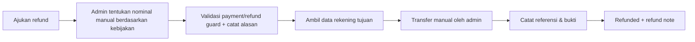
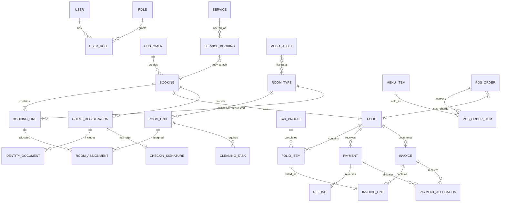

# Product Requirements Document (PRD)

## KOOKA Residence — Landing Page, Booking, Property Operations, POS, Services, dan Employee Attendance

| Informasi    | Nilai                                                                                                                                    |
| ------------ | ---------------------------------------------------------------------------------------------------------------------------------------- |
| Versi        | 2.1 Scope Addendum                                                                                                                       |
| Tanggal      | 2 Agustus 2026                                                                                                                           |
| Status       | Baseline lodging dan Phase 1B dipertahankan; physical database foundation tersedia; UI/API/domain workflow aplikasi inti belum dimulai   |
| Produk       | Satu aplikasi web untuk website publik, booking, sistem operasional/admin, dan mobile-first employee attendance KOOKA Residence Surabaya |
| Pasar awal   | Indonesia, zona waktu Asia/Jakarta, mata uang utama IDR                                                                                  |
| Scope freeze | 1 Agustus 2026                                                                                                                           |

---

## 1. Ringkasan Produk

KOOKA Residence membutuhkan satu platform terpadu untuk:

1. Menampilkan properti secara menarik dan meningkatkan pemesanan langsung.
2. Memungkinkan customer memeriksa ketersediaan serta memesan kamar, beberapa kamar, paket, whole house, makanan, dan layanan.
3. Menerima pembayaran manual melalui transfer bank, uang muka, pembayaran saat check-in, pembayaran saat checkout, atau tunai sesuai kebijakan booking.
4. Mengelola reservasi, alokasi kamar, pindah kamar, invoice, refund manual, jadwal cleaning, galeri, layanan, serta transaksi POS.
5. Memberikan hak akses berbeda kepada Admin, Cleaning, dan F&B.
6. Menyediakan absensi karyawan melalui route mobile-first/PWA dalam aplikasi yang sama, dengan selfie, geofence, Scheduled Shift, dan Free Mode.

Untuk tahap awal, pembayaran tidak menggunakan payment gateway. Website menghasilkan kode booking dan instruksi transfer. Customer kemudian mengirim bukti transfer beserta kode booking melalui WhatsApp. Admin memverifikasi pembayaran secara manual di sistem.

## 2. Tujuan Produk

### 2.1 Tujuan bisnis

- Meningkatkan direct booking dan mengurangi ketergantungan pada OTA.
- Menghilangkan pencatatan reservasi yang tersebar di chat, spreadsheet, dan catatan manual.
- Mencegah double booking, termasuk pada group booking dan whole house.
- Mempercepat pengecekan pembayaran dan penerbitan invoice.
- Memberikan satu sumber data untuk status kamar, cleaning, konsumsi F&B, serta layanan tamu.
- Menyediakan pengalaman brand yang terasa seperti boutique urban tropical retreat.
- Memberikan catatan kehadiran karyawan yang sederhana, auditabel, dan tidak bergantung pada payroll/HRIS penuh.

### 2.2 Indikator keberhasilan

- Tidak ada double booking akibat kesalahan sistem.
- Minimal 90% booking langsung tercatat lengkap dengan customer, tanggal, unit, dan status pembayaran.
- Admin dapat membuat booking manual dalam waktu maksimal 3 menit.
- Admin dapat mengetahui ketersediaan dan status seluruh kamar dari satu layar.
- Cleaning dapat mengetahui daftar kamar checkout dan prioritas pengerjaan tanpa meminta daftar manual.
- Semua transaksi kamar, POS, dan service dapat ditelusuri ke invoice atau folio yang sesuai.
- Conversion rate pencarian ketersediaan ke booking dapat diukur.
- Karyawan dapat melakukan check-in/out dari lokasi yang diizinkan dengan selfie dan server timestamp tanpa event ganda.
- Admin dapat melihat attendance exception serta koreksi tanpa menghapus histori event asli.

## 3. Prinsip Produk dan Keputusan Utama

1. **Inventory berbasis unit fisik.** Room type adalah kategori jual; room/unit adalah kamar fisik yang ditempati.
2. **Booking tidak selalu langsung memiliki nomor kamar.** Customer dapat memesan room type terlebih dahulu. Admin mengalokasikan unit fisik kemudian.
   Public availability menampilkan varian jual berdasarkan kombinasi room type dan maximum guest, tidak pernah nomor kamar fisik. Display name boleh sama—misalnya dua varian `Deluxe` berkapasitas maksimum 2 dan 3 tamu—tetapi stable ID dan internal code harus berbeda agar inventory, harga, dan kapasitas tetap terpisah.
3. **Status dipisahkan.** Booking status, stay status, payment balance status, payment record status, room occupancy, housekeeping condition, serviceability/block, cleaning task, dan refund status tidak boleh digabung menjadi satu field. Payment balance dihitung dari folio; proses verifikasi pembayaran dan refund memiliki lifecycle masing-masing.
4. **Satu booking memiliki satu folio utama.** Tagihan kamar, makanan, layanan, diskon, pajak, pembayaran, dan refund tercatat sebagai baris transaksi.
5. **Pembayaran manual adalah sumber kebenaran tahap awal.** Sistem tidak menganggap lunas sebelum admin melakukan verifikasi.
6. **WhatsApp digunakan sebagai kanal konfirmasi, bukan database.** Kode booking, nilai tagihan, dan status resmi tetap tersimpan di sistem.
7. **Perubahan sensitif memiliki audit log.** Perubahan harga, pembayaran, kamar, refund, dan pembatalan mencatat pengguna, waktu, nilai lama, nilai baru, dan alasan.
8. **Master/configuration berubah melalui version dan effective date.** Existing booking/document mempertahankan snapshot; approval diterapkan berdasarkan risiko dan referenced master diarchive, bukan dihapus.
9. **Go-live bersifat greenfield.** Tidak ada migrasi legacy; hanya initial master setup dan Opening Booking/block untuk commitment yang masih berlaku agar inventory tidak dijual ganda.
10. **Satu deployable application dan satu source of truth.** Landing/booking, admin termasuk admin attendance, serta route mobile-first karyawan berada pada codebase, runtime, identity, domain service, database, private file-storage adapter, audit, build, dan deployment yang sama. Phase 1 memakai persistent local VPS volume. Server route handler internal bukan API service terpisah.

### 3.1 Scope baseline dan change control

- Dokumen ini mempertahankan baseline fungsi lodging versi 2.0 untuk Phase 1–3 dan menambahkan scope addendum 2.1 untuk in-app Employee Attendance Phase 1B. Baseline/addendum berarti batas fitur telah disetujui, bukan berarti konfigurasi operasional atau implementasi sudah selesai.
- Setiap kebutuhan diklasifikasikan sebagai `Phase 1 Included`, `Phase 2 Deferred`, `Phase 3 Integration`, `Manual/SOP`, `Out of Scope`, atau `Open Configuration` pada [SCOPE-DECISION-REGISTER.md](SCOPE-DECISION-REGISTER.md).
- Daftar pada Bagian 27 adalah keputusan konfigurasi yang harus diisi sesuai gate; ke-134 item tersebut bukan fitur baru dan tidak membuka kembali scope secara otomatis.
- Kesiapan sebelum arsitektur, build, UAT, dan go-live dilacak pada [PHASE-1-READINESS-CHECKLIST.md](PHASE-1-READINESS-CHECKLIST.md).
- Fitur baru setelah scope freeze membutuhkan change request yang mencatat tujuan, phase, dampak waktu/biaya, data, keamanan, inventory/financial consistency, migrasi, pengujian, dan keputusan Owner.
- Item deferred tetap berada di roadmap. Pemindahan ke Phase 1 harus disetujui secara eksplisit; tidak boleh terjadi melalui perubahan kecil yang diam-diam memperluas scope.
- Scope freeze ini tidak mengizinkan implementasi aplikasi secara otomatis. Tahap saat ini tetap dokumentasi sampai Owner meminta arsitektur/backlog atau implementasi.
- Change request `CR-001 In-App Employee Attendance` disetujui Owner pada 2 Agustus 2026 sebagai Phase 1B terpisah dan tidak menjadi launch gate Phase 1A lodging.

## 4. Persona dan Hak Akses

### 4.1 Customer

- Melihat kamar, fasilitas, galeri, menu makanan, layanan, harga, kebijakan, dan lokasi.
- Mencari ketersediaan berdasarkan tanggal serta jumlah tamu.
- Membuat booking satu kamar, beberapa kamar, paket, atau whole house.
- Mendapat kode booking, invoice/proforma, instruksi pembayaran, dan tombol WhatsApp.
- Tidak memiliki akun/login customer. Customer memeriksa booking menggunakan kode booking; email booking bersifat opsional sebagai verifikasi tambahan.
- Menerima invoice melalui email.

### 4.2 Owner / Super Admin

Memiliki seluruh akses, termasuk pengguna dan role, konfigurasi pembayaran, harga, laporan, refund, void, dan audit log.

### 4.3 Admin / Front Office

- Melihat dan membuat booking online maupun manual.
- Mengalokasikan atau memindahkan kamar.
- Memperbarui data tamu, tanggal, jumlah tamu, harga sesuai izin, dan catatan internal.
- Memverifikasi transfer, mencatat pembayaran tunai, deposit, pembayaran saat check-in/checkout, dan mengirim invoice.
- Menambah POS atau service ke folio kamar.
- Memproses checkout dan membuat cleaning task.
- Mengajukan atau memproses refund sesuai batas izin.

### 4.4 Cleaning

- Melihat kamar yang akan checkout, sudah checkout, perlu dibersihkan, prioritas, dan target ready time.
- Mengubah task dari `Assigned` → `In Progress` → `Cleaned` → `Inspected`.
- Mencatat kerusakan, barang tertinggal, kebutuhan linen, dan foto bukti bila diperlukan.
- Tidak dapat melihat detail pembayaran, dokumen pribadi, atau data customer yang tidak relevan.

### 4.5 F&B

- Mengakses POS, menu, harga, ketersediaan item, dan antrean order.
- Membuat transaksi standalone atau membebankan transaksi ke kamar/folio.
- Pesanan baru langsung berstatus `Sedang diproses`; staf mengubahnya menjadi `Selesai/disajikan` atau `Dibatalkan`.
- Tidak dapat mengubah booking, tarif kamar, pembayaran kamar, atau refund tanpa hak tambahan.

### 4.6 Employee / Staff Mobile

- Login dengan akun staf individual yang terhubung ke RBAC platform.
- Melakukan check-in dan check-out dengan selfie langsung serta lokasi pada titik/geofence yang dikonfigurasi.
- Melihat status dan riwayat absensi sendiri; shift hari ini tidak ditampilkan.
- Tidak memiliki form correction request. Jika lupa checkout atau ada kesalahan, karyawan meminta admin secara langsung di luar sistem.
- Tidak dapat melihat absensi, shift, lokasi detail, atau selfie karyawan lain tanpa permission attendance khusus.

### 4.7 Attendance Admin

- Permission ini diberikan kepada Owner/Super Admin atau staf tertentu; tidak otomatis melekat pada Front Office, Cleaning, atau F&B.
- Mengelola attendance location, shift template, shift assignment, mode karyawan, exception, koreksi langsung yang diaudit, dan export sesuai izin.
- Akses selfie dan detail koordinat memerlukan permission eksplisit serta audit access.

### 4.6 Matriks akses ringkas

| Modul                                         |         Super Admin         |                             Admin                              |          Cleaning           |             F&B             |
| --------------------------------------------- | :-------------------------: | :------------------------------------------------------------: | :-------------------------: | :-------------------------: |
| User, role, dan high-risk configuration       |       Kelola/approve        |                   Draft terbatas sesuai izin                   |            Tidak            |            Tidak            |
| Booking dan customer                          |           Kelola            |                             Kelola                             |          Terbatas           |  Referensi kamar terbatas   |
| Pembayaran                                    |           Kelola            |                             Kelola                             |            Tidak            | Pembayaran POS sesuai izin  |
| Refund                                        |           Kelola            | Kelola langsung dengan permission, reason, evidence, dan audit |            Tidak            |            Tidak            |
| Room allocation                               |           Kelola            |                             Kelola                             |         Lihat tugas         |            Tidak            |
| Cleaning                                      |           Kelola            |                             Kelola                             |         Kelola task         |            Tidak            |
| POS dan menu                                  |           Kelola            |                             Kelola                             |            Tidak            |           Kelola            |
| Services dan tour                             |           Kelola            |                             Kelola                             |     Lihat bila relevan      | Tambah ke folio sesuai izin |
| Galeri dan konten                             |           Kelola            |                             Kelola                             |            Tidak            |    Menu saja sesuai izin    |
| Laporan dan audit log                         |            Semua            |                          Operasional                           |        Tugas sendiri        |      Transaksi sendiri      |
| Attendance diri sendiri                       |         Kelola diri         |                          Kelola diri                           |         Kelola diri         |         Kelola diri         |
| Attendance admin, shift, location, correction |           Kelola            |                  Hanya bila diberi permission                  |            Tidak            |            Tidak            |
| Attendance selfie/detail koordinat            | Explicit permission + audit |                  Explicit permission + audit                   | Milik sendiri sesuai policy | Milik sendiri sesuai policy |

## 5. Ruang Lingkup Landing Page

### 5.1 Struktur halaman utama

1. **Header ringkas:** Kamar, Fasilitas, Gallery, Menu, Lokasi, pemilih bahasa/mata uang, dan CTA `Cek Ketersediaan`.
2. **Hero:** foto/video asli properti, value proposition, check-in, check-out, jumlah tamu, jumlah kamar, dan tombol pencarian.
3. **Trust strip:** lokasi, rating/testimoni terverifikasi, pembayaran aman melalui rekening resmi, serta bantuan WhatsApp.
4. **Featured rooms:** maksimal tiga kategori utama dengan foto asli, kapasitas, fasilitas, harga mulai, dan detail.
5. **Packages dan whole house:** group stay, family package, atau sewa seluruh properti.
6. **Signature experience:** taman dan suasana KOOKA sebagai pembeda utama.
7. **Food menu preview:** kategori, nama, foto, harga, status tersedia, dan tautan lihat menu lengkap.
8. **Services dan tours:** layanan tambahan tanpa mengalahkan fokus kamar.
9. **Galeri editorial:** foto dan video asli yang dikelola melalui admin.
10. **Testimoni, lokasi, FAQ, kebijakan ringkas, dan CTA terakhir.**

### 5.2 Halaman publik

- Home.
- Daftar kamar dan detail room type.
- Packages, group booking, dan whole house.
- Menu makanan dan minuman.
- Services dan tours.
- Galeri foto/video.
- Lokasi, kontak, FAQ, dan kebijakan.
- Booking flow.
- Kelola/cek booking tanpa akun menggunakan kode booking, dengan email opsional sebagai verifikasi tambahan.
- Halaman instruksi pembayaran dan status konfirmasi.

### 5.3 Detail kamar dan fasilitas

Setiap room type minimal memiliki:

- Nama, deskripsi pendek dan lengkap.
- Foto/video asli.
- Standard serta maximum occupancy untuk dewasa/anak/total, konfigurasi bed, apakah extra bed diizinkan, maksimum extra bed, dan penambahan kapasitasnya.
- Konfigurasi serta jumlah tempat tidur.
- Luas ruang bila tersedia.
- Smoking policy: no smoking/smoking area.
- AC, hot water, Wi-Fi, TV, meja kerja, amenities, kettle, kulkas, kamar mandi, balkon/teras, view, akses tangga, aksesibilitas, parkir, dan fasilitas lain melalui amenity master.
- Check-in/out time, cancellation policy, deposit policy, house rules, serta harga mulai.
- Ketersediaan berdasarkan tanggal dan jumlah tamu.

### 5.4 Bahasa dan preferensi tampilan mata uang

Fitur multi-language dan pilihan mata uang yang sudah tersedia pada website sebelumnya wajib dipertahankan dalam redesign.

Bahasa:

- Website publik dan booking flow mendukung Bahasa Indonesia (`id`) dan English (`en`).
- Bahasa Indonesia menjadi default, kecuali preferensi tersimpan atau locale browser mengarah ke English sesuai aturan yang dikonfigurasi.
- Pilihan bahasa tersedia secara konsisten dari header dan tetap aktif saat pengguna berpindah halaman, mencari kamar, menyelesaikan booking, serta membuka halaman status/instruksi pembayaran.
- Konten customer-facing pada CMS memiliki versi Indonesia dan English, termasuk kamar, amenity, menu, services/tours, FAQ, kebijakan, validasi form, dan pesan sistem.
- Jika terjemahan belum tersedia, sistem menggunakan bahasa fallback yang ditetapkan dan tidak menampilkan key/teks kosong.
- Email dan dokumen customer menggunakan bahasa booking saat dibuat, dengan pilihan admin untuk mengganti bahasa sebelum mengirim.

Preferensi mata uang:

- Pengguna dapat memilih tampilan harga dalam `IDR`, `USD`, atau `AUD`.
- `IDR` adalah mata uang dasar, mata uang kontraktual, sumber kebenaran harga, dan satu-satunya mata uang pemrosesan transaksi pada tahap ini.
- Nilai `USD` dan `AUD` hanya estimasi/preferensi tampilan berdasarkan kurs referensi; bukan price lock, bukan nilai tagihan, dan tidak mengubah nominal IDR booking.
- Di dekat harga estimasi harus ada label yang jelas, misalnya `Estimated`, `Approx.`, atau `Perkiraan`; halaman review booking dan instruksi pembayaran selalu menampilkan total IDR secara dominan.
- Folio, invoice, receipt, payment, refund, laporan, serta audit log menyimpan dan memproses nilai resmi dalam IDR. Nilai estimasi dapat ditampilkan sebagai informasi sekunder tanpa menjadi ledger entry.
- Preferensi mata uang disimpan selama perjalanan pengguna dan diterapkan konsisten pada kamar, package, menu, services/tours, serta booking flow.
- Sistem mencatat sumber kurs, nilai kurs, dan waktu pembaruan untuk transparansi. Jika kurs tidak tersedia atau dianggap terlalu lama, harga kembali ditampilkan dalam IDR tanpa menghalangi booking.
- Formatting angka, tanggal, dan mata uang mengikuti bahasa/locale yang dipilih tanpa mengubah nilai dasar.

## 6. Booking Engine

### 6.1 Jenis booking

- Single room.
- Multi-room dalam satu booking.
- Group booking dengan beberapa room type dan guest list opsional.
- Package: kombinasi kamar, makanan, tour, atau service.
- Whole house: satu produk jual yang mengonsumsi semua unit yang didefinisikan dalam paket tersebut.
- Service-only tanpa menginap.
- Walk-in atau booking manual oleh admin.

### 6.2 Alur booking customer

```mermaid
flowchart LR
    A["Cari tanggal & tamu"] --> B["Pilih kamar/paket"]
    B --> C["Tambah layanan atau makanan opsional"]
    C --> D["Isi data tamu"]
    D --> E["Review harga & kebijakan"]
    E --> F["Booking dibuat"]
    F --> G["Kode booking + invoice/proforma"]
    G --> H["Transfer manual"]
    H --> I["Kirim bukti + kode via WhatsApp"]
    I --> J["Admin verifikasi"]
    J --> K["Status pembayaran diperbarui"]
```

### 6.3 Kode booking

- Unik, mudah dibaca, dan tidak berurutan secara mudah ditebak.
- Contoh tampilan: `KKA-260801-X7M4`.
- Digunakan pada WhatsApp, email, invoice, pencarian booking, dan audit.

### 6.4 Reservation status

- `Draft`: belum diselesaikan.
- `On Hold/Pending Payment`: inventori ditahan dan menunggu pembayaran atau keputusan admin.
- `Confirmed`: reservasi diterima; dapat lunas atau memiliki skema bayar nanti.
- `Completed`: masa inap dan proses penagihan telah selesai.
- `Cancelled`.
- `Expired`: batas hold/konfirmasi terlewati dan inventori telah atau siap dilepas.
- `No Show`.

### 6.5 Stay status

- `Not Started`.
- `Due In`.
- `Checked In/In House`.
- `Due Out`.
- `Checked Out`.
- `No Show`.

Reservation status, stay status, dan payment status tidak boleh saling menggantikan. Contohnya, reservasi dapat `Confirmed`, stay masih `Not Started`, dan pembayaran `Unpaid` karena customer mendapat izin membayar saat checkout.

### 6.6 Kebijakan hold dan kedaluwarsa

- Checkout-session hold memiliki default 15 menit ketika customer masuk tahap penyelesaian booking.
- Booking online publik dengan transfer di depan memiliki payment deadline default 2 jam. Deadline 1 jam hanya digunakan untuk same-day booking atau policy khusus yang dikonfigurasi admin.
- Reminder pembayaran dijadwalkan 30 menit sebelum deadline dan otomatis dibatalkan/diganti saat booking berubah status atau deadline diubah.
- Booking online publik wajib memperoleh verifikasi pembayaran **100% dari total resmi IDR** sebelum reservation menjadi `Confirmed` dengan guarantee classification `Guaranteed`. Deposit persentase/nominal tetap tidak tersedia pada customer-created online booking.
- Guarantee classification disimpan terpisah dari reservation, stay, dan payment status. Basis guarantee minimal mencatat channel/source booking, full-payment atau admin-selected manual-booking policy, nominal minimum, policy version, payment record terverifikasi, serta waktu mulai berlaku.
- Deadline mengukur transfer dan penyerahan bukti/referensi oleh customer, bukan waktu yang dibutuhkan admin untuk menyelesaikan verifikasi.
- Bukti pembayaran yang received-at-nya sebelum deadline tetapi masih `Pending Verification` menempatkan booking pada `Payment Review Hold`; inventory tidak dilepas otomatis sampai review diselesaikan.
- Tanpa bukti/referensi tepat waktu, booking menjadi `Expired` dan inventory dilepas secara atomik.
- Booking expired tidak dapat sekadar dilanjutkan pembayarannya. Customer membuat booking baru atau Front Office melakukan reopen setelah availability recheck serta membuat hold dan deadline baru.
- Admin dapat memperpanjang deadline dengan alasan.
- Booking pay-at-property tidak kedaluwarsa berdasarkan payment deadline, tetapi dapat memiliki confirmation deadline terpisah.

### 6.7 Tata kelola perubahan status

- Perubahan status dilakukan melalui action bisnis tervalidasi, bukan generic status dropdown.
- Setiap transition menetapkan status asal/tujuan, aktor, guard, side effect, permission, alasan, notifikasi, dan audit event.
- Backend menjadi sumber kebenaran allowed transitions; UI hanya menampilkan action yang saat itu valid.
- Transition kritis menggunakan database transaction, concurrency/version check, dan idempotency agar retry tidak membuat perubahan ganda.
- Matrix lengkap untuk reservation, stay, payment, refund, cleaning, registration, dan kondisi room unit tersedia di [STATE-TRANSITIONS.md](STATE-TRANSITIONS.md).

### 6.8 Akses customer tanpa akun

- Customer tidak memiliki account, password, atau login pada Phase 1.
- Lookup menggunakan kombinasi booking code yang tidak mudah ditebak dan email yang sama dengan booking.
- Setelah validasi berhasil, sistem dapat membuat session/token berumur pendek agar customer tidak perlu mengirim ulang data pada setiap request.
- Customer hanya dapat melihat ringkasan booking, tanggal, room type/quantity, guest utama yang dimasking bila perlu, reservation/stay/payment balance status, total/saldo IDR, instruksi pembayaran, serta dokumen customer yang diizinkan.
- Customer tidak dapat melihat KTP/foto/tanda tangan, bukti transfer internal, rekening refund, internal notes, audit log, room-operation notes, atau data tamu lain yang tidak relevan.
- Pada Phase 1, perubahan/cancellation dilakukan melalui Front Office/WhatsApp dan bukan self-service mutation dari halaman lookup.
- Error lookup bersifat generik agar tidak mengungkap apakah booking code atau email yang benar; endpoint menggunakan rate limiting, attempt monitoring, dan audit keamanan.
- Booking manual tanpa email tidak dapat diakses customer sampai Front Office menambahkan email valid.
- Group booking menggunakan email contact person/booker untuk lookup.
- Email booking pertama memuat tombol `Lihat & Bayar Booking`; link boleh mengisi booking code, tetapi customer tetap memverifikasi email booking sebelum detail ditampilkan.
- Halaman lookup menampilkan instruksi transfer, total/deposit/saldo IDR, deadline/countdown, status review pembayaran, dokumen yang diizinkan, dan tombol WhatsApp selama relevan.

### 6.9 Pricing quote dan booking price snapshot

- Seluruh nilai transaksi resmi berupa bilangan bulat rupiah, disimpan sebagai `numeric(18,2)` dengan `CHECK` penolak pecahan dan tidak pernah floating point; USD/AUD hanya estimasi display.
- Harga disimpan per booking line dan stay night, bukan hanya grand total.
- Price quote memiliki expiry, nightly breakdown, rate plan, policy version, tax/service, discount, dan total IDR.
- Booking menyimpan immutable price/policy snapshot; perubahan master tidak mengubah booking historis.
- Amend menggunakan adjustment/snapshot version baru dan audit.
- Cancellation fee serta refundable amount ditentukan admin secara manual berdasarkan policy version; sistem hanya memberi financial guard.
- Aturan lengkap tersedia di [PRICING-RATES.md](PRICING-RATES.md).

## 7. Pembayaran Manual

### 7.1 Metode dan timing

- Transfer bank penuh di depan.
- Deposit/uang muka nominal atau persentase.
- Pembayaran saat check-in.
- Pembayaran saat checkout.
- Tunai.
- Kombinasi/split payment, misalnya deposit transfer dan pelunasan tunai.

Ketersediaan metode ditentukan berdasarkan channel dan sumber pembuatan booking:

- `Customer-created online booking`: wajib transfer/pembayaran 100% dari total resmi IDR sebelum confirmed; pilihan deposit persentase/nominal tetap, pay-at-check-in, atau pay-at-checkout tidak ditampilkan.
- `Admin-created manual booking`: staf berizin dapat memilih full payment, deposit persentase, deposit nominal tetap, pay-at-check-in, pay-at-checkout, tunai, atau kombinasi sesuai policy/permission.

Source/channel serta payment requirement disnapshot saat booking dibuat dan tidak boleh diubah diam-diam untuk melewati full-payment guard. Jika diperlukan perlakuan manual, Front Office menyelesaikan booking online lama secara resmi lalu membuat booking manual dengan availability, payment allocation, reason, dan audit yang benar.

Verified partial payment pada booking online tetap dicatat sebagai payment credit, tetapi tidak mengonfirmasi reservation. Customer harus melunasi outstanding sebelum deadline. Jika booking expired dengan payment credit, inventory dilepas tetapi payment/folio tidak dihapus; Front Office menyelesaikan rebooking, allocation, atau refund manual sesuai policy.

### 7.2 Status saldo pembayaran booking/folio

Status saldo adalah ringkasan yang dihitung otomatis dari posted folio items dan tidak dapat diubah langsung oleh admin:

- `No Payment Required`: tidak ada nilai yang perlu dibayar, misalnya complimentary atau total folio nol.
- `Unpaid`: terdapat tagihan dan belum ada pembayaran terverifikasi yang mengurangi saldo.
- `Partially Paid`: sebagian tagihan telah ditutup oleh pembayaran terverifikasi.
- `Paid`: saldo folio nol dan tidak ada nilai yang masih harus dibayar customer.
- `Overpaid/Credit Balance`: folio memiliki saldo kredit atau properti masih memiliki kewajiban nilai kepada customer.

Status saldo tidak memuat `Pending Verification`, `Rejected`, atau status refund. Nilai ini dihitung ulang setelah charge, discount, payment verification, reversal, adjustment, atau refund diposting ke folio.

### 7.3 Status setiap payment record

Setiap transfer, deposit, pembayaran tunai, atau metode lain memiliki lifecycle sendiri:

- `Pending Verification`: informasi/bukti pembayaran sudah dicatat tetapi dana belum dinyatakan diterima.
- `Verified`: pengguna berizin telah menyatakan dana diterima; payment diposting ke folio.
- `Rejected`: bukti tidak valid atau dana tidak ditemukan; tidak ada nilai yang diposting ke folio.
- `Voided`: payment terverifikasi dibatalkan melalui reversal beralasan; histori asli tetap tersimpan.

Pembayaran tunai atau pembayaran lain yang diterima langsung dapat dibuat sebagai `Verified` oleh pengguna berizin. Admin tidak dapat menandai saldo booking sebagai `Paid` tanpa payment record atau posted adjustment yang dapat diaudit.

### 7.4 Konfirmasi WhatsApp

Rekening/payment instruction dikelola sebagai master configuration pada level properti, bukan teks bebas dan bukan dipilih per kamar/rate plan. Data minimum mencakup nama bank, nomor rekening, nama pemilik, currency `IDR`, status, effective period, serta display/instruction text bilingual bila diperlukan. Semua rekening properti yang aktif ditampilkan sebagai pilihan transfer untuk setiap booking online. Booking menyimpan seluruh versi rekening yang ditawarkan sebagai immutable instruction snapshot; Front Office mencatat rekening tujuan yang benar-benar menerima pembayaran saat memasukkan bukti transfer.

Perubahan rekening merupakan high-risk action: Owner approval/self-approval dengan reason wajib, impact preview, audit, dan security alert. Booking lama tidak berubah otomatis. Replacement hanya melalui `Reissue Payment Instruction` untuk booking target yang dipilih atau approved batch dengan preview, customer notification, dan histori old/new instruction; reissue tidak mengubah total/payment status dengan sendirinya.

Setelah booking dibuat, customer melihat:

- Kode booking.
- Total, required payment/sisa pembayaran, dan deadline; online menampilkan kewajiban 100%, sedangkan label deposit hanya untuk admin-created manual booking.
- Nama bank, nomor rekening, dan nama pemilik rekening.
- Tombol WhatsApp dengan pesan terisi otomatis, misalnya: `Halo KOOKA, saya ingin mengonfirmasi pembayaran booking KKA-... sejumlah Rp ...`.
- Instruksi untuk melampirkan bukti transfer di WhatsApp.
- Customer juga menerima email `Selesaikan Pembayaran Booking` berisi booking code, deadline, nominal IDR, instruksi ringkas, dan link `Lihat & Bayar Booking`.

Pada MVP, bukti transfer tetap berada di WhatsApp. Admin mencatat waktu transfer, jumlah, rekening tujuan, referensi/catatan, dan dapat mengunggah salinan bukti ke booking bila dibutuhkan.

Karena WhatsApp masih manual/deep link, sistem hanya mencatat `Prepared`, `Opened`, atau `Handed Off`. Sistem tidak mengklaim `Sent`, `Delivered`, atau `Read` sebelum WhatsApp Business API tersedia.

### 7.5 Verifikasi admin

- Hanya pengguna berizin yang dapat menandai pembayaran sebagai verified.
- Admin memasukkan jumlah yang benar-benar diterima; sistem menghitung saldo.
- Verifikasi menyimpan verifier, waktu, metode, dan catatan.
- Mencatat bukti transfer hanya membuat payment record `Pending Verification` dan tidak mengurangi saldo.
- Verifikasi memposting payment ke folio dan sistem menghitung ulang status saldo.
- Penolakan tidak memposting nilai ke folio dan wajib menyimpan alasan.
- Customer menerima invoice/receipt yang diperbarui melalui email atau tautan yang dapat dibagikan.
- Perubahan atau penghapusan pembayaran harus menggunakan void/reversal dengan alasan, bukan menghapus histori.

### 7.6 Kewenangan finansial Front Office

- Front Office yang memiliki permission dapat langsung mengisi/mengubah custom price, discount, complimentary/waiver, room-move adjustment, amendment credit, damage charge, payment verification/void-reversal, refund, serta invoice void/supersede tanpa menunggu Owner approval.
- Tidak ada nominal/persentase approval threshold yang memblokir action operasional tersebut. Perubahan berlaku melalui business action resminya dan bukan generic edit.
- Reason wajib, dan sistem menyimpan before/after value, actor, timestamp, source/policy reference, guest-informed indicator bila relevan, serta append-only audit. Posted value tidak diedit/dihapus; koreksi memakai reversal/credit/document supersede.
- Optional alert atau exception report untuk transaksi besar bersifat monitoring dan tidak mengubah action menjadi `Pending Owner Approval`.
- Owner tetap mengendalikan role/permission, rekening bank, tax/service master, invoice identity/sequence, dan high-risk configuration. Front Office tidak dapat menaikkan permission sendiri, menghapus audit, atau menulis ulang histori.

### 7.7 Cash shift dan rekonsiliasi kas — ditunda

- Cash drawer/session, opening float, staff-shift handover, actual cash count, variance approval, dan rekonsiliasi kas di dalam sistem ditunda dari Phase 1.
- Pembayaran tunai Phase 1 tetap wajib menjadi Payment Record `Verified` yang menyimpan booking/folio atau standalone source, nominal IDR, metode, petugas penerima, waktu aktual, receipt/reference, serta audit.
- Transfer bank tidak diperlakukan sebagai uang dalam cash drawer.
- Koreksi pembayaran tunai tetap menggunakan void/reversal; penundaan cash session tidak mengizinkan penghapusan atau perubahan payment historis.
- Serah-terima kas fisik dan rekonsiliasi sementara dijalankan melalui SOP operasional di luar sistem.
- Phase 2 dapat menambahkan cash point/session `Open → Counting → Closed`, opening float, expected-versus-actual cash, `Close with Variance`, approval threshold, handover checklist, serta print/export shift summary.

## 8. Inventory, Room Mapping, dan Pindah Kamar

### 8.1 Entitas inventory

- **Room Type:** produk yang dijual, misalnya One Bed Villa.
- **Room Unit:** kamar fisik dengan nomor sederhana dan berurutan, misalnya Kamar `1`, `2`, `3`; room type disimpan sebagai relasi terpisah dan tidak disimpulkan dari nomor.
- **Sellable Package:** kombinasi beberapa unit/type, termasuk whole house.
- **Block:** maintenance, owner use, deep cleaning, atau alasan lain yang membuat unit tidak dapat dijual.

Room unit memiliki internal ID stabil, `room_number` unik yang disimpan sebagai string, `sort_order`, `room_type_id`, floor/area opsional, dan status aktif. Nomor kamar bukan primary key sehingga perubahan label tidak merusak histori.

### 8.2 Room planning board

Admin memerlukan tampilan calendar/timeline dengan:

- Baris berdasarkan unit fisik.
- Kolom tanggal dengan pilihan harian, mingguan, dan bulanan.
- Booking saat ini dan booking mendatang.
- Filter room type, floor/area, kapasitas, amenity, dan status.
- Layer visual berbeda untuk reservation/assignment, occupancy, housekeeping, due-in/due-out, maintenance, dan block agar beberapa kondisi dapat terlihat bersamaan.
- Daftar booking yang belum dialokasikan ke kamar fisik.
- Peringatan konflik sebelum drag/drop atau perubahan tanggal.

### 8.3 Kondisi unit dan status turunan

Kondisi room unit tidak disimpan sebagai satu status gabungan. Sistem menggunakan tiga dimensi berikut.

**Occupancy status:**

- `Vacant`: unit tidak sedang ditempati.
- `Occupied`: unit sedang ditempati oleh stay aktif.

`Reserved` bukan occupancy status; reservasi dan alokasi ditentukan dari booking line serta room assignment. `Due In`, `Due Out`, dan `Stayover` adalah indikator yang dihitung dari tanggal serta stay status.

**Housekeeping condition:**

- `Dirty`: perlu dibersihkan.
- `Cleaning`: sedang dibersihkan.
- `Cleaned`: pembersihan selesai tetapi belum diinspeksi bila inspection diwajibkan.
- `Inspected`: sudah diperiksa. Kondisi ini baru berarti ready for check-in jika unit juga vacant, in service, dan tidak memiliki block aktif.

**Serviceability/block:**

- `In Service`: unit beroperasi normal.
- `Blocked`: unit tidak dapat dijual/digunakan pada periode tertentu karena owner use, deep cleaning, administrative block, atau alasan terjadwal lain.
- `Out of Order`: unit tidak dapat digunakan karena kerusakan atau maintenance.

Block disimpan sebagai record berbatas waktu dengan jenis, alasan, tanggal/jam mulai dan selesai, pembuat/approver, catatan, serta audit log.

Sistem menghitung status berikut:

- **Available to Sell:** unit aktif, tidak memiliki overlapping block/out-of-order, dan inventory room type masih tersedia. Kondisi `Dirty` tidak otomatis mencegah penjualan untuk tanggal mendatang.
- **Ready for Check-in:** unit `Vacant`, housekeeping `Inspected` atau `Cleaned` bila inspection tidak diwajibkan, `In Service`, tidak memiliki block aktif, serta tidak bertabrakan dengan assignment lain.

Room board menampilkan kombinasi status, bukan memaksa satu label. Contoh: `Kamar 1 · Deluxe · Vacant · Dirty · Cleaning Assigned · Arrival 14:00`.

### 8.4 Availability, hold, dan inventory locking

- Customer memesan room type dan quantity; room assignment ke nomor kamar dapat dilakukan kemudian.
- Search result menampilkan seluruh varian room type yang relevan beserta maximum guest dan jumlah tersedia. Room number tidak diekspos ke customer. Varian dengan display name sama tetapi maximum guest berbeda tetap menjadi pilihan terpisah dengan stable ID/code unik.
- Booking unassigned tetap mengonsumsi room-type inventory. Assignment tidak mengonsumsi inventory kedua kali.
- Stay date menggunakan interval `[check-in, checkout)` sehingga checkout dan check-in pada tanggal yang sama tidak overlap.
- Availability per room type/malam dihitung dari unit fisik aktif dikurangi unit block/out-of-order, confirmed commitments, dan active holds.
- Checkout-session hold direkomendasikan 15 menit; payment/confirmation hold awal direkomendasikan dua jam dan dapat dikonfigurasi.
- Search result adalah snapshot. Final availability check, booking, hold, dan folio dibuat dalam satu database transaction dengan lock untuk seluruh room type/malam.
- Create, amend, cancel, expire, dan release inventory menggunakan idempotency serta concurrency/version check.
- Amend menahan kebutuhan inventory baru sebelum melepas commitment lama; kegagalan tidak boleh mengubah booking lama.
- Hard overbooking tidak diizinkan untuk role mana pun. Konflik eksternal/legacy masuk workflow `Inventory Conflict / Needs Resolution`.
- Whole house/package mengunci seluruh component inventory secara atomik dan menggunakan component version historis.
- Aturan lengkap tersedia di [AVAILABILITY-INVENTORY.md](AVAILABILITY-INVENTORY.md).

#### 8.4.1 Same-day turnover dan konflik extension

- Kamar tetap dapat dijual untuk kedatangan pada tanggal checkout tamu sebelumnya karena periode inventory menggunakan interval `[check-in, checkout)`.
- Ketersediaan untuk dijual berbeda dari kesiapan check-in. Kedatangan setelah checkout pada hari yang sama membuat task `Same-day Turnover` berprioritas tinggi; unit baru dapat digunakan setelah checkout aktual dan memenuhi `Ready for Check-in`.
- Extension adalah permintaan inventory baru, bukan hak otomatis atas unit yang sedang ditempati. Sistem memeriksa ulang room type untuk setiap malam tambahan sebelum menyetujuinya.
- Booking `Confirmed` yang sudah mengonsumsi malam tambahan harus dilindungi. Extension tidak boleh mengambil commitment tersebut, membatalkan booking lain, atau membuat hard overbooking.
- Jika terjadi konflik, Front Office memilih resolusi atomik: menolak extension, memindahkan tamu in-house ke unit/type lain, memindahkan atau meng-upgrade booking mendatang dengan persetujuan yang diperlukan, atau solusi valid lain yang tidak melebihi inventory fisik.
- Sistem menampilkan booking yang terdampak, alternatif unit/type, perbedaan kapasitas/amenity, referensi selisih harga, dan konsekuensi operasional sebelum konfirmasi.
- Untuk perubahan yang dilakukan KOOKA demi menyelesaikan konflik operasional, upgrade ke tipe lebih tinggi direkomendasikan sebagai `Complimentary Upgrade / No Price Change`. Guest-requested extension ke tipe lebih tinggi dapat menggunakan `Additional Charge` atau waiver manual. Downgrade memerlukan persetujuan tamu serta `Price Reduction/Credit` atau kompensasi yang dicatat.
- Sistem menyimpan `booked_room_type`, room type yang dipenuhi, assignment unit aktual, price treatment, alasan, persetujuan/informasi kepada tamu, aktor, waktu, dan audit. Pemindahan commitment room type dan assignment harus berhasil seluruhnya atau tidak mengubah kondisi lama.

### 8.5 Pindah kamar

Admin dapat memindahkan tamu sebelum atau selama menginap dengan proses:

1. Pilih booking/stay dan unit baru yang tersedia.
2. Sistem memeriksa overlap, kapasitas, dan restriction.
3. Tentukan waktu efektif perpindahan.
4. Sistem menampilkan referensi selisih rate; admin memilih `No Price Change`, `Additional Charge`, atau `Price Reduction/Credit`, lalu memasukkan nominal IDR manual dan alasan.
5. Sampai waktu efektif, unit lama tetap `Occupied`. Setelah perpindahan, unit lama menjadi `Vacant + Dirty`, unit baru menjadi `Occupied`, dan stay/folio tetap sama.
6. Buat cleaning task untuk unit lama bila diperlukan.
7. Folio, pembayaran, dan kode booking tetap sama.
8. Audit log menyimpan unit lama, unit baru, pengguna, waktu, dan alasan.

Additional charge/credit dibuat sebagai folio adjustment tanpa menghapus nightly charge historis. `No Price Change` tetap menyimpan alasan. Adjustment di atas limit memerlukan approval, dan additional charge mencatat apakah tamu sudah diberi tahu/menyetujui.

### 8.6 Kunci dan akses kamar — ditunda

- Phase 1 tidak mengelola inventory kunci, issue/return, key deposit, master-key custody, key-card encoder, smart lock, atau access PIN.
- Penyerahan/pengembalian kunci fisik dan master key menggunakan SOP operasional di luar sistem.
- Kunci yang hilang/rusak dapat dicatat melalui Guest Damage Incident dan Damage Charge Catalog, tetapi assessment manual tetap diperlukan dan kehilangan kunci tidak otomatis membuat charge.
- Kunci belum kembali tidak menjadi checkout guard di dalam sistem Phase 1; Front Office menanganinya melalui SOP dan operational note bila perlu.
- Phase 2 dapat menambahkan physical key record, issue/return/lost/damaged lifecycle, relasi room stay, checkout exception, room-move handover, serta audit.
- Integrasi key-card encoder, smart lock, expiring PIN, dan device access log hanya dipertimbangkan Phase 3 setelah jenis hardware dan kebutuhan keamanan diketahui.

### 8.7 Early check-in, late checkout, dan ETA

- Customer dapat menyampaikan ETA atau request, tetapi early check-in/late checkout hanya diputuskan langsung oleh Front Office/Owner dan tidak dijamin oleh form booking.
- Jam `14:00`/`12:00` adalah jadwal standar, bukan cutoff transaksi. Early check-in serta late arrival/check-in tidak mempunyai batas jam global selama masa booking masih berlaku dan unit siap; no-show tidak pernah dibuat otomatis hanya karena jam kedatangan terlewati.
- Late checkout tidak mempunyai batas jam global, tetapi tetap harus disetujui berdasarkan dampak ke kamar dan booking berikutnya; penggunaan yang masuk malam berikutnya memakai extension.
- Request lifecycle: `Requested → Approved / Rejected / Cancelled → Completed`; status request terpisah dari reservation, stay, occupancy, housekeeping, folio, dan payment.
- Early check-in hanya disetujui jika reservation confirmed, unit assigned, previous guest telah checkout, serta unit memenuhi seluruh `Ready for Check-in` guard.
- Late checkout ditolak jika unit dibutuhkan confirmed next arrival, tamu berikutnya sudah menunggu/akan segera tiba, turnover window tidak cukup, properti/room type penuh tanpa alternatif valid, atau operational requirement mengharuskan unit kosong.
- Confirmed booking berikutnya tidak boleh digeser/dibatalkan otomatis. Alternatif room move/upgrade memakai workflow, availability, guest communication/approval, serta price treatment resmi.
- Late checkout dalam hari keberangkatan membuat `Operational Occupancy Block` berbasis waktu dan memperbarui housekeeping target tanpa otomatis menambah room night.
- Late checkout melewati configured overnight threshold wajib dikonversi menjadi extension dengan inventory locking per malam.
- Early check-in/late checkout charge adalah `Accommodation Add-on` dengan IDR/tax snapshot, manual approval/waiver, folio posting idempotent, dan reversal-only correction.
- ETA malam tetap mengikuti guaranteed late-arrival policy dan tidak menggeser checkout, nightly breakdown, atau harga.
- Detail lengkap tersedia di [EARLY-CHECKIN-LATE-CHECKOUT.md](EARLY-CHECKIN-LATE-CHECKOUT.md).

## 9. Group Booking, Packages, dan Whole House

- Multi-room adalah reservation dengan beberapa booking line/stay. Semua kebutuhan inventory pada create dikunci atomik; kegagalan satu line tidak meninggalkan partial booking.
- Satu booking dapat memiliki beberapa booking line dengan room type, quantity, tanggal, harga, dan guest allocation masing-masing.
- Group booking dapat menyimpan contact person, nama grup/perusahaan, catatan, rooming list, dan jadwal pembayaran khusus.
- Group proposal/quotation dipisahkan dari reservation. Inquiry tidak menahan inventory; `Tentative Hold` aktif mengonsumsi inventory sampai deadline.
- Booker, Primary Guest, Room Lead Guest per kamar, Additional Guest, Payer, dan Invoice Recipient disimpan sebagai role/relasi terpisah; satu orang dapat memegang beberapa role.
- Setiap kamar yang digunakan memiliki stay instance, assignment, Room Lead Guest, dan check-in/out sendiri. `Partially Checked In/Out` merupakan indikator booking yang dihitung, bukan reservation status baru.
- Satu master folio dapat menghasilkan satu combined invoice atau beberapa invoice per room, payer/guest, room-only, extras-only, maupun custom selection tanpa menduplikasi charge.
- Invoice recipient dapat berbeda per invoice; payment dapat dialokasikan ke satu/lebih invoice tanpa membuat payment record baru.
- Package dapat berisi fixed atau optional component: kamar, F&B credit atau specific paid menu/order, airport transfer, tour, gym/play area, atau service. Tidak ada breakfast/meal otomatis termasuk dalam harga kamar.
- Package component memiliki version, basis quantity, price allocation, tax/service profile, resource requirement, serta snapshot. Fixed component dikunci otomatis; optional component hanya setelah dipilih.
- Whole house harus mengunci seluruh unit fisik yang menjadi komponennya agar tidak dapat dijual terpisah pada tanggal yang sama.
- Whole House merupakan composite exclusive-use product, bukan room type sintetis. Mandatory room/facility components dikunci atomik dan shared facilities dapat memperoleh booking-linked block.
- Whole House tidak dapat melepas satu kamar sambil tetap berstatus exclusive-use; perubahan tersebut memakai conversion workflow ke multi-room/group dengan inventory dan pricing snapshot baru.
- Perubahan sebagian kamar harus melakukan re-check ketersediaan.
- Satu master folio tetap menyimpan seluruh transaksi; invoice dapat combined atau dipisah berdasarkan room/other charges tanpa menduplikasi folio entries.
- Bundle fixed/manual price tetap memiliki component allocation IDR untuk tax, invoice, reporting, cancellation/refund reference, dan audit; total allocation harus merekonsiliasi total package.
- Aturan lengkap tersedia di [GROUP-PACKAGE-WHOLE-HOUSE.md](GROUP-PACKAGE-WHOLE-HOUSE.md).

## 10. Booking Manual oleh Admin

Admin dapat membuat booking dari telepon, WhatsApp, walk-in, corporate, atau OTA dengan:

- Channel/source booking.
- Data customer atau quick guest profile.
- Tanggal, room type, jumlah unit, jumlah tamu, dan unit fisik opsional.
- Custom rate, discount, complimentary, atau package sesuai permission.
- Payment timing: depan, check-in, checkout, deposit, atau corporate billing.
- Catatan internal, request tamu, dan attachment.
- Pilihan kirim email/invoice atau hanya simpan.

Sistem harus menolak hard overbooking untuk seluruh role. Jika booking eksternal/legacy sudah menimbulkan konflik, sistem membuat `Inventory Conflict / Needs Resolution`; Super Admin menyelesaikannya melalui perubahan unit/type/tanggal atau pembatalan dengan audit.

### 10.1 Registrasi tamu saat check-in

Front Office memerlukan form check-in yang dapat digunakan melalui desktop, ponsel, atau tablet. Pengumpulan data identitas dan tanda tangan tersedia sebagai fitur opsional agar proses tetap fleksibel untuk walk-in, tamu berulang, kondisi perangkat bermasalah, atau kebijakan operasional tertentu.

Data dan media yang dapat dikumpulkan:

- Booker/contact dapat berbeda dari tamu yang menginap.
- Setiap room stay minimal memiliki nama satu Room Lead Guest sebelum check-in; additional guest dapat ditambahkan sesuai kebutuhan.
- Data tamu utama dan tamu tambahan sesuai kebutuhan operasional.
- Jenis identitas, misalnya KTP, paspor, atau identitas lain.
- Nomor identitas dan nama sesuai dokumen, bila diperlukan.
- Foto dokumen identitas melalui kamera perangkat atau upload file.
- Foto tamu melalui kamera perangkat atau upload file, bila dibutuhkan.
- Tanda tangan digital pada signature pad di browser menggunakan jari, stylus, atau pointer.
- Acknowledgement terhadap House Rules/kebijakan dicatat dengan policy version secara terpisah; tanda tangan digital tetap opsional dan tidak menjadi syarat acknowledgement.

Perilaku sistem:

- Pengambilan foto KTP/identitas, foto tamu, dan tanda tangan masing-masing bersifat opsional pada Phase 1; tidak ada booking type atau guest type yang menjadikannya hard requirement.
- Front Office dapat melewati satu atau seluruh langkah tanpa override dan tanpa mengubah reservation status, stay status, payment status, atau eligibility check-in.
- Sistem menyimpan status kelengkapan registrasi secara terpisah, misalnya `Not Started`, `Partial`, `Complete`, atau `Skipped`.
- Tamu atau staf dapat melihat preview, mengambil ulang foto, menghapus hasil sebelum menyimpan, serta menghapus dan mengulang tanda tangan.
- Jika akses kamera ditolak atau perangkat tidak mendukung kamera browser, sistem tetap menyediakan upload file dan input manual.
- Satu booking dapat memiliki data identitas beberapa tamu, tetapi penentuan siapa yang wajib didata mengikuti kebijakan operasional.
- Sebelum capture/upload/sign, layar menampilkan purpose notice ringkas, status opsional, jenis data, dan informasi penyimpanan; consent/policy version serta hasil `Accepted`, `Declined`, atau `Skipped` dicatat.
- Hanya Owner/Super Admin dan Front Office dengan permission khusus yang dapat capture atau melihat data ini. Cleaning, F&B, customer lookup, shared display, invoice, dan notifikasi tidak memperoleh akses.
- Permission `View`, `Capture/Upload`, `Download`, `Export`, `Replace`, serta `Delete/Purge` dipisahkan. Timestamp, petugas check-in, perangkat/channel, view/download, perubahan, serta purge dicatat dalam audit log tanpa menyalin isi sensitif ke log.
- Retention foto/nomor identitas, foto tamu, dan signature dikonfigurasi per kategori dengan event awal, hold guard, purge/anonymization method, serta backup expiry. Durasi produksi wajib ditetapkan sebelum go-live dan tidak di-hardcode.
- Setelah file dipurge, status registrasi dan audit minimum dapat dipertahankan tanpa menyimpan kembali gambar, signature content, atau nomor identitas lengkap.
- Check-in tidak boleh gagal hanya karena data dilewati, consent ditolak, kamera/signature pad tidak tersedia, atau upload gagal.

### 10.2 Flexible Departure Clearance saat checkout

- Pemeriksaan kamar sebelum checkout bersifat opsional/fleksibel dan dilakukan per room stay, bukan hard gate tanpa batas.
- Status clearance: `Not Started`, `In Progress`, `Cleared`, `Issue Found`, atau `Skipped`; terpisah dari stay, occupancy, payment, folio, cleaning, maintenance, dan damage assessment.
- Front Office dapat melewati pemeriksaan dengan permission, actor, waktu, dan alasan; target pemeriksaan menimbulkan alert/decision prompt, bukan menahan tamu selamanya.
- Checklist minimum mencakup kondisi kamar/barang properti, linen/handuk, extra bed, barang tertinggal, maintenance issue, dan paper order/ancillary yang belum tercatat. Kunci tetap memakai SOP manual Phase 1.
- Temuan dirutekan ke Guest Damage Incident, Maintenance Issue, Lost & Found, Manual Paper Order, atau folio action resmi dan tidak otomatis menjadi charge/status sumber.
- `Issue Found` tidak otomatis menyatakan guest responsible atau memblokir checkout. Front Office dapat menyelesaikan, checkout dengan outstanding/override yang diizinkan, atau skip/waive/reject melalui action resmi.
- Actual checkout tetap menghasilkan `Checked Out`, unit `Vacant + Dirty`, dan tepat satu turnover task, baik clearance `Cleared` maupun `Skipped`.
- Detail lengkap tersedia di [CHECKOUT-DEPARTURE-CLEARANCE.md](CHECKOUT-DEPARTURE-CLEARANCE.md).

### 10.3 Penitipan bagasi — ditunda

- Modul penitipan bagasi tidak dibangun pada Phase 1 dan dipindahkan ke Phase 2.
- Bila KOOKA tetap menerima bagasi sebelum check-in atau setelah checkout pada Phase 1, Front Office menggunakan SOP, log, dan tag manual yang terkendali.
- Titipan bagasi tidak mengubah reservation status, stay status, occupancy, room readiness, cleaning task, atau folio; checkout tidak ditahan dan kamar yang sudah dijual kembali tidak digunakan sebagai lokasi penyimpanan.
- Bagasi yang diterima secara resmi belum menjadi Lost & Found. Barang baru dialihkan ke Lost & Found setelah melewati batas pengambilan yang ditetapkan, dengan referensi ke catatan penitipan awal agar riwayat custody tetap dapat ditelusuri.
- Kebijakan manual wajib menentukan jam layanan, batas waktu, lokasi penyimpanan, bukti/tag pengambilan, barang terlarang, dan penanganan barang bernilai tinggi atau sensitif.
- Phase 2 dapat menambahkan record penitipan, kode/tag unik, status custody dan pengambilan, pengingat keterlambatan, serta action konversi ke Lost & Found.

### 10.4 Visitor/pengunjung non-menginap — ditunda

- Visitor Log tidak dibangun pada Phase 1 dan dipindahkan ke Phase 2.
- Jika KOOKA menerima pengunjung non-menginap pada Phase 1, jam kunjungan, batas jumlah, area yang boleh diakses, dan proses keluar-masuk ditangani melalui kebijakan serta catatan manual Front Office.
- Visitor bukan guest yang menginap dan tidak mengubah inventory, reservation, room stay, occupancy, kapasitas menginap, atau folio secara otomatis.
- Jika visitor akhirnya menginap, Front Office harus menambahkannya sebagai `Additional Guest` melalui workflow room stay resmi, lalu memeriksa kapasitas, kebijakan identitas, extra guest, dan extra bed.
- Data visitor dikumpulkan seminimal mungkin. Foto identitas/KTP tidak diminta secara default kecuali kebijakan keamanan atau kewajiban yang telah divalidasi memerlukannya.
- Pesanan F&B/service visitor tetap mengikuti route standalone atau room charge dengan persetujuan/verifikasi penghuni; keberadaan visitor saja tidak menimbulkan charge.
- Phase 2 dapat menambahkan Visitor Log, hosted room/stay, host confirmation, waktu masuk/keluar, status `Expected/On Site/Exited/Denied/Cancelled`, alert overdue, emergency headcount, serta badge termasking pada Live Room Monitor.

### 10.5 Parkir dan kendaraan tamu — ditunda

- Modul permintaan, kapasitas, atau pemetaan parkir tidak dibangun pada Phase 1 dan dipindahkan ke Phase 2.
- Phase 1 hanya menampilkan kebijakan/fasilitas parkir yang telah diverifikasi dan dapat memakai booking/stay note atau log manual bila Front Office perlu mencatat kendaraan.
- Booking kamar tidak otomatis menjamin tempat parkir. Jika kapasitas terbatas, website, konfirmasi booking, dan komunikasi pre-arrival harus menyatakan `subject to availability` atau aturan konfirmasi manual secara jelas.
- Catatan kendaraan manual tidak mengubah reservation, inventory kamar, room stay, occupancy, atau folio.
- Nomor polisi dan identitas kendaraan dikumpulkan hanya bila diperlukan, diperlakukan sebagai data terbatas, dan tidak ditampilkan pada shared display.
- Jika ada biaya parkir pada Phase 1, Front Office dapat mempostingnya sebagai generic `Accommodation Add-on / Parking` dengan nominal, tanggal layanan, tax/service profile atau `No Tax`, source, reason, dan audit; pencatatan kendaraan tetap bukan syarat otomatis untuk charge.
- Phase 2 dapat menambahkan kapasitas per jenis kendaraan, request/confirmation/waitlist, status `Requested/Confirmed/Waitlisted/Rejected/Arrived/Departed`, overflow parking, dan badge termasking. Nomor slot, valet, EV charging, smart gate, atau ANPR hanya dipertimbangkan bila benar-benar diperlukan.

### 10.6 Special request dan preferensi tamu

- Phase 1 menyediakan `Guest Request` ringan untuk menangkap permintaan dari booking publik, WhatsApp/telepon, check-in, atau interaksi Front Office.
- Kategori publik awal Phase 1 adalah `Cleaning Request`, `Extra Guest / Extra Bed`, `Early Check-in`, `Late Checkout`, `Room Preference`, `Accessibility / Special Need`, dan `Other Request`.
- F&B tidak masuk Guest Request karena memakai Manual Paper Order. Tour/service, parking, dan baggage tidak menjadi kategori publik Phase 1; ETA/arrival coordination tetap memakai stay-timing workflow agar tidak diduplikasi.
- Request ditautkan ke booking, room stay/kamar, atau guest yang relevan. Pada multi-room, target harus eksplisit agar request tidak diterapkan ke semua kamar secara tidak sengaja.
- Status: `Submitted`, `Under Review`, `Accepted`, `Unable to Fulfill`, `Fulfilled`, atau `Cancelled`; status ini terpisah dari reservation, stay, cleaning, maintenance, order/service, payment, dan folio.
- Customer selalu melihat label bahwa special request belum dijamin sampai dikonfirmasi KOOKA. `Accepted` menyimpan actor, waktu, target pemenuhan, dan catatan komitmen.
- Guest Request tidak mengubah harga, assignment, inventory, capacity, cleaning, order, atau folio otomatis. Kebutuhan operasional dirutekan melalui action sumber: Cleaning Task, room allocation preference, Manual Paper Order/POS, service, maintenance, atau Accommodation Add-on.
- Front Office menjadi reviewer utama. Cleaning hanya menerima linked Cleaning Task dengan informasi minimum setelah request diterima; Cleaning/F&B tidak melihat catatan sensitif Guest Request.
- Cleaning Request menyimpan preferred time, indikator tamu sedang/akan keluar, dan explicit entry permission; tanda fisik DND yang masih terpasang tetap mengalahkan izin lama.
- Request berbayar hanya dapat `Accepted` setelah Front Office mengisi scope/harga IDR/tax, customer mengonfirmasi melalui kanal tercatat, dan source add-on/action resmi dibuat. Request record tidak menjadi ledger entry.
- Request tampil pada pre-arrival checklist dan dashboard Front Office berdasarkan target waktu/prioritas. Target respons configurable per kategori dan website tidak menjanjikan real-time response; overdue/near arrival menimbulkan alert tanpa silent auto-fulfillment.
- Data aksesibilitas, kesehatan, alergi, atau preferensi sensitif dikumpulkan seminimal mungkin sebagai kebutuhan praktis, dibatasi menurut role, tidak tampil pada shared display, dan mengikuti retention policy.
- Detail lengkap tersedia di [GUEST-REQUESTS-PREFERENCES.md](GUEST-REQUESTS-PREFERENCES.md).

### 10.7 Do Not Disturb — ditangani manual dan fitur ditunda

- Phase 1 tidak membangun entity, status, badge, atau kontrol digital `Do Not Disturb` (DND).
- Tamu menggunakan tanda fisik DND yang digantung pada pintu sebagai instruksi privasi utama.
- Jika Cleaning menemukan tanda DND, petugas tidak masuk dan mengubah Cleaning Task terkait menjadi `Deferred` atau `Unable to Access` dengan alasan `Physical DND Sign`; task tidak dianggap `Cleaned/Inspected`.
- Catatan DND pada Cleaning Task tidak mengubah reservation, stay, occupancy, room readiness, inventory, atau folio dan bukan status kamar tersendiri.
- Front Office mengoordinasikan jadwal/izin masuk baru secara manual. Permintaan cleaning saat tamu pergi tetap memerlukan konfirmasi izin masuk; tanda fisik yang masih terpasang tidak diabaikan hanya karena terdapat request lama.
- Situasi darurat, keselamatan, atau welfare check mengikuti SOP/incident procedure dan kewenangan operasional, bukan tombol override DND Phase 1.
- DND tidak ditampilkan sebagai badge pada Live Room Monitor Phase 1 dan tidak dibawa otomatis saat room move atau setelah checkout.
- Phase 2 dapat mempertimbangkan digital DND, masa berlaku, reminder, alert berkepanjangan, guest/Front Office clearance, dan audited emergency override bila kebutuhan operasional membenarkannya.

### 10.8 Kontak darurat tamu — ditunda

- Field dan workflow khusus emergency contact tidak dibangun pada Phase 1 dan dipindahkan ke Phase 2.
- Phase 1 menggunakan kontak booker dan guest yang sudah tersimpan sebagai jalur komunikasi utama.
- Bila kondisi operasional tertentu memerlukan kontak alternatif, Front Office dapat mencatat satu informasi minimum pada booking/stay note yang aksesnya dibatasi; data tidak boleh disalin ke banyak note, chat internal, shared display, invoice, atau laporan umum.
- Kontak alternatif hanya digunakan untuk keadaan darurat, keselamatan, welfare concern, atau ketika tamu tidak dapat dihubungi; tidak digunakan untuk pemasaran.
- Phase 1 tidak meminta foto identitas/KTP emergency contact dan tidak menjadikan emergency contact sebagai guard booking/check-in.
- Emergency contact tidak menggantikan kebijakan minor/guardian, persetujuan medis/legal, atau prosedur incident.
- Phase 2 dapat menambahkan field terstruktur, status `Provided/Declined/Not Provided`, primary/additional contact, consent/purpose notice, role restriction, access audit, dan retention policy bila kebutuhan telah diprioritaskan.

### 10.9 Minimum age/minor/guardian workflow — ditunda

- Minimum-age validation, workflow khusus anak di bawah umur, guardian assignment, room-to-guardian linkage, dan exception approval tidak dibangun pada Phase 1 dan dipindahkan ke Phase 2.
- Phase 1 tetap meminta jumlah `Adult`, `Child`, dan `Infant` serta memvalidasi standard/max adult, child, total guest, extra guest, dan extra bed berdasarkan konfigurasi room type.
- Sistem Phase 1 tidak menyimpan atau memvalidasi minimum usia Booker/Room Lead Guest, tidak menerapkan kewajiban adult per kamar, dan tidak menyediakan family/group age exception. Room Lead Guest tetap berfungsi sebagai penanggung jawab operasional kamar tanpa age verification.
- Bila KOOKA memiliki house rule usia, pemeriksaannya dilakukan manual di luar sistem dan bukan automatic booking/check-in guard.
- Sistem Phase 1 tidak meminta tanggal lahir lengkap, KTP anak, kartu keluarga, atau akta kelahiran secara default dan tidak membuat automatic guardian verification.
- Bila penempatan anak memerlukan pengecualian, Front Office mencatat keputusan melalui restricted operational note sesuai SOP tanpa mengubah capacity limit atau menganggap emergency contact sebagai guardian.
- Phase 2 dapat menambahkan responsible-adult/guardian link, age-band validation yang lebih rinci, adjacent-room rule, exception approval/audit, dan guardian acknowledgement bila kebijakan operasional telah dipastikan.

### 10.10 Security/damage deposit — ditunda

- Workflow penerimaan, penyimpanan, penggunaan, dan pengembalian security/damage deposit tidak dibangun pada Phase 1 dan dipindahkan ke Phase 2.
- Booking deposit/down payment tetap merupakan pembayaran di muka untuk tagihan booking dan tidak boleh diberi label atau diperlakukan sebagai jaminan kerusakan.
- Phase 1 tidak mempunyai security-deposit balance, deposit allocation ke damage charge, deposit refund workflow, atau automatic deduction saat checkout.
- Guest Damage Charge tetap dinilai dan diposting manual melalui Guest Damage Incident, approval, folio debit, payment, dan refund/reversal workflow yang sudah ditetapkan.
- Jika operasional ingin mulai menerima security deposit, kebijakan dan implementasi terstruktur harus diaktifkan terlebih dahulu; dana tidak boleh disamarkan sebagai room payment atau generic charge.
- Phase 2 dapat menambahkan segregated deposit record/liability balance, receipt, allocation berizin, sisa pengembalian manual, dispute/hold, approval, reconciliation, dan audit.

### 10.11 Booking/stay amendment — Phase 1

- Phase 1 menyediakan amendment untuk memindahkan tanggal sebelum check-in, extension, shortening sebelum kedatangan, early departure saat in-house, serta perubahan parsial satu/more booking line pada multi-room booking.
- Customer tidak melakukan amendment mandiri melalui lookup; Front Office memproses berdasarkan permintaan/konfirmasi melalui kanal resmi.
- Lifecycle amendment: `Draft`, `Pending Guest Confirmation`, `Applied`, `Rejected`, atau `Cancelled`; status terpisah dari reservation, stay, payment, refund, dan cleaning.
- Apply amendment bersifat atomic dan idempotent: inventory/tanggal baru diamankan sebelum commitment lama dilepas. Jika availability, pricing, assignment, add-on, atau concurrency guard gagal, booking lama tetap utuh.
- Extension tidak boleh menggeser booking confirmed. Jika kamar lama tidak tersedia, Front Office menawarkan room move/type lain atau menolak; resolusi mengikuti `Additional Charge`, `No Price Change`, atau `Price Reduction/Credit` yang beralasan dan diaudit.
- Malam yang tidak berubah mempertahankan price/policy snapshot. Malam baru menggunakan current/approved rate; malam yang dihapus menghasilkan adjustment/credit keputusan admin tanpa mengedit posted entry lama.
- Pre-arrival amendment dengan tambahan saldo hanya diterapkan setelah delta terverifikasi; booking/inventory lama dipertahankan sementara new requirement memakai amendment hold berdeadline. In-house extension dapat langsung diterapkan Front Office setelah inventory aman dan delta menjadi outstanding folio.
- Shortening/early departure tidak menghitung refundable amount otomatis. Cancellation/early-departure policy ditampilkan, sedangkan fee, credit, dan refund nominal diputuskan manual melalui folio adjustment serta Refund Record resmi.
- Early departure yang dikonfirmasi menjalankan actual checkout per room stay, membuat unit `Vacant + Dirty` dan turnover task; sisa inventory dilepas hanya melalui action amendment/departure yang berizin, bukan karena tamu sedang keluar sementara.
- Multi-room amendment wajib memilih line/room stay terdampak. Booking line lain, invoice coverage, payer routing, guest allocation, extra bed, services, dan cleaning tidak berubah secara implisit.
- Amendment menyimpan before/after snapshot, price delta IDR, policy/rate version, alasan, guest/payment confirmation, actor/decision maker, waktu, dokumen/notifikasi, dan audit.
- Detail lengkap tersedia di [BOOKING-STAY-AMENDMENTS.md](BOOKING-STAY-AMENDMENTS.md).

### 10.12 House Rules publication dan acknowledgement — Phase 1

- KOOKA menggunakan satu set House Rules customer-facing sebagai sumber kebijakan terpusat, tersedia lengkap dalam Bahasa Indonesia dan English.
- House Rules memiliki draft/review/published status, version, effective period, approver, customer-facing summary/full text, serta audit. Edit tidak mengubah versi yang telah berlaku untuk booking lama.
- Online booking wajib menampilkan link/ringkasan dan checkbox acknowledgement sebelum booking dikirim; record menyimpan policy version/snapshot, language, timestamp, dan channel. Checkbox bukan check-in signature dan tidak mewajibkan signature pad.
- Untuk booking manual, Front Office dapat memberikan policy melalui link, WhatsApp, email, atau print, lalu mencatat `Provided/Acknowledged/Declined` dan channel. Status ini tidak mengubah payment, reservation, stay, atau folio secara otomatis.
- Pada check-in, Front Office dapat menampilkan kembali versi yang melekat pada booking dan mencatat acknowledgement tanpa mewajibkan foto KTP, foto tamu, atau tanda tangan digital.
- Struktur minimum mencakup check-in/checkout dan early/late request, maximum occupancy/extra guest/extra bed, smoking, ketenangan/noise, visitor, cleaning request/DND/room entry, key, damage/missing item, parking, baggage, payment, cancellation/refund, serta no-show/late arrival.
- Nilai yang belum terverifikasi tidak boleh dibuat-buat atau dipublikasikan sebagai janji. Fasilitas terbatas/manual seperti parking dan baggage menggunakan wording `subject to availability and Front Office confirmation` hanya setelah kebijakan operasionalnya disetujui.
- House Rules tidak menghitung fee/refund, membuat damage charge, menyatakan responsibility, menolak/evict guest, membatalkan booking, atau mengubah stay secara otomatis. Tindakan operasional/finansial tetap memakai workflow sumber, permission, reason, evidence, dan audit.
- Full text, summary, checkbox copy, serta acknowledgement copy Indonesia/English wajib lolos review dan publish gate sebelum booking publik diaktifkan.

### 10.13 House-rules violation dan safety/security incident — ditunda

- Modul khusus pelanggaran house rules, warning/escalation, security incident, dan case management ditunda ke Phase 2.
- Phase 1 menggunakan house rules/policy, SOP insiden, restricted operational note, serta workflow sumber seperti Maintenance Issue, Guest Damage Incident, Room Move, Cleaning Task, folio action, atau emergency procedure.
- Note/incident manual tidak otomatis menyatakan guest responsible, membuat charge, mengusir tamu, mengubah stay, atau memblokir kamar; setiap action sensitif memakai permission, reason, evidence, dan audit yang sesuai.
- Bukti keselamatan, keamanan, cedera, atau privasi disimpan terbatas dan tidak tampil pada shared display/notifikasi umum.
- Phase 2 dapat menambahkan incident/violation record, category/severity, warning, owner, escalation, response timeline, resolution, restricted evidence, dan analytics bila diprioritaskan.

### 10.14 Front Office operational handover non-keuangan — ditunda

- Modul digital shift/operational handover ditunda ke Phase 2, termasuk checklist handover dan acknowledgement penerima.
- Phase 1 memakai SOP/catatan serah-terima manual dan membaca status langsung dari dashboard, Live Room Monitor, payment review, Guest Request, cleaning, maintenance, Lost & Found, dan exception queue.
- Handover manual tidak menjadi sumber kebenaran kedua dan tidak menyalin booking code, saldo, KTP, nomor rekening, atau data sensitif yang sudah tersedia pada modul sumber.
- Perubahan/action tetap dilakukan pada workflow sumber; menulis pada handover tidak mengubah status booking, stay, room, cleaning, payment, atau folio.
- Phase 2 dapat menambahkan shift window, outgoing/incoming staff, linked unresolved items, acknowledgement, overdue escalation, restricted visibility, dan audit; financial/cash handover tetap terhubung tetapi mempunyai lifecycle terpisah.

Perlindungan data:

- Sebelum pengambilan, tampilkan tujuan penggunaan, persetujuan yang relevan, dan informasi penyimpanan data secara singkat dan jelas.
- Foto identitas, nomor identitas, foto tamu, dan tanda tangan hanya dapat dilihat oleh role berizin.
- File dan field sensitif dienkripsi saat disimpan, tidak menggunakan URL publik permanen, serta mengikuti retention dan deletion policy.
- Tampilan daftar menggunakan indikator kelengkapan, bukan thumbnail KTP atau tanda tangan.
- Download, perubahan, dan penghapusan data sensitif memerlukan permission dan meninggalkan audit trail.

## 11. Folio, Invoice, dan Dokumen

### 11.1 Folio

Folio adalah ledger transaksi booking yang berisi:

- Room charge per malam.
- Package charge.
- POS makanan/minuman.
- Service/tour.
- Extra guest/extra bed.
- Guest damage/missing-item charge yang telah di-assess dan disetujui.
- Booking deposit/down payment atau biaya lain.
- Discount, tax/service charge bila digunakan.
- Payment, reversal, refund, dan saldo.

Folio menggunakan debit/credit entries. Posted entry tidak dapat diedit/dihapus; koreksi menggunakan reversal yang menunjuk original entry. Folio berstatus `Open` sejak booking dibuat dan hanya menjadi `Closed` setelah seluruh stay selesai serta closure guard terpenuhi. Checkout dengan saldo/pending process menjaga folio tetap open.

Booking deposit/down payment dipisahkan dari security/damage deposit. Security/damage deposit workflow ditunda ke Phase 2 dan tidak diposting sebagai room payment atau generic charge pada Phase 1. Ledger ini bersifat operasional dan bukan accounting general ledger penuh.

Extra bed diposting sebagai `Accommodation Add-on / Extra Bed` yang ditautkan ke booking line, stay/room, service date/malam, resource allocation, dan tax snapshot. Extra guest menggunakan kategori terpisah.

### 11.2 Dokumen

- Document profile configurable memuat nama/legal display name, alamat, telepon, email, logo, NPWP bila digunakan/tervalidasi, footer/terms, template, language fallback, serta effective version; sistem tidak mengarang identitas legal.
- Proforma/instruksi pembayaran sebelum terverifikasi.
- Invoice.
- Receipt/bukti pembayaran.
- Refund note.
- Semua dapat diprint sebagai PDF dan dikirim ke email customer.
- Dokumen memuat logo, identitas properti, kode booking, detail tamu, tanggal, rincian item, total, pembayaran, saldo, kebijakan, dan kontak.
- Nomor dokumen unik dan format dapat dikonfigurasi.
- Invoice mengambil folio entries dan tidak menghitung ulang harga/tax. Scope dapat `Combined`, `Room Only`, `Other Charges`, atau `Custom Selection` berizin.
- Untuk multi-room/group, scope juga dapat `Per Room`, `Per Payer/Guest`, atau `Extras Only`; invoice recipient dapat berbeda tanpa mengganti Booker.
- Satu folio entry hanya boleh berada pada satu active final invoice. Split invoice totals harus sama dengan combined representation dari coverage yang sama.
- Verified payment tetap satu folio entry dan dapat dialokasikan ke satu/lebih invoice tanpa membuat payment baru.
- Document status (`Draft/Issued/Voided/Superseded`) dipisahkan dari settlement summary (`Unpaid/Partially Paid/Paid/Overpaid`).
- Invoice yang sudah diterbitkan tidak diedit; revisi menggunakan folio adjustment/reversal dan document version/void/supersede.
- Front Office berizin dapat issue/void/supersede tanpa Owner approval dengan reason dan audit; Owner tetap mengendalikan document identity dan sequence master.
- Sequence terpisah per jenis dokumen, atomic, unik, tidak mundur, tidak digunakan ulang, dan mempertahankan nomor dokumen voided/superseded.
- Dokumen mengikuti language snapshot `id/en`, selalu menempatkan IDR sebagai nilai resmi, menyimpan rendered snapshot, serta mendukung PDF print/download dan email.
- Folio statement menampilkan seluruh entry, invoice coverage, payment allocation, refund, dan master balance.

### 11.3 Tax dan service-charge configuration

- Room, F&B, tour, service, package, fee, dan adjustment dapat memiliki tax/service profile berbeda atau `No Tax`.
- Mode minimal: `No Tax`, `Inclusive`, `Exclusive`, dan `Custom/Manual` berizin.
- Profile menyimpan label Indonesia/English, rate/fixed amount, effective date, scope, calculation order, discount treatment, rounding, version, dan audit.
- Tax/service dihitung saat folio charge diposting dan disimpan sebagai snapshot; invoice combined maupun split hanya menampilkan entry yang sama sehingga total konsisten.
- Manual tax/no-tax override membutuhkan permission, reason, dan audit.
- Service charge dipisahkan dari tax walaupun menggunakan calculation engine yang sama.
- Aturan lengkap tersedia di [FOLIO-FINANCIAL-LEDGER.md](FOLIO-FINANCIAL-LEDGER.md).

## 12. Refund Manual

### 12.1 Alur refund

### 12.2 Ketentuan

- Refund dapat penuh atau sebagian.
- Cancellation policy memiliki version dan tersimpan pada booking. Sistem menampilkan policy serta ringkasan finansial, tetapi cancellation fee/refundable amount dimasukkan admin secara manual.
- Sistem menampilkan verified payment, refund berhasil sebelumnya, dan maksimum payment value yang aman sebagai guard; guard bukan perhitungan keputusan kebijakan.
- Status refund record: `Requested`, `Approved`, `Rejected`, `Processing`, `Refunded`, `Failed`, atau `Cancelled`.
- Ringkasan `Not Refunded`, `Partially Refunded`, atau `Fully Refunded` dihitung dari seluruh refund yang berhasil dan bukan status sebuah refund record.
- Data rekening customer bersifat sensitif dan hanya terlihat oleh role berizin.
- Refund tidak boleh melebihi net payment yang tersedia; sistem memblokir nominal invalid dan tidak menyediakan approval untuk melewati financial guard.
- Cancellation tidak otomatis membuat refund; admin membuat refund record terpisah bila diperlukan.
- Refund mencatat alasan, actor/processor, waktu, nilai, rekening tujuan, referensi transfer, bukti, serta audit. Front Office berizin dapat menjalankan seluruh action tanpa Owner approval.

## 13. Cleaning dan Housekeeping

### 13.1 Pembuatan jadwal

- Sistem otomatis membuat task untuk semua kamar yang dijadwalkan checkout pada hari tersebut.
- Jenis task minimal: checkout turnover, scheduled stayover, guest-requested stayover, room move, extra-bed setup/removal/relocation, deep cleaning, public facilities, dan task manual.
- Saat tamu yang masih `In House` sedang keluar dan meminta kamar dibersihkan, Front Office membuat task `Guest-Requested Stayover Cleaning`; occupancy unit tetap `Occupied` dan unit tidak kembali menjadi inventory tersedia.
- Task guest request menyimpan waktu yang diminta, prioritas, catatan, serta `entry permission` seperti `Guest Permission Granted`, `Coordinate with Front Office`, atau `Do Not Disturb`.
- Sistem tidak perlu mengubah occupancy menjadi `Vacant` atau menyimpan kehadiran fisik tamu sebagai sumber kebenaran hanya karena tamu sedang keluar sementara.
- Admin dapat menentukan estimated checkout, target ready time, prioritas, dan petugas.

### 13.2 Tampilan Cleaning

- Today, Tomorrow, Overdue, dan All Tasks.
- Nomor kamar/area, jenis task, checkout time, next check-in, prioritas, serta notes yang relevan.
- Lifecycle task: `Requested` → `Assigned` → `In Progress` → `Cleaned` → `Inspected`; exception status dapat berupa `Deferred`, `Unable to Access`, atau `Cancelled` dengan alasan.
- Checklist configurable: linen, bathroom, amenities, minibar, floor, AC, hot water, dan final inspection.
- Catatan kerusakan, maintenance request, lost & found, serta foto.
- Setelah checkout, unit hanya menjadi ready for check-in setelah housekeeping memenuhi aturan inspection. Stayover cleaning tidak mengubah occupancy atau membuat unit dapat dijual kepada tamu lain.

### 13.3 Maintenance issue dan room serviceability

- Maintenance Issue lifecycle: `Reported`, `Triaged`, `Assigned`, `In Progress`, `Resolved`, `Verified`, dan `Closed`; waiting/exception: `Waiting for Parts`, `Waiting for Vendor`, `Deferred`, `Cancelled`, atau `Reopened` melalui action resmi.
- Issue menyimpan room/area/asset, category, description, photo/evidence, reporter/discovered time, severity, safety/guest impact, occupancy context, permission-to-enter, assignee/vendor, SLA, expected return, work note, internal cost, resolution, dan verifier.
- Severity minimal `Critical/Safety`, `High/Guest Impact`, `Normal`, dan `Low/Preventive`; severity tidak otomatis mengubah serviceability tanpa triage disposition.
- Disposition: `Monitor Only`, `Restricted Use`, `Create Planned Block`, atau `Mark Out of Order`.
- `Blocked` dipakai untuk downtime terencana/administratif; `Out of Order` untuk kerusakan tidak terencana/tidak aman/tidak layak. Keduanya tetap terpisah dari occupancy dan housekeeping.
- Occupied room dapat memiliki issue tanpa menjadi vacant. Unsafe issue memicu Front Office alert dan evaluasi room move tanpa mengubah booking/folio secara otomatis.
- Return-to-service memerlukan blocking issue resolved/verified, tidak ada block lain, safety/function check, cleaning bila relevan, housekeeping inspection sesuai rule, actor, time, dan audit.
- Resolved/verified maintenance tidak otomatis berarti `Ready for Check-in`.

### 13.4 Guest damage dan harga barang rusak/hilang

- Guest Damage Incident terpisah dari Maintenance Issue dan menghubungkan booking, room stay, room unit, guest/payer, item/asset, description, quantity, evidence, reporter, guest communication, assessment, serta folio posting.
- Damage Charge Catalog menyimpan stable item ID, category, label Indonesia/English, unit, charge basis, harga reference/default dalam bilangan bulat rupiah, optional reference range/non-blocking alert threshold, tax/service profile atau `No Tax`, evidence requirement, version/effective period, dan audit.
- Charge basis minimal `Fixed Replacement Price`, `Reference Price`, `Actual Repair/Replacement Cost`, atau `Manual Assessment`.
- Catalog price adalah referensi/default dan tidak membuktikan customer wajib membayar. Front Office/Owner tetap menilai bukti dan policy secara manual.
- Internal repair/vendor cost dipisahkan dari customer damage charge. Phase 1 tidak menghitung depreciation otomatis.
- Assessment lifecycle: `Draft`, `Pending Approval`, `Approved`, dan `Posted`; alternative: `Waived`, `Rejected/Not Guest Responsibility`, `Disputed`, atau `Cancelled`. `Approved` adalah keputusan Front Office berizin dan bukan Owner approval. Posted correction memakai folio reversal/credit.
- Saat checkout, staf memilih catalog/manual item berizin, quantity, nominal/tax snapshot, evidence, status guest informed/accepted/disputed/unavailable, serta reason. Front Office dapat approve/post langsung; charge diposting sebagai satu `Guest Damage Charge` debit ke master folio.
- Damage charge dapat masuk combined atau other-charges/custom invoice tanpa double coverage dan dilaporkan terpisah dari room/POS/service revenue.
- Checkout/dispute tidak membuat charge accepted/paid secara otomatis; outstanding tetap mengikuti folio closure guard.
- Booking deposit/down payment berbeda dari security/damage deposit. Damage deposit tidak digunakan pada Phase 1; jika kelak diaktifkan, deposit memakai record/balance terpisah dan allocation berizin tanpa menghapus damage debit atau histori refund.
- Lost & Found tetap memakai entity/lifecycle terpisah dan tidak otomatis menjadi maintenance issue atau damage charge.
- Detail lengkap tersedia di [MAINTENANCE-ASSET-DAMAGE.md](MAINTENANCE-ASSET-DAMAGE.md).

### 13.5 Lost & Found

- Lost & Found memakai entitas terpisah: Found Event/Item, Lost Inquiry, Ownership Claim, append-only Custody Event, Storage Location, Return/Handover, Shipment, serta Disposition Approval.
- Status item, claim, dan pickup/shipment dipisahkan. Item bergerak `Reported → Secured/In Storage → Released`; claim bergerak `Unclaimed → Claim Submitted → Under Review → Verified/Rejected/Withdrawn`.
- Setiap item mendapat kode unik, lokasi/waktu ditemukan, room/area dan booking/stay bila diketahui, deskripsi/kondisi/foto minimum, storage/seal, sensitivity/high-value flag, serta retention deadline.
- Cleaning dapat membuat Found Item dari task tanpa mengubah occupancy, housekeeping, room readiness, reservation, folio, atau status cleaning secara otomatis.
- Setiap perpindahan barang membuat immutable Custody Event. Koreksi dibuat sebagai event baru; unsecured item, unknown location, custody gap, dan seal mismatch menjadi exception.
- Verifikasi klaim memakai kombinasi kontak booking, ciri rahasia, lokasi/waktu, dan bukti kepemilikan. Booking code saja tidak cukup untuk barang high-value.
- Handover dapat memakai tanda tangan digital opsional melalui tablet, tetapi dokumennya terpisah dari check-in signature. Perwakilan membutuhkan otorisasi.
- Pengiriman menyimpan alamat sensitif, kurir/tracking/biaya/payer/evidence dan status tersendiri. Closed stay folio tidak dibuka hanya untuk biaya kirim; gunakan standalone invoice/receipt kecuali folio masih open dan policy mengizinkan.
- Retention dikonfigurasi per kategori. Identitas, kartu, uang, obat, high-value, hazardous, dan perishable item mengikuti kebijakan khusus; disposition memerlukan eligibility check, approval, evidence, dan audit.
- Barang tamu tidak otomatis menjadi maintenance issue atau Guest Damage Charge. Barang properti yang rusak/hilang akibat tamu tetap menggunakan Guest Damage Incident.
- Detail lengkap tersedia di [LOST-FOUND-CUSTODY.md](LOST-FOUND-CUSTODY.md).

### 13.6 Keluhan tamu dan service recovery

Modul complaint/ticket lengkap ditunda ke Phase 2 karena belum menjadi kebutuhan utama operasional awal.

- Phase 1 menyediakan operational note pada booking/room stay untuk merangkum keluhan, waktu, kanal, staf, keputusan, dan tindak lanjut penting.
- Keluhan diarahkan ke workflow sumber yang sesuai: Cleaning Task, Maintenance Issue, Room Move, folio adjustment/reversal, Refund Record, Lost & Found, atau incident procedure.
- Kompensasi tidak mengubah/menghapus posted charge. Discount/folio credit memakai Front Office permission, reason, actor, audit, dan reference ke booking/stay note tanpa Owner approval threshold; pengembalian dana tetap memakai Refund Record.
- Insiden keselamatan, keamanan, cedera, atau privasi mengikuti incident procedure sederhana dan tidak diperlakukan hanya sebagai catatan keluhan biasa.
- WhatsApp/chat bukan source of truth; hasil komunikasi dan keputusan operasional diringkas di sistem tanpa menyalin data sensitif yang tidak diperlukan.
- Phase 2 dapat menambahkan Guest Case lifecycle, classification/severity, assignment, SLA, escalation, guest-response state, communication timeline, service-recovery decision, dashboard, dan complaint analytics.

## 14. POS Makanan dan Minuman

### 14.1 Menu publik

- Kategori, nama, deskripsi, foto, harga, dietary tag, spicy level, status tersedia/sold out, dan jam ketersediaan.
- Menu dapat ditampilkan di landing page serta halaman menu lengkap.
- KOOKA tidak menyediakan breakfast included. Semua makanan/minuman harus dipesan terpisah dengan item, quantity, harga, tax/service profile atau No Tax, serta order source yang dapat ditelusuri.
- Tarif kamar dan rate plan bersifat `Room Only` terhadap makanan. Website, booking summary, invoice, serta komunikasi tidak boleh menyatakan breakfast/meal included.

### 14.2 POS internal

- Cari/pilih menu, quantity, modifier/catatan, discount sesuai izin, tax/service, payment method, dan status order.
- Pemesanan customer dilakukan melalui formulir kertas yang tersedia di kamar dan diserahkan ke Front Office; tidak ada self-order/cart customer pada scope awal.
- Front Office memasukkan formulir sebagai `Manual Paper Order` dengan paper-form/intake reference unik, room/contact context, item, quantity, notes, requested time, source, operator, dan waktu input.
- Setelah input, sistem menjadi source of truth. Form kertas ditandai `Processed` dan disimpan/dimusnahkan mengikuti SOP/retention agar tidak dimasukkan dua kali.
- Harga/tax berasal dari active menu version di sistem. Jika harga pada kertas berbeda, Front Office mengonfirmasi harga berlaku atau memakai approved override; perbedaan tidak diselesaikan diam-diam.
- Pilihan transaksi:
  - **Standalone:** langsung dibayar dan memiliki receipt sendiri.
  - **Room charge:** ditambahkan ke folio booking yang sedang checked-in.
- Untuk room charge, staff harus memverifikasi nomor kamar dan nama/identitas ringan tamu untuk mencegah salah tagih.
- Order/fulfillment status, payment status, dan folio posting status disimpan terpisah.
- Antarmuka F&B memakai lifecycle sederhana `Sedang diproses → Selesai/disajikan`, dengan `Dibatalkan` sebagai jalur exception. Pesanan baru langsung masuk tahap `Sedang diproses`; status internal yang lebih rinci tetap dikenali hanya untuk kompatibilitas histori dan audit.
- Settlement route dapat `Standalone`, `Room Charge`, atau `Split` bila diaktifkan. Folio posting status minimal `Not Posted`, `Posted`, atau `Reversed`.
- Room charge normal memerlukan stay `In House`, active assignment, Room Lead Guest verification, charge privilege, billing bucket/payer, folio guard, dan confirmation step.
- Charge privilege minimal `Allowed`, `Not Allowed`, atau `Front Office Confirmation Required`; high-value/company billing dapat memerlukan konfirmasi Front Office, reason, dan audit tetapi tidak Owner approval.
- Posting ke booking mendatang atau stay checked-out ditolak pada alur normal. Correction khusus menggunakan permission, reason, folio reopen/guard, dan audit.
- Void/cancel membutuhkan alasan dan permission.
- Shift report sederhana: transaksi, payment method, void, discount, dan total.
- Paper order boleh menjadi `Standalone` maupun `Room Charge`; settlement route dipilih Front Office setelah verifikasi dan tidak disimpulkan hanya dari nomor kamar yang ditulis tamu.

### 14.3 Di luar MVP awal POS

- Recipe costing dan inventory bahan baku tingkat lanjut.
- Integrasi printer dapur otomatis dan kitchen display kompleks.
- Integrasi akuntansi.

Fitur tersebut dapat ditambahkan setelah alur transaksi dasar stabil.

## 15. Services dan Tours

Extra bed tidak dimodelkan sebagai service/tour. Extra bed merupakan accommodation add-on yang mengikuti stay date, room capacity, resource allocation, folio, dan housekeeping setup.

- Master service memiliki nama, kategori, deskripsi, foto, harga, unit harga (`per jam`, `per orang`, `per sesi`, `per hari`), kapasitas, durasi, jadwal, resource, dan kebijakan pembatalan.
- Service dapat dipesan oleh customer atau admin.
- Service dapat standalone atau ditambahkan ke folio kamar.
- Sistem mencegah overbooking resource/instruktur jika resource scheduling diaktifkan.
- Service-only mendapat booking code dan invoice sendiri.
- Status service: `Reserved`, `Confirmed`, `In Progress`, `Completed`, `Cancelled`, `No Show`.
- Lifecycle lengkap dapat dimulai dari `Requested`; payment dan folio posting tetap terpisah dari fulfillment status.
- Confirmation mengunci resource/provider/capacity bila scheduling aktif dan tidak boleh membuat partial booking/charge.
- Package component membuat/reference satu source order/booking; included value tidak diposting ulang sebagai retail charge.
- Cancellation fulfillment, financial void/reversal, refund, dan service-recovery credit merupakan action terpisah.
- Aturan lengkap tersedia di [POS-SERVICES-TOURS.md](POS-SERVICES-TOURS.md).

## 16. CMS: Kamar, Konten, Galeri, dan Menu

- Operational/product master menjadi sumber kapasitas, extra-bed rule, amenity, rate, availability, menu/service price, tax, schedule, serta resource rules. CMS hanya mengelola editorial copy/media dan tidak boleh membuat nilai operasional tandingan.
- Admin dapat upload beberapa foto dan video.
- Metadata: judul, alt text, caption, kategori, urutan, featured, visibility, dan relasi ke room/service/menu.
- Admin dapat memilih hero media serta thumbnail.
- Upload masuk staging; validasi type/signature/size/dimension, security scan, sensitive metadata stripping, processing status, serta retry idempotent.
- Gambar dikompresi dan memiliki responsive WebP/AVIF/fallback variants, thumbnail, focal point, dan context-specific crop/order.
- Video memiliki poster/thumbnail dan batas durasi/ukuran yang dapat dikonfigurasi.
- Content lifecycle: `Draft`, `In Review`, `Scheduled`, `Published`, dan `Archived`; revision history dan restore membuat version baru.
- Edit, review, publish, policy/trust management, production-readiness override, archive, dan purge menggunakan permission terpisah.
- Konten/media memiliki field Indonesia/English serta translation completeness; fallback harus utuh dan tidak menampilkan key/field kosong.
- Cancellation/payment policy memiliki versi Bahasa Indonesia/English, effective date, serta draft/published status; booking menyimpan policy version yang berlaku saat dibuat.
- Media classification: `Authentic Property Asset`, `Stock/Placeholder`, atau `Pending Verification`, lengkap dengan source/rights/consent/license expiry bila relevan.
- Room hero dan minimum photo set final wajib memakai authentic property assets; stock/Unsplash hanya staging/placeholder sesuai production-readiness rule.
- Testimonial, rating, distance/location, facility claim, dan trust item menyimpan provenance serta verified-by/at; unverified content tidak dipublikasikan sebagai fakta.
- Draft preview memakai protected short-lived link. Publish/schedule/rollback membuat version event dan cache invalidation tanpa half-published page.
- Referenced content/media tidak dapat hard-delete langsung; gunakan unpublish/archive, reference check, permission, dan audited purge.
- Aturan lengkap tersedia di [CMS-CONTENT-MEDIA.md](CMS-CONTENT-MEDIA.md).

## 17. Dashboard Admin

Dashboard utama menampilkan:

- Arrivals, departures, in-house, dan no-show hari ini.
- Pending payment verification dan payment overdue.
- Occupancy serta available room hari ini dan tanggal mendatang.
- Kamar dirty, cleaning, maintenance, dan blocked.
- Booking tanpa alokasi kamar.
- Upcoming group/whole-house booking.
- Saldo folio yang belum lunas, termasuk tamu yang akan checkout.
- POS sales dan service bookings ringkas.
- Alert konflik atau tindakan mendesak.

### 17.1 Live Room Monitor / Room Status Board

Phase 1 menyediakan satu halaman pantauan near-real-time yang menampilkan seluruh unit fisik sebagai grid kartu berurutan berdasarkan nomor/sort order.

Setiap kartu minimal memuat:

- Nomor kamar dan room type sebagai atribut terpisah.
- Occupancy `Vacant/Occupied`.
- Stay indicator seperti `Due In`, `In House`, `Due Out`, `Late Checkout`, atau `Possible No Show`.
- Active `Room Lead Guest` serta jumlah additional guest sesuai permission.
- Scheduled/actual check-in dan checkout.
- Housekeeping condition, cleaning task/exception, dan guest-requested cleaning.
- Serviceability/maintenance/block.
- Next arrival, target ready time, serta alert same-day turnover/conflict.

Reservation, stay, occupancy, housekeeping, cleaning, serviceability, dan payment tidak digabung menjadi satu warna/status. Nama penghuni berasal dari active room/stay guest allocation, bukan otomatis dari booker; booking unassigned tidak ditampilkan sebagai penghuni kamar tertentu. Room move efektif memindahkan penghuni ke unit baru dalam transaksi yang sama.

Owner/Front Office dapat melihat nama sesuai permission. Cleaning memperoleh informasi minimum dan nama dimasking bila tidak diperlukan. `Shared Display/TV Mode` memasking nama serta menyembunyikan booking code, kontak, saldo, dan seluruh data sensitif. Halaman menampilkan `Last updated`, connection/stale warning, auto-refresh, filter, search berizin, serta quick action yang tetap memakai business guard resmi.

Detail aturan tersedia di [REPORTING-DASHBOARD-RECONCILIATION.md](REPORTING-DASHBOARD-RECONCILIATION.md).

## 18. Model Data Konseptual

Entitas tambahan yang diperlukan: property root, configuration/master definition/version, configuration change set, approval request/decision, impact-check run/item, amenity, room-type amenity, rate plan, inventory hold/commitment, inventory conflict, availability block, operational occupancy block, accommodation add-on, stay timing request/status event, departure clearance/checklist snapshot, add-on resource pool/allocation, booking guest role, room/stay guest allocation, operational note, payer/billing bucket, invoice recipient, group proposal/version, tentative hold, rooming-list version, package, package component/version/snapshot, composite inventory commitment, whole-house conversion, POS order/item/version, settlement allocation, charge privilege, service/tour booking, scheduled resource/allocation, shift, content entity/revision/translation, media asset/variant/relation/rights, trust source/verification, preview token, publish event, data-classification rule, retention policy/version, data hold, purge/anonymization job, device/session, security event/alert, guest, guest registration, identity document, check-in signature, consent/policy version, invoice, invoice line/version, payment allocation, tax profile/version, service-charge profile/version, payment instruction, business event, transactional outbox, notification template/version, notification message, delivery attempt, scheduled notification, internal alert, report definition/version, report/export run, metric definition/version, reconciliation rule/run/exception, credential reference, release/version, readiness checklist, Go/No-Go decision, offline operation log/entry, hypercare issue/review, maintenance issue/status event/work assignment, asset/category, maintenance cost, guest damage incident, damage charge catalog/item/version, damage assessment/approval, found event/item, lost inquiry, ownership claim, custody event, storage location, return/handover, shipment, disposition approval, Phase-2 guest case/status event/assignment/communication/service-recovery decision, audit log, serta permission.

## 19. Aturan Bisnis Kritis

- Checkout harus menampilkan saldo folio; saldo belum lunas memerlukan pembayaran, corporate billing, atau override berizin.
- Check-in hanya boleh dilakukan ketika status turunan `Ready for Check-in` terpenuhi; override memerlukan permission, alasan, dan audit.
- Whole house dan komponennya tidak boleh tersedia bersamaan.
- Perubahan tanggal, unit, atau quantity selalu memicu pengecekan availability ulang.
- Extension adalah amend inventory baru; booking confirmed yang sudah ada diprioritaskan dan tidak boleh digeser otomatis.
- Hard overbooking tidak diizinkan. Booking/hold dibuat setelah availability recheck dan inventory locking transaksional untuk seluruh malam.
- Pembayaran tidak boleh dihapus; gunakan void/reversal.
- Posted folio item tidak dapat diedit/dihapus. Tidak ada action `Set Balance to Zero`; perubahan saldo hanya melalui debit/credit entry, reversal, payment, atau refund resmi.
- Invoice tidak menghitung ulang harga/tax. Combined dan split invoices mengambil folio entries yang sama dan tidak boleh melakukan double coverage.
- Payment balance status dihitung dari folio. Payment record dan refund record memiliki lifecycle terpisah dan tidak boleh menimpa status satu sama lain.
- POS room charge hanya dapat ditambahkan ke stay yang aktif, kecuali admin memilih booking mendatang dengan izin khusus.
- Harga historis pada booking tidak berubah otomatis ketika master rate diubah.
- Semua tanggal dan jam disimpan secara konsisten serta ditampilkan dalam Asia/Jakarta.
- Mata uang booking, folio, invoice, pembayaran, refund, laporan, dan audit adalah IDR. Tampilan USD/AUD hanya estimasi berdasarkan kurs referensi dan tidak pernah menggantikan nilai resmi IDR.
- `Arrival Overdue/Possible No Show` adalah indikator, bukan pelepasan inventory. Booking online guaranteed mempertahankan room-type commitment sampai checkout asli secara default.
- Late arrival tidak menggeser checkout, nightly breakdown, atau harga. Perubahan tanggal memerlukan amend/extension baru.
- Maximum physical occupancy tidak dapat dilewati. Extra bed hanya dapat ditambahkan pada room type/unit yang mengizinkan dan tidak boleh membuat total guest melebihi konfigurasi maksimum.
- Extra guest dan extra bed disimpan terpisah. Required extra-bed inventory dikunci bersama room inventory agar booking berhasil atau gagal seluruhnya.
- Inquiry/quotation tidak menahan inventory. Tentative group hold memiliki deadline, status hold, permission extension, serta release idempotent.
- Package/Whole House tidak menciptakan stok baru; seluruh availability berasal dari versioned physical/resource components.
- Whole House dan kamar individual komponennya tidak dapat tersedia bersamaan.
- POS/service fulfillment, payment, dan folio posting tidak boleh saling menggantikan.
- Order/service cancellation tidak menghapus payment atau posted charge; financial correction memakai reversal dan refund record terpisah bila dana dikembalikan.
- Satu source POS/service/package component hanya boleh menghasilkan satu posting folio yang sah.
- Public price, capacity, availability, amenity, dan rule berasal dari operational master; CMS tidak menjadi source tandingan.
- Published policy/trust content memiliki version, provenance/effective date, dan audit; booking menyimpan policy snapshot historis.
- Staff memakai akun individual; shared account tidak diperbolehkan. Login memakai email dan kata sandi biasa tanpa MFA/TOTP untuk seluruh role.
- Authorization sensitif diterapkan server-side hingga action/field/file. View, capture, download, export, replace, purge, dan grant-access memiliki permission/audit terpisah.
- Highly Sensitive data disimpan private/encrypted, memakai short-lived authorized access, masking, secure upload, retention, serta purge/anonymization workflow.
- SSO/enterprise identity provider integration tidak diperlukan dan tidak masuk roadmap aktif.
- Booking/payment/refund tidak bergantung pada keberhasilan provider notifikasi; business event dan outbox dibuat transaksional lalu diproses worker yang idempotent.
- Template notifikasi bilingual, versioned, menyimpan rendered snapshot, dan melakukan dedupe berdasarkan event, recipient, channel, serta template version.
- Scheduled reminder dibatalkan atau diganti ketika status/deadline booking berubah. WhatsApp manual tidak boleh diberi status delivery yang tidak dapat dibuktikan.
- Live Room Monitor selalu menurunkan status dari entity sumber dan tidak memiliki generic combined-status editor. Nama penghuni berasal dari active room guest allocation serta dimasking menurut role/display mode.
- Actual, forecast, dan held room nights dilaporkan terpisah. Maintenance exclusion, complimentary, ADR, RevPAR, serta revenue category mengikuti versioned metric definition.
- Reconciliation tidak memperbaiki ledger/inventory sensitif secara diam-diam; mismatch masuk exception queue dan diselesaikan melalui business action berizin.
- Operational master menggunakan stable internal ID; display name/room number dapat berubah secara terkendali tanpa memutus histori.
- Transaction-impacting configuration memakai version/effective date. Existing booking, posting, document, dan notification mempertahankan version/rendered snapshot yang berlaku.
- Approval configuration berbasis risiko; referenced master diarchive/retired, bukan hard-delete. Activation menjalankan impact check, concurrency guard, dan audit.
- Maintenance issue, serviceability/block, cleaning, guest-damage assessment, internal repair cost, folio posting, dan payment mempunyai lifecycle/status terpisah.
- Maintenance issue tidak otomatis membuat room Out of Order atau customer charge. Return-to-service dan Guest Damage Charge memakai guard/approval terpisah.
- Damage catalog price/version menjadi reference snapshot; assessment manual yang approved memposting satu idempotent folio debit dan tidak mengubah internal maintenance cost menjadi customer charge otomatis.
- Lost & Found item, inquiry, claim, custody, dan return/shipment memakai lifecycle terpisah. Menemukan barang tidak mengubah occupancy/readiness atau membuat maintenance/damage/folio posting otomatis.
- Custody transfer bersifat append-only. Hanya satu verified owner aktif per item; high-value claim memerlukan bukti lebih dari booking code dan disposition memerlukan retention/claim/hold/approval guard.
- Phase 1 complaint handling memakai booking/stay operational note dan action modul sumber, bukan generic status mutation. Financial recovery selalu memakai folio credit/discount/reversal atau Refund Record resmi dengan permission, reason, dan audit; Front Office berizin tidak menunggu Owner approval.
- Cash shift/drawer reconciliation ditunda ke Phase 2; setiap pembayaran tunai Phase 1 tetap mempunyai payment source, actor, actual timestamp, amount IDR, receipt/reference, serta reversal-only correction.
- Key/access tracking ditunda. Phase 1 memakai SOP fisik; lost/damaged key dapat mereferensikan Guest Damage Incident tanpa automatic charge. Smart-lock/key-card integration bukan bagian MVP.
- Early check-in/late checkout hanya disetujui Front Office. Next confirmed guest, guest waiting/near arrival, full occupancy/type, insufficient turnover, atau invalid readiness membuat request ditolak; approval tidak boleh menggeser booking berikutnya otomatis.
- Late checkout intraday memakai operational time block; jika melewati overnight threshold wajib memakai extension. ETA/request/approval, stay status, cleaning, add-on posting, dan payment tetap terpisah.
- Semua room rate adalah `Room Only` terhadap makanan. F&B selalu menjadi order/charge terpisah; package hanya boleh memuat F&B credit atau specific paid component yang eksplisit dan tidak menciptakan breakfast entitlement otomatis.
- Formulir kertas hanya intake channel. Front Office membuat source order resmi; paper reference harus unik/idempotent, sedangkan fulfillment, standalone payment, room-charge posting, dan correction tetap memakai lifecycle terpisah.
- Departure Clearance bersifat opsional/fleksibel dan per room stay. Cleared/Issue Found/Skipped tidak mengubah entity sumber otomatis; actual checkout dan turnover tetap melalui action idempotent resmi.
- Penitipan bagasi ditunda ke Phase 2. Penerimaan sementara pada Phase 1 memakai SOP/log/tag manual dan tidak mengubah stay, occupancy, readiness, cleaning, checkout, atau folio; barang overdue hanya menjadi Lost & Found melalui pencatatan/alih custody yang jelas.
- Visitor Log ditunda ke Phase 2. Catatan manual Phase 1 tidak mengubah inventory, occupancy, room stay, kapasitas menginap, atau folio; visitor yang menginap wajib dikonversi menjadi Additional Guest melalui action resmi.
- Pengelolaan parkir/kendaraan ditunda ke Phase 2. Pada Phase 1, booking kamar tidak menjamin parkir; informasi publik harus sesuai kapasitas/kebijakan nyata dan catatan kendaraan manual tidak mengubah inventory, stay, occupancy, atau folio.
- Guest Request mempunyai lifecycle sendiri dan tidak menjadi sumber status/charge modul lain. `Accepted` bukan fulfillment; action seperti cleaning, order, assignment, add-on, atau maintenance harus dibuat dan diselesaikan pada workflow sumber yang sesuai.
- Digital DND ditunda. Tanda pintu fisik menjadi instruksi Phase 1; Cleaning mencatat `Deferred/Unable to Access` dan tidak mengubah occupancy/readiness atau menandai task selesai.
- Emergency contact khusus ditunda ke Phase 2. Phase 1 memakai kontak booker/guest; optional alternative contact hanya boleh disimpan sekali sebagai restricted operational note dan tidak menjadi check-in/booking guard.
- Minimum age/minor/guardian workflow ditunda. Adult/child/infant count dan room-capacity guard tetap berlaku Phase 1 hanya untuk okupansi; sistem tidak memiliki age/booker/guardian/adult-per-room guard dan tidak mengumpulkan dokumen anak secara default.
- Security/damage deposit ditunda ke Phase 2. Booking deposit tetap room-payment credit; tidak ada jaminan balance, automatic deduction, atau refund security deposit di Phase 1.
- Booking/stay amendment memakai lifecycle dan atomic apply tersendiri. Tanggal baru dikunci sebelum tanggal lama dilepas; gagal apply mempertahankan booking lama. Price/folio/refund, actual checkout, cleaning, dan notification tetap melalui workflow sumber.
- House-rules/security incident module dan digital operational handover ditunda. Phase 1 memakai policy/SOP/restricted note serta dashboard/workflow sumber; note/handover tidak boleh menjadi generic status mutation atau menyimpan ulang data sensitif.

### 19.1 Stay operations dan daily close

- Business date menggunakan Asia/Jakarta dengan automatic rollover rekomendasi awal pukul 04:00 yang dapat dikonfigurasi.
- Sistem menyimpan timestamp aktual, service date, dan business date secara terpisah.
- Rollover menghitung due-in/due-out, membuat housekeeping task, menandai exception, dan melakukan reconciliation secara idempotent tanpa memblokir Front Office.
- Daily operations memiliki `Open`, `Needs Attention`, dan `Closed`; Owner dapat `Close with Exceptions` dengan alasan serta audit.
- No-show final merupakan action manual berdasarkan komunikasi serta keputusan Front Office yang dicatat; tidak ada cutoff waktu otomatis. Untuk booking guaranteed, action no-show tidak otomatis melepaskan inventory.
- `Retain Until Original Checkout` menjadi inventory disposition default booking online guaranteed. Front Office dengan permission khusus dapat menjalankan `Release Remaining Nights` tanpa Owner approval, dengan contact attempt, alasan, policy snapshot, affected nights/quantity, konsekuensi finansial, serta audit.
- Jika guest datang pukul 00:00 dan commitment masih dipertahankan, guest dapat check-in setelah assignment serta room readiness valid. Checkout asli tidak berubah.
- Aturan rinci tersedia di [STAY-OPERATIONS-DAILY-CLOSE.md](STAY-OPERATIONS-DAILY-CLOSE.md).

### 19.2 Master data dan configuration governance

- Scope aktif adalah single-property KOOKA Residence; data memiliki satu property root tanpa UI/workflow multi-property.
- Operational master menjadi source capacity, rate, tax, availability, payment, schedule, dan rule; CMS tetap mengelola editorial copy/media.
- Version lifecycle: `Draft`, `Scheduled`, `Active`, dan `Retired`; approval state disimpan terpisah.
- Hierarchy dibatasi pada property default → room type/product → rate plan/package/approved channel override. Resolved value menampilkan source, version, dan effective period.
- Booking/folio/document lama tidak berubah karena master baru. Existing data hanya berubah melalui amend/reissue action dengan snapshot baru, permission, alasan, audit, dan notification bila relevan.
- Low-risk configuration dapat diaktifkan Admin berizin. High-risk master seperti rekening bank, tax/service, invoice identity/sequence, maximum capacity, serta role/permission memerlukan Owner approval; transaksi finansial operasional tidak memakai approval limit.
- Owner dapat self-approve untuk operasi kecil dengan alasan wajib serta security event. Perubahan rekening bank selalu menghasilkan security alert.
- Impact checker memeriksa future booking/assignment, capacity, extra bed, block, rate/tax/policy overlap, document sequence, payment method, serta recovery access sebelum activation.
- Konflik keras memblokir activation; konflik yang disetujui masuk exception queue dan tidak mengubah/cancel booking otomatis.
- Stable `room_unit_id` mempertahankan histori ketika nomor tampilan berubah; nomor tetap unik dan room type tetap atribut terpisah.
- Referenced master memakai `Inactive/Archived/Retired`; rollback/restore membuat version baru.
- API key/secret dipisahkan dari operational configuration dan tidak muncul pada UI setelah disimpan, export, diff, audit payload, analytics, atau log.
- Aturan rinci tersedia di [MASTER-DATA-CONFIGURATION-GOVERNANCE.md](MASTER-DATA-CONFIGURATION-GOVERNANCE.md).

### 19.3 Greenfield go-live dan operational continuity

- Tidak dibangun legacy migration/importer untuk booking, customer, payment, invoice, chat, identity document, user, configuration, atau audit lama.
- Production mendapat initial master/configuration yang divalidasi Owner; UAT/staging menggunakan dummy data terpisah.
- Reservation/stay yang sudah ada sebelum go-live tetapi masih mengonsumsi inventory dicatat manual sebagai `Opening Booking`; temporary `Opening Inventory Block` hanya menjadi fallback bila data minimum belum siap.
- Historical completed stay tidak dibuat ulang sebagai transaction/ledger baru.
- Admin dan public booking diaktifkan pada inventory source yang sama; entry point booking lama dinonaktifkan/redirect pada cutover.
- Go/No-Go memerlukan validasi inventory, rekening, core flow, RBAC, notification, backup/restore, monitoring, critical issues, serta approval Owner/Front Office/implementation lead.
- Setelah live transaction, rollback tidak menggunakan blind database restore. Prioritas adalah disable affected/public flow, forward fix/application rollback yang data-compatible, dan reconciliation.
- System-unavailable procedure memakai controlled Offline Operations Log; recovery entry menyimpan source `Offline Recovery`, actual event time, unique reference, actor, idempotency, dan audit.
- Hypercare default berlangsung 14 hari dengan daily operational/financial reconciliation dan exit approval.
- Aturan rinci tersedia di [GO-LIVE-CUTOVER-ROLLBACK.md](GO-LIVE-CUTOVER-ROLLBACK.md).

## 20. Notifikasi

Notifikasi menyampaikan event dari sistem dan bukan sumber kebenaran reservation/payment. Setiap business event dapat menghasilkan beberapa message serta delivery attempt. Pengiriman memakai transactional outbox, retry/backoff, idempotency/dedupe, failure review queue, dan tidak boleh me-rollback booking hanya karena provider email gagal.

Status delivery otomatis: `Pending`, `Processing`, `Sent`, `Delivered` bila provider mendukung, `Failed`, `Cancelled`, dan `Suppressed`. WhatsApp manual/deep link menggunakan `Prepared`, `Opened`, atau `Handed Off`, bukan `Sent/Delivered/Read`.

### Customer

- Booking dibuat.
- Instruksi transfer dan reminder sebelum deadline.
- Bukti pembayaran sedang direview.
- Pembayaran diverifikasi/ditolak.
- Booking confirmed, berubah, dibatalkan, atau expired.
- Invoice/receipt/refund note.
- Reminder check-in dan informasi kedatangan.
- Early check-in/late checkout request received, approved, rejected, cancelled, atau changed; approved time dan charge IDR bila ada.
- Lost & Found: kandidat barang ditemukan, permintaan verifikasi, claim terverifikasi, jadwal pickup, handover, pengiriman/tracking, delivery failure, atau retention reminder sesuai policy.

Template customer bersifat bilingual dan versioned, mengikuti language snapshot booking, menyimpan rendered snapshot, serta selalu menempatkan IDR sebagai nilai resmi. Recipient dapat berupa Booker/Contact Person, Primary Guest/Room Lead Guest, Payer, atau Invoice Recipient sesuai tujuan pesan.

### Internal

- Booking baru.
- Bukti transfer perlu diverifikasi berdasarkan catatan admin/WhatsApp.
- Payment overdue.
- Arrival, departure, dan saldo belum lunas.
- Cleaning overdue atau next check-in mendekat.
- Refund menunggu approval/proses.
- Konflik room allocation atau maintenance block.
- Room belum ready, possible no-show, late checkout risk, same-day turnover, inspection gagal, atau security/retention failure.
- Lost & Found high-value/unsecured, claim pending/multiple, pickup overdue, shipment failed/returned, retention deadline, disposition approval, atau custody/seal exception.

Alert internal memiliki lifecycle `Open`, `Acknowledged`, `Resolved`, atau `Escalated`; acknowledge tidak sama dengan resolved. MVP menggunakan email, in-app alert, dan tautan WhatsApp manual. Integrasi WhatsApp Business API otomatis bukan kebutuhan wajib tahap pertama.

Pesan tidak boleh memuat KTP/foto/tanda tangan, rekening refund, bukti transfer internal, internal notes, atau public file link. Detail lengkap tersedia di [NOTIFICATIONS-CUSTOMER-COMMUNICATION.md](NOTIFICATIONS-CUSTOMER-COMMUNICATION.md).

## 21. Laporan

- Dashboard operasional, laporan, dan reconciliation dipisahkan; laporan operasional bukan general ledger accounting.
- Setiap report menyatakan date dimension seperti booking-created, stay/service date, business date, posted date, payment received/verified date, refund completed date, atau document issued date.
- `Actual Occupancy` memakai actual occupied room nights dibagi sellable room nights. `Forecast Occupancy` memakai confirmed room nights; active hold ditampilkan terpisah.
- Valid maintenance/out-of-order room nights dikeluarkan dari sellable denominator tetapi physical capacity dan exclusion tetap terlihat.
- Complimentary room yang benar-benar dihuni masuk actual occupancy, tetapi tidak masuk paid room-night denominator ADR.
- `ADR` memakai net room revenue sebelum tax/service dibagi paid occupied room nights; `RevPAR` memakai net room revenue dibagi sellable room nights.
- Room, POS, service/tour, extra bed, cancellation/no-show fee, discount, tax/service charge, payment, refund, dan outstanding dilaporkan sebagai kategori/dimensi berbeda.
- Semua agregasi resmi menggunakan IDR; USD/AUD tidak menjadi basis report.
- Phase 1 menyediakan booking, inventory/occupancy, room charge, payment/refund, outstanding, cleaning, room move/block, dan exception report serta CSV.
- Phase 1 juga menyediakan Lost & Found report untuk item/inquiry/claim, time-to-secure, custody exception, pickup/shipment outcome, serta retention/disposition; biaya kirim dilaporkan terpisah dari room revenue.
- Phase 2 menambahkan ADR/RevPAR/trend, POS, service/tour, group/package/Whole House, dan Owner dashboard lebih lengkap.
- Reconciliation Phase 1 memeriksa inventory commitment, assignment overlap, stay/occupancy, cleaning turnover, folio balance, invoice coverage, payment allocation, refund limit, source posting, dan block conflict.
- Mismatch masuk `Reconciliation Exception` dan tidak dikoreksi otomatis tanpa action, permission, alasan, serta audit.
- Export menyimpan actor, generated-at, filter, timezone, data-as-of, metric version, dan masking sesuai role.
- Detail lengkap tersedia di [REPORTING-DASHBOARD-RECONCILIATION.md](REPORTING-DASHBOARD-RECONCILIATION.md).

## 22. Non-Functional Requirements

- Responsive mulai 360 px dan nyaman digunakan pada desktop admin.
- Target Core Web Vitals yang baik; hero image/video tidak boleh memblokir interaksi utama.
- Role-based access control pada server, bukan hanya menyembunyikan menu.
- Staff memakai akun individual; password di-hash, session/device dapat direvoke, dan login biasa tanpa MFA memiliki rate limiting/monitoring.
- Booking lookup customer menggunakan booking code dengan email opsional sebagai verifikasi tambahan, generic error response, short-lived session, rate limiting, attempt monitoring, dan tidak mengekspos data sensitif/internal.
- Audit log immutable untuk transaksi sensitif.
- Backup database terjadwal dan prosedur restore yang diuji.
- Upload divalidasi berdasarkan jenis, ukuran, dan keamanan file.
- Data sensitif seperti rekening refund, nomor/foto identitas, foto tamu, dan tanda tangan dibatasi, dienkripsi saat transit dan saat disimpan, serta memiliki retention/deletion policy.
- Kamera browser dan signature pad harus memiliki fallback yang jelas; kegagalan permission/perangkat tidak boleh membuat check-in buntu ketika fitur bersifat opsional.
- Idempotency atau transaction lock pada pembuatan booking agar klik ganda tidak menjual inventory dua kali.
- Print-ready invoice A4 dan layout mobile-friendly.
- Internationalization tidak boleh bergantung pada teks hard-coded; konten dan pesan customer-facing memiliki key/field terjemahan Indonesia dan English dengan fallback yang jelas.
- Halaman publik menyediakan metadata bahasa yang sesuai, termasuk `lang`, canonical, dan `hreflang` bila memiliki URL terlokalisasi.
- Accessibility dasar: keyboard navigation, label form, contrast, alt text, dan error yang jelas.
- Analytics consent dan privacy notice sesuai kebutuhan operasional.
- Data/file classification menentukan masking, permission, audit, export, retention, dan purge rule.
- KTP/signature/refund account/payment evidence memakai private file-storage adapter—persistent local VPS volume pada Phase 1—dengan short-lived authorized access, secure upload scan, dan tidak boleh masuk log/analytics/URL/email biasa.
- Retention rule versioned per data category; purge/anonymization memeriksa hold dan mempertahankan financial/inventory referential integrity.
- Backup terenkripsi, akses terbatas, job monitored, serta restore test terjadwal; purge memiliki backup-expiry strategy.
- Event notifikasi menggunakan transactional outbox, idempotent worker, retry/backoff, dedupe, serta failure review; kegagalan provider tidak membatalkan transaksi bisnis.
- Scheduled notification menggunakan timestamp server dan dibatalkan/diganti ketika status, tanggal, atau deadline sumber berubah.
- Live Room Monitor melakukan auto-refresh, menampilkan last-updated/connection state, dan memberikan stale warning; reconnect tidak boleh menggandakan business action.
- Shared Display Mode memasking identitas dan financial data. Status memakai label/icon selain warna agar tetap aksesibel.
- Report/export menyimpan date dimension, timezone, generated-at, filters, data-as-of, metric version, actor, dan masking sesuai permission.
- Configuration activation bersifat transactional/idempotent, memakai version/concurrency check, dan tidak meninggalkan sebagian module menggunakan version berbeda.
- Foto/ciri rahasia Lost & Found, claim evidence, alamat pengiriman, storage location detail, serta custody evidence memakai private authorized access, masking, purpose-based permission, audit, dan retention.
- Custody Event bersifat append-only; correction tidak menimpa event lama. Sistem harus dapat mendeteksi unsecured item, unknown storage, custody gap, dan seal mismatch.
- Configuration UI menampilkan resolved source/version, effective period, history/diff, impact preview, approval state, dan reference usage sesuai permission.
- Secret/integration credential memakai secure credential reference dan tidak muncul kembali pada UI, export, diff, audit payload, analytics, atau log.
- UAT/staging terpisah dari production; production go-live menyimpan release/config version, readiness evidence, Go/No-Go decision, serta monitoring state.
- Rollback application tidak boleh menghilangkan live transaction; database restore memerlukan data-loss assessment, replay/re-entry plan, reconciliation, approval, dan incident record.
- Offline recovery menjaga actual event timestamp, actor, unique source reference, idempotency/dedupe, audit, dan data-minimization rule.
- Maintenance/damage photos menggunakan private authorized access; shared display, notification, analytics, dan generic logs tidak memuat evidence atau financial detail.
- Damage folio posting memakai unique source/idempotency guard; retry tidak membuat charge ganda dan posted correction memakai reversal.
- Aturan lengkap tersedia di [SECURITY-PRIVACY-RETENTION.md](SECURITY-PRIVACY-RETENTION.md).

## 23. Prioritas Implementasi

### Phase 1 — Core lodging MVP

- Landing page baru dan CMS dasar.
- CMS dasar memuat bilingual field/fallback, revision, review/publish, preview, image processing, authentic/placeholder classification, policy version, dan production-readiness checklist.
- Bahasa Indonesia/English serta pilihan tampilan harga IDR/USD/AUD dengan transaksi resmi tetap IDR.
- Room type, room unit, amenity, rate, dan availability.
- Booking single/multi-room, booking manual, serta kode booking.
- Booking online wajib membayar 100% melalui transfer manual sebelum confirmation; deposit persentase/nominal tetap dan pay-at-check-in/checkout hanya tersedia untuk booking yang dibuat admin berizin.
- Booker/guest roles, Room Lead Guest per kamar, partial check-in/out, maximum occupancy, dan accommodation add-on extra bed.
- ETA serta Front-Office-only early check-in/late checkout approval, readiness/next-arrival guard, operational occupancy block, housekeeping update, dan accommodation add-on charge/waiver.
- Automatic daily rollover, guaranteed late arrival/no-show handling, exception checklist, dan daily close ringan.
- Guest registration saat check-in dengan foto identitas/KTP, foto tamu, dan tanda tangan digital opsional serta dukungan tablet.
- Dashboard, Live Room Monitor seluruh unit dengan guest-name RBAC/shared-display masking, calendar room mapping, dan basic room move.
- Folio, invoice PDF, print, email, dan basic refund manual.
- Invoice combined/room-only/other-charges, payment allocation, folio statement, serta configurable tax/service profiles.
- Cleaning schedule checkout dan role Cleaning.
- Maintenance issue/severity/assignment/SLA, planned block/Out of Order, resolution/verification/return-to-service, cleaning/room-move linkage, Damage Charge Catalog, guest assessment/approval/dispute, folio posting, dan audit.
- Lost & Found item/inquiry, manual claim verification, storage, append-only custody, pickup/shipping manual, signature receipt opsional, retention/disposition, dashboard/report, RBAC, dan audit.
- Basic manual F&B paper-order entry oleh Front Office untuk standalone atau room charge, dengan item/quantity/price-tax snapshot, source reference, room-charge verification, receipt/folio posting, lifecycle dasar, dan audit.
- Flexible Departure Clearance per room stay dengan checklist singkat, issue routing, skip/reason, target alert, multi-room support, dan audit.
- Guest Request/special preference dasar dengan target booking/room stay/guest, status review/accept/fulfill, pre-arrival alert, routing ke workflow sumber, privacy guard, dan audit.
- Booking/stay amendment untuk date move, extension, shortening, early departure, serta partial multi-room change dengan atomic inventory, price/folio delta, guest confirmation, cleaning update, notification, dan audit.
- User, role, permission, dan audit log.
- Individual staff accounts, login email/password tanpa MFA, field/file permissions, private sensitive storage, security audit, retention/purge, dan backup/restore test.
- Customer return flow tanpa login, email transaksional, WhatsApp manual/deep link, bilingual versioned template, transactional outbox, retry/dedupe, payment deadline/reminder, serta internal alert queue.
- Basic operational report/export, versioned occupancy metric, dan reconciliation exception untuk inventory, assignment, folio, invoice, payment, refund, cleaning, serta block.
- Single-property master/configuration UI untuk room, rate, tax/service, payment/bank instruction, policy, operations, document, role/permission; version/effective date, snapshot, impact preview, risk-based approval, archive, audit, dan configuration export.
- Greenfield launch tanpa legacy migration; initial production setup, Opening Booking/block bila perlu, UAT/rehearsal, Go/No-Go, redirect, rollback/offline procedure, monitoring, dan 14-day hypercare.

### Phase 1B — Employee Attendance MVP

Phase 1B adalah workstream tambahan dalam modular web application yang sama. Penyelesaiannya tidak menjadi Definition of Done atau launch gate Phase 1A Core Lodging MVP.

- Mobile staff login menggunakan akun individual dan shared RBAC.
- Selfie kamera serta lokasi pada setiap check-in dan check-out.
- Server-side geofence validation terhadap satu atau beberapa Attendance Location configurable.
- Scheduled Shift dengan shift template/assignment, check-in window, late tolerance, dan shift lintas tengah malam.
- Free Mode tanpa shift assignment dengan satu open session serta configurable maximum duration/forgot-checkout handling.
- Personal attendance status/history tanpa tampilan shift hari ini dan tanpa correction request mandiri.
- Admin attendance monitor, exception, direct audited correction, location/shift master, serta CSV recap.
- Append-only attendance event, server official time, idempotency, correction before/after, permission, dan audit.
- Private selfie storage, explicit access permission/audit, configurable retention, serta tanpa continuous location tracking atau facial recognition.
- UI route karyawan `/staff/attendance`, admin route `/admin/attendance`, dan server route handler berada dalam codebase/runtime/build/deployment yang sama dengan landing, booking, dan admin operasional.
- Detail requirement dan acceptance criteria berada di [MOBILE-ATTENDANCE.md](MOBILE-ATTENDANCE.md).

### Phase 2 — Revenue extension

- Group booking, package builder, dan whole house.
- Group proposal/tentative hold, rooming list, versioned component builder, bundled price allocation, dan Whole House conversion.
- POS standalone dan room charge.
- POS penuh dengan dedicated F&B workflow, standalone, room charge, split settlement, charge privilege, shift, cancellation/void, QR/menu enhancement, dan reports; paper-order intake tetap didukung.
- Services/tours standalone dan folio charge dengan resource scheduling serta fulfillment lifecycle terpisah.
- Menu publik, gallery/video/services CMS lengkap, scheduled publishing, completeness dashboard, trust provenance workflow, dan advanced media rights.
- Laporan operasional dan revenue lebih lengkap, termasuk ADR, RevPAR, channel/source, group/package, POS, serta services/tours.
- Group/package/Whole House, POS, service/tour/resource master serta CSV bulk import dengan validation, preview/dry-run, dan idempotent change set.
- Asset registry, preventive-maintenance schedule, recurring work order, vendor/cost/warranty, inspection template, dan basic spare-part usage.
- Lost & Found barcode/QR label, matching assistance, richer storage dashboard, bulk inventory check, dan enhanced shipping workflow.
- Guest Case/complaint management lengkap: classification/severity, assignment, SLA/escalation, communication timeline, service-recovery approval, satisfaction follow-up, recurring-problem detection, dan analytics.
- Cash point/session, opening float, expected-versus-actual cash, variance approval, Front Office handover checklist, dan cash-shift summary; attendance shift assignment minimum termasuk Phase 1B, sedangkan advanced workforce roster/optimization dan petty cash tetap dipisahkan.
- Physical room-key inventory, issue/return/lost/damaged tracking, room-move handover, checkout exception, dan audit.
- Penitipan bagasi sebelum check-in/setelah checkout dengan record/tag unik, status custody/pickup, batas waktu, exception overdue, dan konversi terkontrol ke Lost & Found.
- Visitor Log untuk pengunjung non-menginap, host/room reference, entry/exit, policy guard, overdue alert, emergency headcount, privacy masking, dan konversi resmi menjadi Additional Guest bila menginap.
- Permintaan dan kapasitas parkir, vehicle type/count, confirmation/waitlist, arrival/departure, overflow parking, privacy masking, serta optional parking charge linkage.
- Digital Do Not Disturb, effective window, alert berkepanjangan, guest/Front Office clearance, Live Room Monitor badge, dan audited emergency override hanya jika dibutuhkan.
- Emergency contact terstruktur, purpose notice, `Provided/Declined/Not Provided`, primary/additional contact, restricted access/audit, dan retention.
- Minimum-age validation, minor/guardian linkage, responsible-adult rule, age-band validation, adjacent-room requirement, exception approval, dan guardian acknowledgement.
- Security/damage deposit terpisah dengan liability balance, receipt, authorized allocation, remainder refund, hold/dispute, reconciliation, dan audit.
- House-rules violation/security incident management terstruktur dengan severity, warning/escalation, restricted evidence, response timeline, resolution, dan analytics.
- Front Office operational handover dengan shift window, linked unresolved items, acknowledgement, overdue escalation, privacy guard, dan audit; cash lifecycle tetap terpisah.

### Phase 3 — Automation dan optimization

- WhatsApp Business API bila bisnis sudah siap diverifikasi.
- Payment gateway ketika verifikasi bisnis selesai.
- Cross-system reconciliation, dynamic pricing, OTA/channel manager, inventory F&B, dan integrasi akuntansi.
- Secure credential reference, OTA/payment/accounting mapping, rotation/revocation, dan cross-system configuration validation.
- Vendor/maintenance integration atau IoT alert hanya bila kebutuhan operasional membenarkan kompleksitasnya.
- Courier integration untuk Lost & Found hanya bila volume dan manfaat operasional membenarkan kompleksitasnya.
- Key-card encoder atau smart-lock/PIN integration hanya setelah hardware serta keamanan operasional ditetapkan.

## 24. Acceptance Criteria Utama

### Booking dan pembayaran

- Customer dapat membuat booking yang valid tanpa payment gateway dan menerima kode booking.
- Tombol WhatsApp membawa kode booking serta jumlah pembayaran dalam pesan terisi otomatis.
- Admin dapat mencatat beberapa pembayaran untuk satu booking dan sistem menghitung saldo dengan benar.
- Bukti transfer yang baru dicatat berstatus `Pending Verification` dan belum mengurangi saldo booking.
- Hanya payment `Verified` yang diposting ke folio; payment `Rejected` tidak memengaruhi saldo.
- Payment terverifikasi tidak dapat dihapus; void membuat reversal dan menyimpan histori serta alasan.
- Refund menggunakan record dan lifecycle terpisah tanpa mengubah histori payment asli.
- Booking bayar saat checkout dapat berstatus `Confirmed` dengan payment status `Unpaid` tanpa dianggap error.
- Booking complimentary atau folio bernilai nol dapat berstatus `No Payment Required` tanpa membuat payment record fiktif.
- Booking online menjadi reservation `Confirmed` dengan guarantee classification `Guaranteed` hanya setelah 100% total resmi IDR terverifikasi; partial payment tetap credit tanpa confirmation, sedangkan pending verification yang diterima tepat waktu menahan inventory sampai direview.
- Invoice dapat diprint dan dikirim melalui email.
- Booking online publik memperoleh deadline default 2 jam; deadline 1 jam hanya berlaku untuk same-day/policy khusus.
- Deadline dianggap dipenuhi ketika transfer dan bukti/referensi diterima sebelum batas waktu; admin dapat menyelesaikan verifikasi setelah deadline tanpa inventory dilepas.
- Booking tanpa bukti/referensi tepat waktu menjadi `Expired` dan inventory dilepas tepat sekali.

### Customer booking lookup

- Customer tidak memiliki akun/login dan dapat mencari booking menggunakan booking code; email booking dapat diisi sebagai verifikasi tambahan.
- Booking code atau kombinasi booking code dan email yang salah menghasilkan pesan generik dan tidak membocorkan field mana yang valid.
- Lookup tidak menampilkan KTP, tanda tangan, bukti/internal payment notes, rekening refund, internal notes, audit, atau data operasional sensitif.
- Booking manual tanpa email tidak dapat dicari customer sampai email valid ditambahkan.
- Customer tidak dapat mengubah/cancel booking melalui lookup pada Phase 1; halaman menyediakan kontak Front Office/WhatsApp.
- Setelah booking, customer melihat booking code, rekening resmi, nominal IDR, deadline/countdown, dan tombol WhatsApp; email pertama menyediakan link `Lihat & Bayar Booking`.
- Link email yang mengisi booking code tetap meminta email booking atau session valid sebelum menampilkan detail.
- Customer dengan payment `Pending Verification` melihat bahwa pembayaran sedang direview dan inventory booking masih ditahan.

### Notifikasi dan komunikasi

- Kegagalan provider email tidak membatalkan booking/payment; outbox dapat retry tanpa duplicate message.
- Reminder lama dibatalkan/diganti setelah confirmed, cancelled, expired, amended, atau deadline berubah.
- Template Indonesia/English mengikuti language snapshot dan menyimpan versi/rendered snapshot.
- WhatsApp manual tidak pernah ditampilkan sebagai `Delivered` atau `Read`.
- Pesan dan provider log tidak memuat data Highly Sensitive.

### Dashboard, Live Room Monitor, laporan, dan reconciliation

- Seluruh unit fisik muncul tepat sekali pada satu halaman Live Room Monitor dan berurutan berdasarkan room number/sort order.
- Kamar occupied menampilkan active Room Lead Guest yang benar sesuai permission; booking unassigned tidak ditampilkan sebagai penghuni unit sembarang.
- Room move efektif memindahkan nama/status ke unit baru dan mengubah unit lama menjadi vacant/dirty tanpa tampilan ganda.
- Monitor memperbarui check-in/out, cleaning, inspection, maintenance, serta block tanpa refresh manual dan menampilkan warning bila data stale.
- Shared Display Mode memasking nama serta menyembunyikan booking code, kontak, saldo, dan data sensitif; Cleaning tidak memperoleh full guest identity tanpa permission.
- Occupancy, stay, housekeeping, cleaning, dan serviceability muncul sebagai badge terpisah serta tidak hanya dibedakan oleh warna.
- Actual, forecast, dan held room nights dihitung terpisah; complimentary masuk actual occupancy tetapi tidak masuk paid ADR denominator.
- Valid maintenance exclusion mengurangi sellable room nights tetapi physical capacity dan excluded nights tetap dapat diaudit.
- Room/ancillary charge, payment, refund, outstanding, tax/service, serta discount tidak digabung menjadi satu angka revenue/cash.
- Reconciliation mendeteksi overlap, duplicate posting/invoice coverage, invalid allocation/refund, serta inconsistency stay/room/cleaning tanpa mengubah ledger otomatis.
- Export menyimpan actor, filters/date dimension, timezone, generated-at, data-as-of, metric version, dan masking.

### Master data dan configuration governance

- Sistem beroperasi sebagai single property dengan satu property root dan tanpa UI/workflow multi-property.
- Master memakai stable internal ID; nomor kamar sederhana tetap unik dan perubahan display number tidak memutus histori unit.
- Rate, policy, tax/service, payment instruction, capacity rule, document profile, dan configuration transaksional lain memiliki version/effective period.
- Booking, posted folio, issued document, dan sent notification lama mempertahankan snapshot/version; master baru tidak mengubah histori.
- Admin dapat mengaktifkan low-risk change sesuai izin; high-risk change memerlukan Owner approval atau Owner self-approval, alasan wajib, serta audit/security event.
- Perubahan rekening bank menghasilkan security alert dan tidak mengganti instruksi booking lama tanpa explicit reissue.
- Impact checker menolak atau menandai perubahan yang berkonflik dengan booking, assignment, capacity, extra bed, block, overlapping rate/tax/policy, payment method, document sequence, atau recovery permission.
- Referenced master tidak dapat hard-delete; `Inactive/Archived/Retired` menghentikan penggunaan baru sambil mempertahankan histori.
- Scheduled activation bersifat idempotent/atomic, tidak menghasilkan version overlap atau partial activation, serta resolved-value view menunjukkan source/version yang dipakai.
- Rollback membuat version baru. CSV import Phase 2 mempunyai validation, preview/dry-run, row errors, dan logical change-set atomicity.
- Integration secret tidak dapat dibaca kembali melalui UI/export/log/audit setelah disimpan.

### Greenfield go-live, cutover, dan rollback

- Tidak ada legacy booking/customer/payment/invoice/chat/identity/user/configuration data yang dimigrasikan otomatis.
- Production dapat dimulai kosong bila tidak ada commitment yang overlap tanggal go-live.
- Commitment yang masih berlaku dicatat sebagai manual `Opening Booking`; temporary `Opening Inventory Block` hanya menjadi fallback sampai data minimum siap.
- Historical completed booking tidak dibuat ulang sebagai transaction atau ledger baru.
- Staging/UAT menggunakan dummy data terpisah dan tidak mencemari report/operasi production.
- Go/No-Go ditolak bila inventory, rekening, core flow, RBAC, notification, backup/restore, monitoring, atau critical issues belum valid.
- Admin dan public booking menggunakan inventory source yang sama sejak aktivasi; booking CTA lama tidak menerima reservation baru setelah cutover.
- Setelah live transaction, rollback tidak menggunakan blind database restore dan tidak menghilangkan booking/payment/check-in/audit baru.
- Offline Recovery menyimpan actual event time, actor, source reference unik, idempotency/dedupe, serta audit.
- Redirect, canonical/hreflang, sitemap, analytics/consent, email, dan WhatsApp link lulus smoke test.
- Hypercare 14 hari menjalankan daily reconciliation serta mempunyai exit checklist yang disetujui Owner/Front Office.

### Pricing dan adjustment

- Booking menyimpan nightly price breakdown dan immutable price/policy snapshot dalam IDR.
- Perubahan master rate tidak mengubah harga booking lama.
- Room move menyediakan `No Price Change`, `Additional Charge`, dan `Price Reduction/Credit` dengan nominal manual, alasan, permission, dan audit tanpa Owner approval.
- Room move adjustment menjadi folio item/reversal yang dapat ditelusuri tanpa menghapus charge lama.
- Cancellation fee dan refundable amount dimasukkan manual dengan policy version serta financial guard.
- Cancellation tidak otomatis membuat refund; refund manual menggunakan record/action terpisah yang dapat diproses Front Office berizin.
- Cancellation/no-show policy bilingual, versioned/effective-dated, dan disnapshot pada booking. Customer meminta melalui kanal resmi; Front Office mengisi fee/credit/refund manual tanpa Owner approval.
- Guaranteed online no-show tetap `Retain Until Original Checkout`; mark no-show tidak melepas inventory. Front Office dapat menjalankan explicit release dengan contact attempt, reason, policy/financial snapshot, affected nights, dan audit.

### Folio, invoice, dan tax

- Satu booking memiliki satu master folio dengan immutable debit/credit entries dan traceable source.
- Checkout dengan outstanding/pending process tidak menutup folio atau menyelesaikan reservation.
- Posted entry hanya dikoreksi melalui reversal; closed folio direopen dengan permission dan audit.
- Admin dapat menerbitkan combined, room-only, atau other-charges invoices dari master folio.
- Multi-room/group dapat menerbitkan combined, per-room, per-payer/guest, extras-only, atau custom invoices dengan invoice recipient berbeda.
- Satu charge/tax entry tidak dapat masuk ke dua active final invoices; total split harus sama dengan combined representation.
- Payment allocation ke invoice tidak membuat payment ledger entry baru dan tidak boleh melebihi verified payment.
- Room/F&B/tour/service dapat menggunakan tax profile berbeda, inclusive/exclusive, custom, atau no-tax.
- Tax/service snapshot dihitung sekali saat posting folio dan tidak dihitung ulang oleh invoice renderer.
- Invoice issued tidak diedit; koreksi menggunakan adjustment/reversal serta void/supersede/version baru.

### Bahasa dan tampilan mata uang

- Pengguna dapat berpindah antara Bahasa Indonesia dan English dari website publik hingga booking, instruksi pembayaran, dan status booking tanpa kehilangan data form/booking.
- Jika terjemahan konten belum tersedia, fallback tampil utuh dan tidak memperlihatkan key atau bagian kosong.
- Pengguna dapat memilih `IDR`, `USD`, atau `AUD`, dan preferensi diterapkan konsisten pada seluruh harga customer-facing.
- Harga USD/AUD selalu diberi label estimasi, sedangkan review booking dan instruksi pembayaran menampilkan nilai IDR secara dominan.
- Mengganti mata uang tampilan tidak mengubah nilai dasar IDR, folio, invoice, payment, refund, atau laporan.
- Ketika kurs gagal dimuat atau kedaluwarsa menurut konfigurasi, sistem kembali ke IDR dan booking tetap dapat dilanjutkan.

### Inventory dan kamar

- Sistem menolak booking yang melebihi inventory tersedia.
- Group dan whole-house booking mengunci seluruh unit terkait.
- Admin dapat mengalokasikan, melepas, dan memindahkan unit tanpa kehilangan folio.
- Semua perpindahan kamar tercatat di audit log.
- Inventory room type dan setiap room assignment menggunakan interval `[check-in, checkout)`.
- Booking unassigned mengurangi availability; assignment unit tidak mengurangi inventory kedua kali.
- Dua request bersamaan untuk unit terakhir hanya boleh menghasilkan satu booking berhasil.
- Amend gagal mempertahankan booking/commitment lama; cancel/expire melepaskan inventory tepat satu kali.
- Tidak ada role yang dapat melewati physical capacity; konflik eksternal/legacy masuk `Needs Resolution`.
- Generic status update ditolak; perubahan reservation, stay, payment, refund, cleaning, dan room condition hanya dapat dilakukan melalui action yang valid pada state-transition matrix.
- Occupancy, housekeeping condition, dan serviceability/block disimpan terpisah; `Due In`, `Due Out`, `Available to Sell`, dan `Ready for Check-in` dihitung oleh sistem.
- Booking tanpa room assignment tidak mengubah occupancy unit fisik mana pun.
- Kamar `Vacant + Dirty + In Service` dapat dijual untuk tanggal mendatang tetapi tidak dapat digunakan check-in sebelum ready.
- Kamar `Vacant + Inspected + Blocked` tetap tidak dapat dijual atau digunakan selama block aktif.
- `Arrival Overdue/Possible No Show` tidak melepas inventory atau mengubah guaranteed booking secara otomatis.
- Guaranteed booking yang belum check-in tetap mengurangi availability sampai checkout asli; tamu dapat late check-in selama periodenya belum berakhir dan unit ready.
- Mark no-show dan keputusan release inventory merupakan action terpisah; default guaranteed booking adalah `Retain Until Original Checkout`.
- Sistem menolak guest count di atas maximum occupancy dan menolak required extra bed pada kamar yang tidak mendukungnya.
- Jika stok extra bed dilacak, room dan extra-bed inventory dikunci atomik; request bersamaan tidak boleh menjual resource terakhir dua kali.
- Checkout dan arrival pada tanggal yang sama dapat dijual tanpa overlap; arrival tersebut masuk prioritas `Same-day Turnover` dan tetap menunggu unit ready.
- Extension yang berbenturan dengan booking confirmed ditolak sampai admin memilih resolusi tanpa overbooking; kegagalan resolusi mempertahankan booking dan assignment sebelumnya.
- Complimentary upgrade menyimpan booked room type, fulfilled room type, assignment aktual, harga awal, alasan, serta audit secara terpisah.

### Early check-in dan late checkout

- Default jam standar properti adalah check-in `14:00` dan checkout `12:00` dalam `Asia/Jakarta`. Keduanya configurable, versioned/effective-dated, diaudit, dan menjadi policy snapshot booking; perubahan tidak berlaku retroaktif secara diam-diam.
- Jam tersebut hanya acuan. Sistem tidak menerapkan earliest early check-in, latest late arrival, atau no-show cutoff otomatis; Front Office mengambil keputusan langsung di lokasi selama periode booking masih berlaku.
- ETA/request customer tidak menjadi jaminan atau mengubah tanggal, harga, stay, maupun inventory dengan sendirinya.
- Hanya Front Office/Owner berizin yang dapat approve/reject; decision menyimpan requested/approved time, snapshot readiness/conflict, reason, actor, dan audit.
- Early check-in ditolak jika previous guest belum checkout, unit belum assigned, atau unit belum `Ready for Check-in`.
- Approved early check-in tidak menjadi `In House` sebelum actual check-in action berhasil.
- Late checkout ditolak saat next confirmed guest sudah menunggu/akan segera datang, turnover time tidak cukup, atau properti/room type penuh tanpa alternatif valid.
- Confirmed next booking tidak dipindahkan/dibatalkan otomatis akibat request.
- Approved late checkout intraday membuat operational occupancy block, memperbarui cleaning/target ready time, dan tampil pada room board/monitor.
- Operational block tidak otomatis membuat room-night atau charge; crossing overnight threshold memakai extension workflow.
- Add-on charge/complimentary mempunyai IDR/tax snapshot, reason/actor, source uniqueness, dan correction melalui reversal; Front Office berizin dapat mengeksekusi tanpa Owner approval.
- Aturan lengkap tersedia di [EARLY-CHECKIN-LATE-CHECKOUT.md](EARLY-CHECKIN-LATE-CHECKOUT.md).

### Guest, occupancy, flexible billing, dan extra bed

- Booker dapat berbeda dari Primary Guest, Room Lead Guest, Additional Guest, Payer, dan Invoice Recipient.
- Setiap room stay memiliki Room Lead Guest dan dapat check-in/out independen; indikator partial tidak menggantikan reservation status.
- Combined maupun split invoice per room/payer/extras menggunakan master folio dan tidak menduplikasi charge atau tax.
- Extra guest dan extra bed adalah konsep serta charge category terpisah.
- Extra-bed charge memiliki basis per-night/per-stay, breakdown, tax snapshot, dan dapat masuk combined atau split invoice.
- Room move/amend memvalidasi ulang occupancy dan extra-bed resource serta mempertahankan kondisi lama bila gagal.
- Extra-bed setup/removal/relocation task dibuat tepat satu kali dan mengikuti assignment unit aktual.

### Group, package, dan whole house

- Multi-room booking berhasil seluruhnya atau gagal tanpa partial commitment.
- Inquiry/quotation tidak mengurangi availability; active tentative hold mengurangi availability sampai deadline dan release tepat satu kali.
- Package fixed component dikunci otomatis dan optional component hanya ketika dipilih.
- Whole House mengunci seluruh mandatory room/facility component atomik serta mencegah penjualan individual.
- Whole House tidak dapat melakukan partial room release tanpa conversion ke multi-room/group.
- Package/Whole House booking menyimpan component/version dan price/tax snapshot historis.
- Bundled price mempunyai component allocation yang totalnya sama dengan harga resmi setelah explicit discount/rounding.
- Combined/split invoice dan component source order tidak membuat charge atau tax ganda.

### Registrasi check-in

- Front Office dapat mengambil foto identitas/KTP dan foto tamu langsung dari kamera perangkat atau mengunggah file.
- Tamu dapat menandatangani form check-in dengan jari atau stylus melalui tablet, serta menghapus dan mengulang tanda tangan sebelum menyimpan.
- Foto identitas, foto tamu, dan tanda tangan dapat dilewati tanpa menghalangi check-in ketika konfigurasi masih opsional.
- Sistem menyimpan status kelengkapan registrasi terpisah dari reservation, stay, dan payment status.
- Penolakan izin kamera menampilkan fallback upload/input manual dan tidak membuat data booking hilang.
- Hanya role berizin yang dapat melihat atau mengunduh data sensitif; akses dan perubahan meninggalkan audit trail.

### Flexible Departure Clearance

- Clearance dapat `Cleared`, `Issue Found`, atau `Skipped` per room stay tanpa mencampur stay/payment/cleaning/damage status.
- Skip memerlukan permission, actor, waktu, dan alasan; target pemeriksaan menghasilkan alert dan tidak menjadi permanent hard lock.
- `Issue Found` tidak otomatis membuat responsibility, damage charge, maintenance block, Lost & Found outcome, atau folio posting.
- Temuan dapat membuat/reference Guest Damage Incident, Maintenance Issue, Found Item, Manual Paper Order, atau financial action yang benar.
- Actual checkout setelah cleared/skipped menghasilkan `Checked Out`, `Vacant + Dirty`, dan tepat satu turnover task.
- Multi-room dapat clearance/checkout per stay tanpa mengubah kamar lain.
- Clearance/checkout tidak memposting damage charge dua kali dan shared display tidak menampilkan evidence sensitif.
- Detail acceptance tersedia di [CHECKOUT-DEPARTURE-CLEARANCE.md](CHECKOUT-DEPARTURE-CLEARANCE.md).

### Cleaning

- Kamar checkout hari ini otomatis muncul di jadwal Cleaning.
- Cleaning dapat memperbarui status dan mencatat issue tanpa mengakses data pembayaran.
- Setelah checkout, kamar tidak boleh digunakan untuk check-in berikutnya sebelum memenuhi status `Ready for Check-in`; kondisi dirty tidak otomatis mencegah penjualan untuk tanggal mendatang.
- Permintaan cleaning saat tamu sedang keluar membuat task `Guest-Requested Stayover Cleaning`; stay dan occupancy tetap aktif/`Occupied`.
- Task guest request dapat bergerak dari `Requested` hingga `Inspected`, atau menjadi `Deferred`, `Unable to Access`, maupun `Cancelled` dengan alasan.
- Stayover cleaning tidak melepaskan inventory dan tidak mengubah reservation atau stay status.

### Maintenance, Out of Order, dan guest damage charge

- Issue kecil dapat aktif tanpa mengubah occupied room menjadi Vacant/Out of Order atau membuat customer charge.
- Critical issue dapat membuat Out of Order serta conflict workflow tanpa membatalkan confirmed booking otomatis.
- Planned block/Out of Order mengurangi sellable inventory sesuai period/reason dan tetap terlihat pada physical-capacity report.
- Unsafe occupied-room move mempertahankan booking/folio serta membuat unit lama `Vacant + Dirty + Out of Order` sesuai workflow.
- `Resolved` tidak membuat unit Ready; Return to Service menolak bila verification, blocking issue, safety check, cleaning, atau readiness guard belum terpenuhi.
- Cleaning dapat report issue/photo tetapi tidak menetapkan responsibility, price, block, atau folio charge tanpa permission.
- Damage catalog item menyimpan version/effective date, charge basis, reference IDR, tax profile/No Tax, evidence, dan approval rule; perubahan harga tidak mengubah charge lama.
- Damage assessment tidak memposting sebelum approval dan tidak dibuat otomatis dari maintenance issue.
- Quantity, unit price, tax snapshot, incident/catalog version, actor, dan approval menghasilkan tepat satu idempotent Guest Damage Charge folio entry.
- Combined maupun other-charges/custom invoice mengambil damage entry yang sama tanpa double coverage.
- Manual amount override, waiver, dispute, reversal, guest communication, dan outstanding checkout menyimpan reason/permission/audit.
- Internal maintenance cost tidak menjadi customer charge/revenue otomatis; disputed charge tidak dianggap accepted/paid karena checkout.
- Shared display/notification tidak menampilkan damage evidence atau financial detail.
- Lost & Found tidak berubah menjadi maintenance/damage charge tanpa action/entity terpisah.

### Lost & Found

- Cleaning dapat membuat Found Item dari task tanpa mengubah occupancy, readiness, stay, folio, atau menyelesaikan task cleaning otomatis.
- Item mempunyai kode unik, sensitivity/high-value flag, storage/seal, retention policy/version, dan deadline.
- Item, claim, pickup, dan shipment mempunyai lifecycle terpisah; satu item hanya memiliki satu verified owner aktif.
- Setiap perpindahan membuat append-only Custody Event; correction menambah event baru dan custody gap menjadi exception.
- Lost Inquiry dapat disimpan tanpa item cocok dan kandidat tidak otomatis memverifikasi kepemilikan.
- Booking code saja tidak cukup untuk high-value claim; keputusan menyimpan reviewer, evidence reference, serta reason.
- Pickup perwakilan membutuhkan authorization; tanda tangan handover opsional terpisah dari check-in signature.
- Failed/returned shipment mengembalikan item ke storage/custody dan tidak dianggap delivered.
- Closed stay folio tidak dibuka otomatis untuk shipping charge; standalone invoice/receipt dapat digunakan.
- Active claim/hold mencegah disposition meski retention deadline terlewati. Disposition memerlukan policy, approval, evidence, dan audit.
- Shared display/notifikasi/export umum tidak mengekspos foto, ciri rahasia, alamat, storage detail, atau evidence sensitif.
- Detail acceptance tersedia di [LOST-FOUND-CUSTODY.md](LOST-FOUND-CUSTODY.md).

### Keluhan tamu minimum — Phase 1

- Front Office dapat menyimpan operational note pada booking/stay dengan waktu, kanal, ringkasan, actor, dan tindak lanjut.
- Note dapat mereferensikan Cleaning Task, Maintenance Issue, Room Move, financial adjustment, Refund Record, Lost & Found, atau incident record tanpa menggantikan lifecycle sumber.
- Compensation yang memengaruhi saldo menggunakan folio action resmi dan tidak menghapus posted charge.
- Refund tetap membutuhkan Refund Record; alasan pada note saja tidak mengubah saldo atau payment status.
- Critical safety/security/privacy report dapat dieskalasikan melalui incident procedure dan evidence sensitif mengikuti permission/retention.
- Tidak ada klaim bahwa Phase 1 menyediakan ticket SLA, automated escalation, atau complaint analytics lengkap.

### POS dan service

- F&B dapat membuat transaksi standalone dan memperoleh receipt.
- F&B/Admin dapat membebankan transaksi ke folio kamar aktif.
- Front Office dapat memasukkan order dari formulir kertas kamar; setiap lembar/intake mempunyai reference unik dan satu paper source tidak boleh membuat dua order aktif tanpa explicit duplicate/correction workflow.
- Paper order dapat dipilih sebagai standalone atau room charge setelah verifikasi; nomor kamar pada kertas saja tidak cukup untuk posting ke folio.
- Sistem mengambil active menu price/tax snapshot. Price mismatch pada kertas memerlukan guest confirmation atau approved override yang diaudit.
- Data kertas minimum, penandaan processed, penyimpanan, dan pemusnahan mengikuti SOP/retention; sistem menjadi source of truth setelah input.
- Service dapat menghasilkan invoice sendiri atau masuk ke folio kamar.
- Void, discount, dan refund mengikuti permission dan meninggalkan audit trail.
- Order/fulfillment, payment, dan folio posting status terpisah.
- Room charge menolak stay nonaktif dan memerlukan assignment, Room Lead Guest verification, charge privilege, billing destination, serta confirmation step.
- Retry posting hanya menghasilkan satu debit; route change setelah posting menggunakan reversal/repost.
- Service/tour resource tidak dapat double-booked.
- Package included item tidak menghasilkan source order atau retail charge ganda.
- Cancel, void/reversal, refund, dan service-recovery credit memiliki action serta audit masing-masing.

### CMS

- Admin dapat upload, mengurutkan, publish/unpublish foto dan video.
- Admin dapat mengelola atribut kamar, menu, harga, services, dan status ketersediaan konten.
- Editorial CMS tidak dapat membuat operational capacity/rate/availability tandingan.
- Draft/In Review content tidak muncul publik; published content menampilkan locale benar atau fallback utuh.
- Restore menghasilkan revision baru; publish/rollback menginvalidasi cache tanpa half-published relation.
- Media gagal processing tidak dapat menjadi hero; satu asset dapat digunakan ulang tanpa duplicate file.
- Production readiness menolak room hero/minimum set yang belum authentic sesuai configured rule.
- Booking lama mempertahankan exact policy version/snapshot.
- Trust claim tanpa provenance/verification tidak dipublikasikan sebagai verified fact.
- Referenced content/media tidak dapat hard-delete tanpa archive/reference resolution dan permission.

### In-app Employee Attendance

- Karyawan dapat check-in/out pada Scheduled Shift maupun Free Mode menggunakan akun sendiri.
- Setiap attendance event memerlukan selfie kamera, location/accuracy, authorization, geofence validation server-side, official server time, dan idempotency key.
- Retry jaringan tidak membuat event ganda; check-in kedua ditolak saat session masih terbuka.
- Shift lintas tengah malam membentuk satu attendance session yang benar.
- Employee hanya melihat status/riwayat sendiri tanpa tampilan shift hari ini; permission attendance admin tidak otomatis dimiliki seluruh role operasional.
- Selfie dan koordinat detail tersimpan privat, tidak masuk export umum, serta setiap aksesnya diaudit.
- Karyawan meminta koreksi langsung kepada admin di luar sistem. Admin berizin mengoreksi tanpa request/approval workflow; event asli tidak ditimpa dan correction menyimpan actor, reason, evidence optional, serta before/after.
- Location hanya diambil saat absensi; tidak ada continuous/background tracking pada MVP.
- Route mobile-first karyawan dan admin attendance menggunakan application service/database source of truth yang sama dalam satu deployment.
- Acceptance criteria detail berada di [MOBILE-ATTENDANCE.md](MOBILE-ATTENDANCE.md).

## 25. Out of Scope untuk MVP Pertama

- Verifikasi transfer bank otomatis.
- Payment gateway Xendit atau provider lain.
- Sinkronisasi OTA/channel manager.
- Loyalty program.
- Accounting general ledger penuh.
- Payroll dan full HRIS; employee profile minimum serta attendance shift assignment Phase 1B tetap termasuk.
- Inventory bahan baku/restock F&B tingkat lanjut.
- Semua native Android/iOS app dan binary app-store release; Employee Attendance Phase 1B berupa route mobile-first/PWA dalam aplikasi web utama.
- Advanced workforce scheduling/optimization, leave management lengkap, facial recognition, continuous GPS tracking, dan attendance hardware integration.
- SSO/enterprise identity provider integration.
- Legacy data migration/importer untuk booking, customer, payment, invoice, chat, identity document, user, configuration, atau audit lama.

## 26. Risiko dan Mitigasi

| Risiko                                                                     | Dampak                                                                                        | Mitigasi                                                                                                                                                                      |
| -------------------------------------------------------------------------- | --------------------------------------------------------------------------------------------- | ----------------------------------------------------------------------------------------------------------------------------------------------------------------------------- |
| Admin lupa memverifikasi transfer                                          | Booking tertahan atau salah status                                                            | Dashboard pending verification, reminder, dan deadline jelas                                                                                                                  |
| Booking palsu menahan inventory                                            | Kehilangan peluang jual                                                                       | Payment deadline, expiry, dan release policy                                                                                                                                  |
| Whole house bertabrakan dengan kamar individu                              | Double booking                                                                                | Package inventory mengunci seluruh unit komponen dalam satu transaksi                                                                                                         |
| Salah tagih POS ke kamar                                                   | Komplain tamu                                                                                 | Verifikasi nomor kamar + nama tamu, audit log, dan confirmation step                                                                                                          |
| Room move membuat status unit kacau                                        | Kamar tidak siap atau terjual ganda                                                           | Workflow efektif-time, automatic dirty task, dan conflict guard                                                                                                               |
| Bukti transfer hanya di WhatsApp                                           | Data sulit dilacak                                                                            | Catat metadata pembayaran dan attachment opsional di sistem                                                                                                                   |
| Role melihat data berlebih                                                 | Risiko privasi                                                                                | Least privilege, server-side permission, dan audit access                                                                                                                     |
| Selfie/koordinat absensi bocor                                             | Risiko privasi karyawan                                                                       | Private file storage, encryption, explicit permission, access audit, masking, retention/purge                                                                                 |
| GPS tidak akurat atau berada dekat batas geofence                          | Absensi sah tertolak/diragukan                                                                | Configurable radius dan accuracy threshold, reason yang jelas, `Needs Review`, serta koreksi langsung oleh admin berizin                                                      |
| Client memalsukan waktu/jarak/status                                       | Catatan absensi tidak dapat dipercaya                                                         | Server official time dan server-side geofence calculation; client metadata hanya input yang divalidasi                                                                        |
| Retry jaringan membuat check-in ganda                                      | Session/durasi kerja salah                                                                    | Idempotency key, unique open-session guard, transaction, dan concurrency check                                                                                                |
| Karyawan lupa check-out                                                    | Session tetap terbuka                                                                         | Configurable maximum duration, exception dashboard, permintaan langsung kepada admin, koreksi auditabel, dan tanpa silent fabricated checkout                                 |
| Absensi berubah menjadi pengawasan terus-menerus                           | Privasi dan penerimaan staf buruk                                                             | Tidak ada continuous/background location tracking; lokasi hanya diminta ketika melakukan attendance action                                                                    |
| Foto KTP atau tanda tangan bocor/disimpan terlalu lama                     | Risiko privasi dan kepatuhan                                                                  | Consent yang jelas, encryption, private storage, RBAC, audit akses, serta retention/deletion policy                                                                           |
| Kamera/signature pad gagal di perangkat check-in                           | Antrean check-in terhambat                                                                    | Fitur selalu opsional pada Phase 1, fallback upload/input manual, retry, dan kemampuan skip tanpa override                                                                    |
| Pengguna menganggap harga USD/AUD sebagai nilai tagihan pasti              | Selisih ekspektasi dan komplain pembayaran                                                    | Label estimasi yang konsisten, timestamp kurs, dan total IDR dominan pada review/instruksi pembayaran                                                                         |
| Terjemahan tidak lengkap atau tidak konsisten                              | Kebingungan saat booking                                                                      | Translation completeness check, fallback language, dan review konten sebelum publish                                                                                          |
| Booking lookup ditebak atau disalahgunakan                                 | Kebocoran data booking                                                                        | Kode entropy tinggi, email matching, generic errors, rate limiting, short-lived session, masking, dan monitoring                                                              |
| Combined dan split invoice menghasilkan nominal berbeda/double billing     | Sengketa tagihan                                                                              | Invoice mengambil immutable folio entries, unique active coverage, tax snapshot, allocation validation, dan reconciliation test                                               |
| Tax profile berubah dan mengubah invoice lama                              | Histori keuangan tidak konsisten                                                              | Versioned tax snapshot pada posting; koreksi hanya melalui reversal dan entry baru                                                                                            |
| Foto/video memperlambat landing page                                       | Conversion turun                                                                              | Compression, responsive images, lazy loading, poster video                                                                                                                    |
| CMS copy berbeda dari booking engine                                       | Salah ekspektasi dan komplain                                                                 | Operational master menjadi source harga/capacity/rule; CMS hanya editorial                                                                                                    |
| Stock/placeholder terpublikasi sebagai kamar asli                          | Hilangnya kepercayaan                                                                         | Authenticity classification, minimum authentic set, production-readiness block/override audit                                                                                 |
| Konten/policy lama berubah tanpa histori                                   | Sengketa kebijakan                                                                            | Revision/effective date, published snapshot pada booking, restore sebagai version baru                                                                                        |
| House Rules belum terverifikasi tetapi sudah dipublikasikan                | Tamu menerima janji fasilitas/kebijakan yang tidak dapat dipenuhi                             | Publication gate bilingual, Owner/Front Office review, nilai belum pasti tetap unpublished, dan wording subject-to-confirmation hanya untuk proses yang benar-benar disetujui |
| Akun staf bersama membuat audit tidak dapat dipercaya                      | Fraud/error sulit ditelusuri                                                                  | Individual accounts, password hashing, rate limit, session/device revoke, access review                                                                                       |
| Dokumen sensitif dapat diakses melalui URL/log                             | Kebocoran KTP/signature/rekening                                                              | Private encrypted storage, authorized signed URL, masking, log/analytics exclusion                                                                                            |
| Data disimpan tanpa batas                                                  | Risiko privasi dan biaya                                                                      | Versioned retention, hold-aware purge/anonymization, backup expiry strategy                                                                                                   |
| Email gagal atau terkirim ganda                                            | Customer kehilangan instruksi atau menerima pesan membingungkan                               | Transactional outbox, retry/backoff, dedupe key, failure queue, dan resend berizin                                                                                            |
| Reminder lama terkirim setelah status berubah                              | Customer diminta membayar booking yang sudah confirmed/cancelled                              | Cancel/replace scheduled message berdasarkan event dan status terbaru                                                                                                         |
| Bukti tepat waktu belum sempat diverifikasi saat deadline                  | Inventory terlepas meskipun customer sudah membayar                                           | Received-at yang terukur dan `Payment Review Hold` hingga keputusan admin                                                                                                     |
| WhatsApp manual dianggap sudah terkirim                                    | Staf mengira customer sudah menerima pesan                                                    | Status hanya `Prepared/Opened/Handed Off` sampai API memberi delivery receipt                                                                                                 |
| Live Room Monitor menampilkan data lama                                    | Staf mengambil keputusan dari kondisi kamar yang salah                                        | Auto-refresh, connection state, last-updated, stale warning, dan fallback refetch                                                                                             |
| Nama tamu terlihat pada layar bersama                                      | Kebocoran privasi operasional                                                                 | RBAC, Shared Display Mode, masking default, auto-lock, dan tanpa data sensitif/financial detail                                                                               |
| Satu status warna menyembunyikan kondisi lain                              | Cleaning/Front Office salah memahami kesiapan kamar                                           | Badge terpisah untuk occupancy, stay, housekeeping, cleaning, dan serviceability serta label/icon aksesibel                                                                   |
| Definisi occupancy/revenue berubah tanpa jejak                             | Laporan antarperiode tidak dapat dibandingkan                                                 | Versioned metric definitions, generated-at/filter/date dimension, dan immutable source posting                                                                                |
| Reconciliation memperbaiki data otomatis                                   | Histori finansial/inventory rusak tanpa diketahui                                             | Exception queue; koreksi hanya melalui business action, permission, alasan, reversal/adjustment, dan audit                                                                    |
| Master baru mengubah booking/invoice lama                                  | Harga, tax, atau kebijakan historis berubah                                                   | Version/effective date dan immutable booking/posting/document snapshot                                                                                                        |
| Rekening pembayaran diubah tanpa kontrol                                   | Customer mentransfer ke rekening salah/fraud                                                  | Owner approval, mandatory reason, security alert, preview, dan explicit reissue untuk booking lama                                                                            |
| Capacity/room type/extra bed diubah saat ada booking                       | Booking aktif menjadi tidak valid                                                             | Dependency/impact checker, hard conflict block, dan exception queue tanpa auto-cancel                                                                                         |
| Override configuration tidak jelas sumbernya                               | Booking memakai deadline/rate yang tidak dipahami staf                                        | Hierarchy terbatas dan resolved-value/source/version view                                                                                                                     |
| Referenced master dihapus                                                  | Histori booking, invoice, atau integration rusak                                              | Stable ID, archive/retire, reference check, dan controlled purge                                                                                                              |
| Scheduled activation berjalan sebagian/dua kali                            | Modul memakai konfigurasi berbeda                                                             | Transactional activation, version/concurrency guard, idempotency, dan overlap validation                                                                                      |
| Komitmen kamar sebelum go-live tidak dicatat                               | Sistem baru menjual kamar yang sebenarnya sudah dipesan                                       | Opening Booking/block dan room-night reconciliation sebelum public booking aktif                                                                                              |
| Data dummy masuk production                                                | Report/customer communication tercemar                                                        | Staging terpisah, synthetic data, production smoke-test marker, dan action cleanup resmi                                                                                      |
| Admin dan website aktif pada inventory berbeda                             | Double booking saat cutover                                                                   | Aktivasi terkoordinasi pada satu source; old booking CTA disabled/redirected                                                                                                  |
| Blind database restore setelah transaksi live                              | Booking/payment/check-in baru hilang                                                          | Disable flow, forward fix/data-compatible app rollback, reconciliation, dan DR restore gate                                                                                   |
| Operasi manual saat outage tidak dimasukkan kembali                        | Inventory/folio/status berbeda dari kejadian nyata                                            | Controlled Offline Operations Log, unique reference, actual timestamp, idempotent recovery, dan reconciliation                                                                |
| Issue awal tidak terpantau                                                 | Gangguan berulang setelah launch                                                              | 14-day hypercare, daily review, severity/owner, monitoring, dan exit checklist                                                                                                |
| Semua issue otomatis memblokir kamar                                       | Inventory hilang untuk kerusakan kecil                                                        | Severity + manual triage disposition; maintenance dan serviceability dipisahkan                                                                                               |
| Kamar dikembalikan terlalu cepat                                           | Tamu berikutnya masuk kamar belum aman/bersih                                                 | Resolved → Verified → Return to Service dengan blocking issue, safety, cleaning, dan readiness guards                                                                         |
| Harga catalog dianggap otomatis wajib dibayar                              | Sengketa dan penagihan tidak adil                                                             | Manual guest-responsibility assessment, evidence, communication/dispute, approval, dan price snapshot                                                                         |
| Internal repair cost otomatis ditagih ke customer                          | Nominal tidak sesuai kebijakan                                                                | Internal cost dan customer charge entity terpisah; override/waiver memerlukan reason/approval                                                                                 |
| Damage charge diposting dua kali saat checkout/retry                       | Saldo dan invoice salah                                                                       | Unique incident/assessment source, idempotency, folio reconciliation, dan reversal-only correction                                                                            |
| Foto kerusakan mengekspos tamu/barang pribadi                              | Risiko privasi                                                                                | Private evidence storage, least privilege, no shared-display/notification payload, retention, dan audit access                                                                |
| Orang yang salah mengklaim barang                                          | Kehilangan barang dan sengketa                                                                | Secret attributes, multi-factor ownership verification, satu verified owner aktif, review/reason, dan escalation untuk multiple claim                                         |
| Barang berpindah tanpa jejak atau seal tidak cocok                         | Kehilangan/fraud internal                                                                     | Append-only custody event, controlled storage, seal/label, exception dashboard, serta audit                                                                                   |
| Foto/detail Lost & Found tersebar                                          | Privasi tamu dan klaim palsu                                                                  | Private evidence, restricted secret attributes, no public inventory/photo sharing, masking, dan access audit                                                                  |
| Barang didisposition terlalu cepat                                         | Klaim tamu tidak dapat dipenuhi                                                               | Versioned retention, active claim/hold guard, contact/approval requirement, serta disposition evidence                                                                        |
| Pengiriman gagal tetapi dianggap selesai                                   | Barang tidak kembali terlacak                                                                 | Shipment lifecycle terpisah; failed/returned membuat custody event dan kembali ke storage                                                                                     |
| Found Item/inquiry tercatat ganda                                          | Status dan klaim membingungkan                                                                | Unique code, duplicate/candidate matching, merge/reference workflow, dan audit tanpa hard-delete                                                                              |
| Keluhan hanya tersimpan di WhatsApp atau ingatan staf                      | Tindak lanjut dan kompensasi tidak terlacak                                                   | Phase 1 operational note, reference ke action sumber, reason/approval/audit finansial; Guest Case lengkap Phase 2                                                             |
| Kompensasi diberikan dengan mengedit charge lama                           | Ledger dan invoice tidak dapat dijelaskan                                                     | Gunakan discount/folio credit/reversal resmi atau Refund Record, permission Front Office, mandatory reason, source reference, dan audit                                       |
| Cash shift ditunda dan kas fisik berbeda dari payment record               | Selisih kas sulit ditelusuri                                                                  | Payment tunai tetap menyimpan actor/time/source/receipt; SOP serah-terima manual sampai cash session Phase 2 tersedia                                                         |
| Kunci fisik tidak dilacak pada Phase 1                                     | Kunci hilang/terlambat kembali sulit ditelusuri                                               | SOP issue/return manual, operational note, Damage Incident bila relevan; key tracking system Phase 2                                                                          |
| Penitipan bagasi hanya dicatat manual pada Phase 1                         | Bagasi tertukar, hilang, atau tidak diambil tanpa jejak memadai                               | SOP penerimaan, tag bernomor, log manual, lokasi terkendali, verifikasi pickup, dan eskalasi/alih ke Lost & Found sampai modul Phase 2 tersedia                               |
| Pengunjung non-menginap hanya dicatat manual pada Phase 1                  | Tidak diketahui siapa yang masih berada di properti atau visitor keliru dianggap penghuni     | Kebijakan jam/area/jumlah, log masuk-keluar manual, host confirmation, emergency check, dan workflow Additional Guest jika visitor menginap                                   |
| Website membuat tamu menganggap parkir pasti tersedia                      | Tamu tiba tanpa tempat parkir dan terjadi komplain                                            | Tampilkan kapasitas/kebijakan yang terverifikasi, label subject to availability, konfirmasi manual, dan informasi overflow sebelum modul parkir Phase 2 tersedia              |
| Special request hanya tersimpan di WhatsApp/free text                      | Permintaan terlewat atau dianggap sudah dijamin                                               | Guest Request terstruktur, label not guaranteed, target waktu, owner/review, pre-arrival alert, dan linked source action                                                      |
| Request diterima tetapi tidak benar-benar dikerjakan                       | Customer menganggap janji telah dipenuhi                                                      | Pisahkan `Accepted` dari `Fulfilled`; completion memerlukan bukti/catatan atau status workflow sumber yang relevan                                                            |
| Catatan alergi/aksesibilitas terlihat terlalu luas                         | Risiko privasi dan keselamatan                                                                | Data minimum berbasis kebutuhan, field/access restriction, masking shared display, retention, dan explicit operational routing                                                |
| Tanda DND fisik diabaikan atau task dianggap selesai                       | Pelanggaran privasi atau kamar tidak dibersihkan tanpa diketahui                              | SOP jangan masuk, task `Deferred/Unable to Access` dengan reason, koordinasi manual Front Office, dan tidak boleh mark Cleaned/Inspected                                      |
| Kontak alternatif darurat tersebar di note/chat manual                     | Kebocoran data atau penggunaan di luar tujuan                                                 | Gunakan kontak booker/guest sebagai default; bila benar-benar perlu, satu restricted note, minimum data, no shared display/marketing, dan retention terkontrol                |
| Workflow minimum age/minor ditunda tetapi capacity category disalahartikan | Staf menganggap label Adult/Child/Infant sebagai age verification atau booking/check-in guard | Tegaskan kategori hanya untuk capacity guard; tidak ada minimum-age/adult-per-room/guardian validation di Phase 1 dan tidak ada default child-document collection             |
| Booking deposit keliru dianggap sebagai jaminan kerusakan                  | Saldo, refund, dan hak tamu menjadi tidak jelas                                               | Security deposit ditunda; label/document booking deposit harus eksplisit dan dana jaminan tidak boleh dicatat sebagai room payment/generic charge                             |
| Amendment melepas tanggal lama sebelum tanggal baru aman                   | Booking kehilangan inventory atau terjadi partial update                                      | Lock new commitment first, atomic apply, concurrency/version guard, idempotency, dan rollback ke kondisi lama bila gagal                                                      |
| Early departure otomatis memberi refund atau malam tetap tertahan          | Kerugian revenue, saldo salah, atau inventory tidak dapat dijual                              | Pisahkan actual checkout, inventory release, policy/financial decision, folio adjustment, dan Refund Record manual                                                            |
| Handover manual menjadi salinan status yang cepat usang                    | Staf bertindak berdasarkan data lama                                                          | Handover hanya referensi/link; dashboard dan entity sumber tetap source of truth, action dilakukan pada workflow asli                                                         |
| Insiden hanya ditulis bebas atau otomatis menuduh tamu                     | Risiko keselamatan, privasi, dan sengketa                                                     | Phase 1 SOP/restricted note dan source action berizin; no automatic responsibility/charge/stay mutation; modul terstruktur Phase 2                                            |
| Late checkout disetujui saat tamu berikutnya menunggu                      | Kamar terlambat siap dan service failure                                                      | Front Office guard pada next arrival, full occupancy/type, turnover buffer, operational block, serta mandatory rejection saat tidak aman                                      |
| Early check-in dianggap otomatis menjamin kamar siap                       | Tamu tiba tetapi unit masih occupied/dirty                                                    | Request-only wording, assigned/vacant/readiness guard, serta actual check-in action terpisah                                                                                  |
| Formulir pesanan kertas dimasukkan dua kali                                | Pesanan/tagihan ganda                                                                         | Pre-numbered/intake reference unik, processed marking, duplicate warning, source uniqueness, dan reversal-only correction                                                     |
| Nomor kamar pada kertas salah atau sudah checkout                          | Salah membebankan folio                                                                       | Active-stay, assignment, guest-name, charge-privilege, payer/bucket, dan confirmation guard; fallback standalone                                                              |
| Harga pada kertas berbeda dari menu aktif                                  | Sengketa harga                                                                                | Tampilkan active price/tax, konfirmasi guest atau approved override, simpan price snapshot/reason/audit                                                                       |
| Checkout terlalu lama menunggu pemeriksaan                                 | Pengalaman tamu buruk dan antrean Front Office                                                | Optional clearance, target alert, parallel folio review, skip/override beralasan, tanpa permanent hard lock                                                                   |
| Temuan clearance otomatis dianggap kesalahan tamu                          | Sengketa dan salah tagih                                                                      | Issue routing terpisah; damage responsibility/amount tetap assessment manual dan approval                                                                                     |

## 27. Open Configuration Register

Bagian ini menyimpan nilai kebijakan, master data, threshold, role, content, dan prosedur yang belum ditetapkan. Nomor tetap dipertahankan untuk traceability percakapan. Prioritas dan completion gate dikelompokkan pada [PHASE-1-READINESS-CHECKLIST.md](PHASE-1-READINESS-CHECKLIST.md); item Phase 2/3 tidak memblokir dimulainya desain Phase 1 kecuali menjadi dependency data/model yang disebut eksplisit.

1. Jumlah kamar diperkirakan sekitar 15 unit tetapi belum terverifikasi; berapa daftar final nomor kamar, room type tiap unit, dan kombinasi whole house yang sebenarnya?
2. Diputuskan: customer-created online booking wajib membayar 100%; deposit persentase/nominal tetap hanya untuk admin-created manual booking. Berapa default/limit deposit manual yang boleh dipilih setiap role, bila perlu?
3. Berapa lama `Payment Review Hold` boleh tetap terbuka sebelum dieskalasikan kepada Owner?
4. Model tax/service per kategori telah disetujui dan initial safe configuration adalah `No Tax`; profile produksi mana yang inclusive/exclusive/No Tax, berapa rate/base/order/rounding-nya, dan label dokumen apa yang telah divalidasi Owner/pihak perpajakan?
5. Berapa jam pemesanan/penyajian F&B, last-order time, serta kondisi menu dianggap unavailable/sold out?
6. Diputuskan: Front Office berizin boleh memberikan discount, custom price, complimentary, void/reversal, refund, damage charge, adjustment, dan invoice correction tanpa Owner approval atau nominal limit; role/permission detail serta mandatory reason/evidence apa yang berlaku per action?
7. Model document profile telah disetujui; nama/legal display name, alamat, kontak, logo, NPWP bila digunakan/tervalidasi, footer/terms, dan data produksi apa yang akan diisi Owner?
8. Nomor WhatsApp resmi, jam operasional, serta pesan di luar jam layanan apa yang akan digunakan?
9. Apakah F&B membutuhkan kitchen printer/KDS pada fase pertama?
10. Apakah layanan/tour menggunakan staf/resource yang perlu dijadwalkan untuk mencegah bentrok?
11. Apakah customer perlu mengunggah bukti transfer di website sebagai alternatif WhatsApp?
12. Model base, special-date, seasonal, weekday/weekend, promo/discount, dan custom rate telah disetujui; rate plan corporate, OTA, long-stay, peak season, serta promo awal mana yang benar-benar akan diaktifkan dan berapa nilainya?
13. Berapa lama data customer, bukti transfer, foto/nomor identitas, foto tamu, tanda tangan, dan data rekening refund disimpan; event awal, hold, purge method, serta backup expiry apa yang berlaku per kategori?
14. Diputuskan: foto KTP/identitas, foto tamu, dan tanda tangan selalu opsional pada Phase 1 dan dapat dilewati tanpa menghalangi check-in; final purpose/consent text Indonesia/English apa yang akan dipublikasikan?
15. Sumber kurs apa yang digunakan, seberapa sering diperbarui, berapa batas kurs dianggap kedaluwarsa, dan bagaimana aturan pembulatan estimasi USD/AUD?
16. Apakah Bahasa Indonesia selalu menjadi default, atau locale browser/pilihan terakhir pengguna boleh menentukan bahasa awal?
17. Model capacity dan hard maximum telah disetujui; berapa nilai final standard/max adult, child, total guest, bed configuration, dan extra-bed eligibility setiap room type/unit?
18. Extra bed default `Per Night`; berapa jumlah fisiknya dan apakah stok perlu memakai mode `Inventory Tracked` atau `Non-Inventory Tracked`?
19. Default usia awal adalah Infant `0–2`, Child `3–11`, Adult `12+` dan tetap configurable; kapan extra guest diwajibkan memesan extra bed atau boleh memakai existing bed?
20. Untuk multi-room/group, siapa default payer dan invoice recipient; apakah room charge dan extras mempunyai routing default yang berbeda?
21. Unit kamar dan fasilitas apa saja yang termasuk setiap Whole House version, serta fasilitas mana yang benar-benar eksklusif?
22. Berapa maximum guest, harga bundle, deposit, dan cancellation policy Whole House?
23. Berapa lama default tentative group hold dan siapa yang boleh memperpanjangnya?
24. Apakah package component boleh disubstitusi; jika boleh, siapa yang menyetujui dan bagaimana perbedaan harganya?
25. Apakah POS Phase 2 membutuhkan split settlement sejak awal dan berapa high-value threshold untuk room-charge approval?
26. Apakah setiap kamar default boleh room charge, atau charge privilege harus diaktifkan saat check-in?
27. Resource apa saja untuk service/tour yang harus dijadwalkan dan apakah ada external provider confirmation?
28. Apakah cash shift membutuhkan opening float, closing cash count, dan variance approval?
29. Siapa yang boleh review/publish content, policy, trust claim, dan production-readiness override?
30. Berapa minimum foto asli per room type dan shot wajib apa saja sebelum production-ready?
31. Berapa batas file/durasi video, format yang diterima, dan retention untuk original media?
32. Apakah scheduled publishing dibutuhkan sejak Phase 1 atau cukup Phase 2?
33. Diputuskan: hanya Owner/Super Admin dan Front Office dengan explicit field/file permission yang dapat mengakses KTP/signature/guest photo; Cleaning, F&B, customer lookup, shared display, invoice, dan notifikasi tidak dapat mengaksesnya. Siapa named role/person yang memperoleh permission `View`, `Capture/Upload`, `Download`, `Export`, `Replace`, dan `Delete/Purge` saat production?
34. Berapa retention period serta event awal per kategori data dan berapa lama audit/security event disimpan?
35. Diputuskan: MFA/TOTP tidak digunakan; login seluruh staf memakai email dan kata sandi biasa. Bagaimana SOP reset password dan verifikasi identitas staf ketika akses akun hilang?
36. Apakah tablet digunakan bergantian; bagaimana fast user switch, lock timeout, dan device registration operasionalnya?
37. Provider email dan domain pengirim apa yang dipakai, serta alamat reply-to Front Office mana yang resmi?
38. Apakah reminder pre-arrival dikirim H-1, H-2, atau dapat dikonfigurasi per rate/policy?
39. Label final fitur menggunakan `Pantauan Kamar`, `Live Room Monitor`, atau `Room Status Board`?
40. Apakah Cleaning boleh melihat initial/nama singkat penghuni atau cukup status `Occupied`?
41. Perangkat apa yang dipakai sebagai shared display dan berapa auto-lock/stale threshold yang sesuai operasional?
42. Jenis maintenance/block apa saja yang valid untuk dikeluarkan dari denominator sellable room nights?
43. Admin mana yang boleh membuat draft perubahan medium/high-risk dan siapa Owner approver utamanya?
44. Berapa minimum notice/effective-time untuk perubahan rate, policy, tax, dan payment instruction?
45. Diputuskan: rekening baru tidak mengubah booking lama otomatis; replacement memakai explicit `Reissue Payment Instruction` dengan target terpilih atau approved batch, preview, notification, dan audit. Berapa role/minimum notice yang diizinkan untuk batch reissue?
46. Apa sumber master data awal dan siapa yang menandatangani hasil validasi room/rate/capacity/amenity sebelum go-live?
47. Sequence per document type harus unik/atomic/tidak digunakan ulang dan mempertahankan nomor voided; prefix, periode reset tampilan bila ada, serta format final apa yang akan dipilih Owner?
48. Apakah perubahan nomor kamar hanya boleh saat unit kosong atau dapat dijadwalkan setelah active stay selesai?
49. Kapan target tanggal/jam greenfield cutover dan apakah ada maintenance window?
50. Apakah pada tanggal tersebut terdapat reservation/stay lama yang perlu dicatat sebagai Opening Booking/block?
51. Siapa Owner, Front Office lead, implementation lead, dan content owner yang memberi Go/No-Go?
52. Siapa yang boleh disable/re-enable public booking ketika incident dan apa response target tiap severity?
53. Format/lokasi aman apa yang digunakan untuk Offline Operations Log?
54. Apakah hypercare default 14 hari cukup atau diperpanjang mengikuti okupansi/peak period?
55. Barang/kategori apa saja dan berapa harga referensi awal untuk Damage Charge Catalog?
56. Untuk setiap item, apakah charge basis fixed, reference, actual repair/replacement cost, atau manual; serta tax profile/No Tax apa yang berlaku?
57. Damage charge/manual override tidak memerlukan Owner approval; evidence minimum, reason category, dan optional non-blocking alert threshold apa yang wajib?
58. Berapa SLA acknowledgment/resolution per maintenance severity dan siapa verifier Return to Service?
59. Apakah KOOKA menggunakan security/damage deposit; bila ya, bagaimana allocation, sisa refund, dan dispute policy?
60. Bagaimana kebijakan guest acknowledgement/dispute/outstanding checkout untuk damage charge?
61. Berapa masa simpan per kategori Lost & Found, termasuk uang, identitas, kartu, obat, barang berbahaya, perishable, barang biasa, dan high-value?
62. Apa definisi/threshold barang `High Value` dan kontrol tambahan apa yang diwajibkan?
63. Di mana lokasi penyimpanan Lost & Found, bagaimana penomoran bag/seal, dan kapan dual custody diwajibkan?
64. Siapa yang boleh memverifikasi claim, menyetujui disposition, serta menjadi dua petugas verifikasi uang tunai?
65. Apa syarat pengambilan oleh perwakilan dan minimum identity/authorization check yang digunakan tanpa mengumpulkan data berlebih?
66. Kurir, asuransi, biaya, payer, allowed destination, dan batas tanggung jawab apa yang berlaku untuk pengiriman?
67. Kapan barang harus ditransfer ke pihak berwenang dan pihak/policy lokal mana yang akan memvalidasi prosedurnya?
68. Berapa contact attempt serta notice period sebelum donation/disposal dan evidence apa yang wajib?
69. Kapan volume/kompleksitas keluhan dianggap cukup untuk mengaktifkan Guest Case module Phase 2?
70. Apa kategori/severity, SLA, escalation owner, dan compensation approval threshold untuk Guest Case Phase 2?
71. Jenis akses kamar apa yang digunakan saat ini: kunci fisik, key card, smart lock, atau kombinasi?
72. Berapa salinan kunci per kamar, siapa yang menjaga master key, dan bagaimana SOP issue/return Phase 1?
73. Kapan volume/risiko kehilangan kunci membenarkan key-tracking Phase 2 dan apakah ada rencana hardware smart lock/key-card Phase 3?
74. Diputuskan: jam standar check-in `14:00` dan checkout `12:00` hanya menjadi acuan. Early check-in, late arrival/check-in, dan late checkout tidak memakai cutoff jam global; keputusan langsung Front Office tetap memakai readiness, next-arrival, extension, reason, dan audit guard.
75. Berapa minimum cleaning/inspection buffer dan threshold kedatangan berikutnya dianggap terlalu dekat/menunggu?
76. Pukul berapa late checkout harus dikonversi menjadi extension malam berikutnya?
77. Berapa harga, basis, serta tax/service profile/No Tax untuk early check-in/late checkout? Front Office berizin dapat mengisi/waive tanpa Owner approval dengan reason dan audit.
78. Apakah form publik hanya meminta ETA atau juga menerima request berlabel `subject to Front Office approval`?
79. Apakah formulir pesanan makanan dicetak dengan nomor unik/pre-numbered dan siapa yang menandainya `Processed`?
80. Field minimum apa yang dicetak: nomor kamar, nama, item/quantity, catatan, waktu, settlement preference, dan apakah tanda tangan diperlukan?
81. Berapa lama formulir kertas disimpan dan bagaimana penyimpanan/pemusnahannya agar data tamu tidak tersebar?
82. Jika harga formulir lama berbeda dari menu aktif, apakah default-nya konfirmasi harga baru atau honor printed price dengan approval?
83. Apakah Departure Clearance default untuk semua stay atau hanya selected/risk cases?
84. Berapa target waktu pemeriksaan dan siapa petugas/checker pada setiap jam operasional?
85. Siapa yang boleh skip clearance atau checkout dengan issue/outstanding, dan alasan/checklist apa yang wajib?
86. Berapa retention untuk clearance notes, checklist, foto, dan linked evidence?
87. Apakah KOOKA menerima bagasi sebelum check-in, setelah checkout, atau keduanya; serta berapa batas waktu penitipannya?
88. Barang apa yang dilarang dititipkan dan kontrol apa yang berlaku untuk barang bernilai tinggi, sensitif, mudah rusak, atau berbahaya?
89. Bagaimana format tag/log manual, lokasi penyimpanan, bukti penerimaan, dan verifikasi pengambilan pada Phase 1?
90. Kapan bagasi overdue dianggap unclaimed dan dialihkan menjadi Lost & Found, serta siapa yang berwenang melakukan alih custody tersebut?
91. Apakah KOOKA mengizinkan pengunjung non-menginap; jika ya, berapa jam kunjungan, batas jumlah, dan area yang boleh diakses?
92. Data minimum visitor apa yang dicatat pada log manual Phase 1 dan siapa yang boleh melihat atau memusnahkannya?
93. Bagaimana host confirmation, pemeriksaan visitor yang belum keluar, serta prosedur emergency headcount dilakukan pada Phase 1?
94. Kapan visitor wajib dikonversi menjadi Additional Guest dan kebijakan kapasitas/extra guest/identitas apa yang berlaku?
95. Berapa kapasitas parkir nyata untuk mobil, motor, atau kendaraan lain dan apakah tempat parkir dapat dijamin?
96. Apakah parkir gratis atau berbayar; jika berbayar, berapa basis harga serta tax/service profile atau `No Tax`? Front Office berizin dapat memasukkan nominal dengan reason/audit.
97. Apakah nomor polisi perlu dicatat pada Phase 1, siapa yang boleh melihatnya, dan berapa lama data tersebut disimpan?
98. Apa proses konfirmasi manual serta lokasi/instruksi overflow parking ketika kapasitas KOOKA penuh?
99. Kapan kebutuhan operasional membenarkan parking request/capacity module Phase 2 atau fitur lanjutan seperti numbered slot, valet, EV charging, smart gate, atau ANPR?
100. Diputuskan: kategori publik awal adalah Cleaning Request, Extra Guest/Extra Bed, Early Check-in, Late Checkout, Room Preference, Accessibility/Special Need, dan Other Request; apa label/copy final Indonesia/English setiap kategori?
101. Diputuskan: Front Office menjadi owner/reviewer utama dan response target configurable tanpa janji real-time; berapa target produksi per kategori serta kapan request overdue dieskalasikan?
102. Informasi aksesibilitas, alergi, atau kebutuhan sensitif apa yang benar-benar diperlukan, siapa yang boleh melihatnya, dan berapa retention-nya?
103. Diputuskan: Front Office memutuskan request dan Cleaning hanya menerima linked task/informasi minimum; named permission dan kategori apa yang membutuhkan konfirmasi operasional sebelum Front Office menerima?
104. Bagaimana customer menerima konfirmasi `Accepted` atau `Unable to Fulfill`, terutama untuk request yang masuk melalui website sebelum kedatangan?
105. Diputuskan: paid request baru `Accepted` setelah scope/harga IDR/tax diisi Front Office, customer confirmation tercatat, dan source add-on/action dibuat; kanal/evidence confirmation produksi apa yang digunakan?
106. Bagaimana bentuk, lokasi penyediaan, dan instruksi penggunaan tanda fisik DND untuk tamu?
107. Setelah Cleaning menemukan tanda DND, siapa yang menghubungi tamu dan berapa lama sebelum mencoba menjadwalkan ulang?
108. Apa SOP emergency/welfare entry ketika tanda DND terpasang dan siapa yang berwenang menyetujui serta mendokumentasikannya?
109. Kapan volume/risiko operasional membenarkan digital DND module pada Phase 2?
110. Dalam kondisi apa KOOKA benar-benar memerlukan emergency contact selain booker/guest contact?
111. Jika fitur diaktifkan pada Phase 2, apa field minimum dan apakah cukup satu kontak per booking atau perlu per Room Lead Guest?
112. Siapa yang boleh melihat/menggunakan emergency contact, bagaimana purpose notice diberikan, dan berapa retention-nya?
113. Kebijakan minor/guardian serta incident apa yang tetap harus dipisahkan dari emergency contact?
114. Phase 2 backlog bila fitur diprioritaskan kembali: berapa minimum usia Booker dan Room Lead Guest menurut kebijakan KOOKA yang telah divalidasi?
115. Phase 2 backlog bila fitur diprioritaskan kembali: apakah setiap kamar wajib memiliki adult dan pengecualian keluarga/group apa yang diperlukan?
116. Phase 2 backlog bila fitur diprioritaskan kembali: data/bukti minimum apa yang diperlukan tanpa mengumpulkan dokumen anak secara berlebihan?
117. Berapa lama `Pending Guest Confirmation` amendment boleh menahan inventory tambahan sebelum expired/cancelled?
118. Untuk malam baru, apakah default memakai current rate, negotiated rate, atau original rate dengan approval?
119. Diputuskan: Front Office berizin boleh memberi `No Price Change`, credit, atau manual price override pada amendment tanpa Owner approval; reason/evidence dan guest-confirmation rule apa yang wajib?
120. Bagaimana early-departure policy menentukan charge/credit secara manual dan siapa yang boleh melepaskan sisa room nights?
121. Diputuskan: pre-arrival amendment dengan delta debit memerlukan payment verified sebelum apply; in-house extension dapat langsung menjadi outstanding folio setelah Front Office mengamankan inventory. Berapa deadline amendment payment hold sebelum new inventory dilepas?
122. Pada multi-room amendment, siapa yang boleh mengubah sebagian kamar dan bagaimana customer confirmation dibuktikan?
123. Dokumen/notifikasi amendment apa yang wajib dikirim: revised confirmation, proforma, invoice supersede, atau kombinasi berdasarkan financial impact?
124. Nilai dan wording final House Rules Indonesia/English apa yang disetujui untuk smoking, noise, visitor, occupancy/extra bed, DND/room entry, key, damage, parking, baggage, cancellation/refund, no-show, serta acknowledgement checkbox/manual channel?
125. Browser/perangkat Android/iOS minimum apa yang didukung, apakah PWA install prompt diaktifkan, serta bagaimana fallback izin kamera/lokasi?
126. Apa daftar final Attendance Location, koordinat, radius, minimum GPS accuracy, effective period, dan rule bila berada dekat batas geofence?
127. Apakah semua karyawan wajib selfie saat check-in dan check-out; named role mana yang boleh melihat/download selfie dan berapa retention-nya?
128. Apa shift template produksi, check-in window, late tolerance, early-arrival handling, serta rule shift lintas tengah malam?
129. Karyawan/role mana yang boleh memakai Free Mode dan berapa maksimum attendance session sebelum menjadi exception?
130. Bagaimana karyawan meminta langsung kepada admin saat forgot-checkout, berapa batas waktu koreksi, serta reason/evidence minimum dan admin role yang berizin?
131. Berapa retention attendance event, lokasi detail, selfie, correction, access audit, serta backup expiry?
132. Apakah perangkat pribadi diizinkan, bagaimana session/device revoke, dan apa support path ketika kamera/GPS/jaringan gagal?
133. Siapa yang boleh mengelola attendance location, shift template/assignment, correction, export, dan access-selfie?
134. Apa nama modul/PWA, icon/manifest, serta support contact untuk karyawan?

## 28. Rekomendasi Keputusan Awal

Untuk implementasi pertama, gunakan konfigurasi awal berikut dan ubah setelah data operasional tersedia:

- Booking publik: pembayaran 100% dari total resmi IDR, deadline 2 jam. Deposit persentase/nominal tetap hanya untuk admin-created manual booking.
- Checkout-session hold default 15 menit; booking publik same-day/policy khusus dapat memakai payment deadline 1 jam.
- Reminder pembayaran dikirim 30 menit sebelum deadline. Bukti/referensi tepat waktu masuk `Payment Review Hold`; tanpa bukti, booking expired dan inventory dilepas.
- Booking manual: admin dapat memilih bayar di depan, check-in, atau checkout.
- Unit fisik boleh belum dialokasikan sampai mendekati check-in.
- Foto identitas/KTP, foto tamu, dan tanda tangan tersedia saat check-in tetapi selalu opsional pada Phase 1; Front Office dapat melewati masing-masing langkah tanpa override atau check-in block. Capture memakai purpose notice, Owner/Front-Office-only explicit permission, private storage, access audit, serta configurable retention/purge.
- Bahasa customer-facing tersedia dalam Bahasa Indonesia dan English, dengan Bahasa Indonesia sebagai default awal dan fallback.
- Harga dapat dilihat dalam IDR, USD, atau AUD; USD/AUD hanya estimasi dan seluruh booking, folio, invoice, payment, serta refund tetap diproses dalam IDR.
- Konfirmasi pembayaran dilakukan melalui WhatsApp dan dicatat admin.
- Customer tidak memiliki akun/login; lookup Phase 1 menggunakan booking code dengan email opsional, rate limiting, dan data exposure terbatas.
- Customer menerima email `Selesaikan Pembayaran Booking` dan dapat kembali melalui `Lihat & Bayar Booking`; transactional outbox, bilingual template, retry/dedupe, serta internal alert queue digunakan sejak Phase 1.
- Sediakan `Live Room Monitor/Pantauan Kamar` pada Phase 1: seluruh unit dalam satu grid, nama active Room Lead Guest sesuai RBAC, badge status terpisah, checkout/next arrival, cleaning/maintenance alert, auto-refresh, last-updated, dan Shared Display Mode yang dimasking.
- Pisahkan Actual Occupancy, Forecast Occupancy, dan Held Inventory. Complimentary occupied room masuk actual occupancy tetapi tidak masuk paid ADR; valid maintenance block dikeluarkan dari sellable inventory dengan exclusion tetap terlihat.
- Semua report resmi menggunakan IDR, versioned metric/date dimension, dan reconciliation exception queue tanpa silent auto-fix.
- Gunakan satu property root tanpa fitur multi-property. Operational master memakai stable ID, version/effective date, dan resolved source; existing booking/document mempertahankan snapshot.
- Terapkan approval berbasis risiko hanya pada high-risk master configuration: rekening, tax/service, invoice identity/sequence, maximum capacity, serta role/permission memerlukan Owner approval. Transaksi finansial operasional Front Office tidak memakai Owner approval limit.
- Perubahan rekening membutuhkan Owner approval/self-approval, mandatory reason, security alert, preview, serta explicit reissue untuk booking lama. Referenced master selalu diarchive/retired, bukan hard-delete.
- Jalankan impact checker sebelum activation; konflik tidak mengubah atau membatalkan booking otomatis. Scheduled activation atomic/idempotent dan rollback membuat version baru.
- Luncurkan sebagai greenfield tanpa legacy importer. Isi hanya initial master/config dan Opening Booking/block untuk commitment yang masih overlap go-live; historical completed data tidak dibuat ulang.
- Pisahkan staging/UAT dari production, aktifkan admin dan public booking pada inventory yang sama, disable/redirect booking CTA lama, serta gunakan Go/No-Go gate.
- Setelah live transaction, prioritaskan forward fix/application rollback yang kompatibel; blind database restore dilarang. Gunakan Offline Operations Log dan hypercare 14 hari dengan daily reconciliation.
- Pisahkan Maintenance Issue, work/internal cost, room serviceability/block, cleaning, Guest Damage Incident, assessment, folio charge, dan payment status.
- Sediakan versioned Damage Charge Catalog dalam IDR dengan charge basis, tax/No Tax, evidence, optional alert threshold, serta price snapshot. Catalog hanya referensi/default; customer charge tetap melalui assessment manual Front Office berizin tanpa Owner approval.
- Return to Service memerlukan maintenance verification, tidak ada blocking issue, safety/function check, cleaning/inspection, dan audit. Lost & Found tetap entity terpisah.
- Terapkan Lost & Found Phase 1 sebagai workflow Front Office tanpa customer login: item/inquiry/claim dipisahkan, custody append-only, private evidence, controlled storage, multi-factor claim verification, manual pickup/shipping, dan configurable retention/disposition.
- Gunakan standalone invoice/receipt untuk biaya kirim setelah folio stay ditutup; tanda tangan serah-terima pada tablet bersifat opsional dan terpisah dari check-in signature.
- Tunda Guest Case/ticket lengkap ke Phase 2. Phase 1 cukup memakai booking/stay operational note, routing ke workflow sumber, incident procedure sederhana, serta kompensasi/refund melalui financial action resmi dan audited.
- Tunda cash drawer/session dan Front Office shift reconciliation ke Phase 2. Phase 1 tetap mewajibkan Payment Record tunai yang lengkap dan SOP serah-terima kas manual di luar sistem.
- Tunda room-key/access tracking ke Phase 2 dan smart-lock/key-card integration ke Phase 3. Phase 1 menggunakan SOP manual; lost/damaged key ditangani melalui Guest Damage Incident/assessment bila perlu.
- Early check-in/late checkout diproses langsung oleh Front Office. Tolak jika unit belum ready, ada next guest menunggu/dekat tiba, turnover tidak cukup, atau properti/type penuh; gunakan operational block intraday dan extension bila melewati malam berikutnya.
- Tidak ada breakfast included. Semua tarif kamar `Room Only` terhadap makanan; seluruh F&B dipesan dan ditagihkan sebagai order terpisah dengan harga yang terlihat.
- Pemesanan F&B memakai formulir kertas kamar yang diserahkan ke Front Office. Front Office memasukkan `Manual Paper Order` ke sistem dan memilih standalone atau room charge setelah guard; tidak ada customer self-order/cart awal.
- Gunakan Flexible Departure Clearance opsional per room stay. Pemeriksaan dapat cleared/issue found/skipped dengan reason; target tidak menahan tamu tanpa batas dan setiap temuan masuk workflow sumber terpisah.
- Tunda modul penitipan bagasi ke Phase 2. Jika titipan tetap diterima pada Phase 1, gunakan SOP/log/tag manual; jangan menahan checkout, membuka folio kembali, atau mengubah status kamar. Alihkan bagasi overdue ke Lost & Found dengan riwayat custody yang dapat ditelusuri.
- Tunda Visitor Log ke Phase 2. Jika pengunjung diperbolehkan pada Phase 1, gunakan kebijakan dan log masuk-keluar manual dengan data minimum; jangan mengubah occupancy/folio otomatis, dan konversikan menjadi Additional Guest jika akhirnya menginap.
- Tunda parking/vehicle module ke Phase 2. Phase 1 cukup memakai kebijakan publik yang terverifikasi, catatan manual opsional, dan konfirmasi availability; jangan menjanjikan parkir dari booking kamar atau menampilkan nomor polisi pada shared display.
- Terapkan Guest Request dasar pada Phase 1 dengan kategori terstruktur, target booking/room/guest, label not guaranteed, status review/accept/fulfill, target waktu, pre-arrival alert, serta routing eksplisit ke Cleaning/order/service/add-on tanpa membuat charge otomatis.
- Tunda digital DND ke Phase 2. Phase 1 menggunakan tanda fisik; Cleaning wajib menghormatinya, mencatat `Deferred/Unable to Access`, dan mengoordinasikan ulang melalui Front Office tanpa mengubah status kamar atau occupancy.
- Tunda emergency-contact feature ke Phase 2. Phase 1 gunakan booker/guest contact; alternatif hanya dicatat bila perlu sebagai restricted note dengan data minimum, tujuan darurat, dan tanpa check-in hard gate.
- Tunda minimum age/minor/guardian workflow ke Phase 2. Phase 1 tetap memvalidasi Adult/Child/Infant dan kapasitas hanya untuk okupansi; jangan membangun age/booker/adult-per-room/guardian guard atau meminta dokumen anak secara default.
- Tunda security/damage-deposit workflow ke Phase 2. Jangan gunakan booking deposit sebagai jaminan atau melakukan automatic damage deduction; Guest Damage Charge dan payment/refund tetap mengikuti workflow resminya sendiri.
- Terapkan Booking/Stay Amendment Phase 1 melalui Front Office: atomic lock/release inventory, unchanged-night snapshot, explicit price delta, manual refund decision, partial multi-room target, source-workflow updates, guest confirmation, serta audit.
- Tunda house-rules violation/security incident module ke Phase 2. Phase 1 gunakan policy/SOP, restricted note, dan action pada workflow sumber tanpa automatic responsibility, charge, eviction, atau stay mutation.
- Publikasikan satu House Rules bilingual yang versioned/effective-dated dan disnapshot pada booking. Online booking memakai checkbox acknowledgement; Front Office dapat mencatat acknowledgement manual/tanpa signature. Nilai belum terverifikasi tidak boleh dipublikasikan sebagai janji dan policy tidak membuat charge/refund/status mutation otomatis.
- Tunda digital Front Office operational handover ke Phase 2. Phase 1 memakai SOP/catatan manual yang hanya mereferensikan dashboard/source records dan tidak menggandakan status atau data sensitif.
- POS dimulai tanpa inventory bahan baku, tetapi semua transaksi dan void sudah diaudit.
- Cleaning task otomatis dibuat pada dini hari di tanggal checkout dan diperbarui saat tamu benar-benar checkout.
- Extra bed diperlakukan sebagai accommodation add-on; default charge basis `Per Night`, dengan stok fisik dilacak jika jumlahnya terbatas.
- SSO dan MFA tidak digunakan; gunakan login email/password dengan akun staf individual, server-side RBAC, private sensitive storage, access audit, rate limiting, session revoke, serta configurable retention.
- Bangun Employee Attendance sebagai Phase 1B berupa route mobile-first/PWA dan admin attendance di modular web application yang sama; gunakan shared RBAC/audit/private-file-storage/database, server time, server-side geofence, selfie check-in/out, dan correction append-only tanpa backend/deployment terpisah.
- Attendance MVP tidak memakai facial recognition atau continuous location tracking. Bila kamera/GPS/jaringan gagal atau karyawan lupa checkout, karyawan menghubungi admin dan admin berizin membuat koreksi auditabel; sistem tidak membuat absensi palsu otomatis.

---

## 29. Definition of Done Produk

Phase 1 dianggap siap diluncurkan ketika customer dapat mencari kamar, membuat booking single/multi-room, menerima instruksi transfer, kembali menggunakan booking code dengan email opsional, mengonfirmasi pembayaran melalui WhatsApp manual, serta menerima dokumen yang sesuai. Tim internal harus dapat mengelola inventory fisik, booking/amendment, payment verification, assignment/room move, stay/check-in/out, folio/invoice/refund, cleaning, maintenance/damage, Lost & Found, Guest Request, basic manual F&B paper-order entry, CMS dasar, role/permission, reporting, dan reconciliation tanpa perubahan langsung di database atau spreadsheet sebagai source of truth.

Initial configuration, foto/konten produksi, Opening Booking/block bila ada, security/privacy control, UAT, backup/restore test, Go/No-Go, offline/rollback procedure, redirect, monitoring, dan hypercare wajib memenuhi [PHASE-1-READINESS-CHECKLIST.md](PHASE-1-READINESS-CHECKLIST.md). POS penuh, services/tours, group/package/Whole House, CMS/revenue reporting lengkap, dan seluruh item deferred bukan launch gate Phase 1.

Phase 1B Employee Attendance dianggap selesai ketika karyawan dapat check-in/out melalui route mobile-first dengan selfie dan server-validated geofence pada Scheduled Shift maupun Free Mode, melihat riwayat tanpa tampilan shift/correction form; admin dapat memantau exception, mengelola location/shift, melakukan koreksi langsung yang diaudit, serta mengekspor rekap; seluruhnya dapat dibangun dan dideploy bersama aplikasi utama; dan security/privacy/idempotency/audit acceptance pada [MOBILE-ATTENDANCE.md](MOBILE-ATTENDANCE.md) terpenuhi. Phase 1B bukan launch gate Phase 1A lodging.

## 30. Scope Freeze dan Handoff

- Baseline fungsi disetujui pada 1 Agustus 2026 setelah review sampai Point 37.
- Change request `CR-001 In-App Employee Attendance` disetujui pada 2 Agustus 2026 sebagai scope addendum Phase 1B; keputusan final adalah satu deployable application, bukan API/backend terpisah.
- [SCOPE-DECISION-REGISTER.md](SCOPE-DECISION-REGISTER.md) adalah ringkasan klasifikasi scope; jika terjadi perbedaan, PRD dan dokumen domain yang direferensikan menjadi sumber detail dan keputusan terbaru yang eksplisit mengalahkan asumsi lama.
- [PHASE-1-READINESS-CHECKLIST.md](PHASE-1-READINESS-CHECKLIST.md) menjadi gate konfigurasi, content, security, build, UAT, dan go-live.
- Supporting document boleh tetap berlabel `Draft` sampai detail implementasinya divalidasi; status tersebut tidak membuka kembali klasifikasi phase pada baseline ini.
- Baseline arsitektur single-deploy Next.js/PostgreSQL/Redis/local-private-storage dan logical PostgreSQL schema telah disusun serta disetujui Owner dalam [TECHNICAL-ARCHITECTURE.md](TECHNICAL-ARCHITECTURE.md) dan [DATABASE-SCHEMA.md](DATABASE-SCHEMA.md). Model room type/unit, nightly inventory claim, PostgreSQL locking, serta physical room-night uniqueness dikunci; struktur domain lain mengikuti rekomendasi teknis dokumen tanpa memerlukan pembahasan ulang, kecuali nilai configuration real atau perubahan scope. Setelah instruksi lanjutan Owner, physical Drizzle schema, generated initial SQL, hard constraints, dan migration plan dibuat serta lolos disposable PostgreSQL 18 validation. Dependency root, production database/seed, UI/API/domain services, environment, dan deployment belum dibuat.
